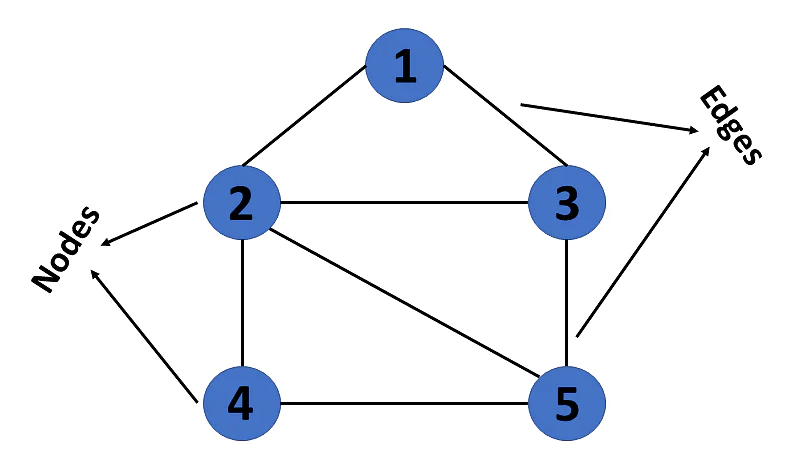

[TIL on July 15th, 2022](../../TIL/2022/07/07-15-2022.md)
# **Breadth First Search**

### Graphs
- Graphs in data structures are non-linear data structures made up of a finite number of nodes or vertices and the edges that connect them
- Graphs in data structures are used to address real-world problems in which it represents the problem area as a network like telephone networks, circuit networks, and social networks
- For example, it can represent a single user as nodes or vertices in a telephone network, while the link between them via telephone represents edges

#### Example

- This graph has a set of vertices V = {1,2,3,4,5} and a set of edges E = {(1,2),(1,3),(2,3),(2,4),(2,5),(3,5),(4,5)}

### BFS, Breadth First Search?
- BFS is an algorithm to visit all vertices for Graphs

### Steps for BFS
1. Put the coordinates of an initial vertice in a queue, and mark the initial vertice as a visited vertice
2. Pop the element (or elements) from queue and do step 3 for vertices on top, bottom, left and right
3. An element that the program visit for the first time, the element is checked and put to queue; visited elements are just skipped
4. Repeat steps above until the queue becomes empty

#### Time complexity
- Assume that a total number of vertices is N, the time complexity becomes O(N) since the program visit all vertices once
- If the number of rows and the number of columns are R and C, respectively, the time complexity becomes O(RC)

### Related STL
- `pair` in utility header
- make_pair put values in
- C++11 and the version above that could simply use braces (`{}`)

```cpp
#include <bits/stdc++.h>
using namespace std;

int main(void){
    pair<int, int> t1 = make_pair(10, 13);
    pair<int, int> t2 = {4, 6};
    cout << t1.first ' ' << t1.second << '\n'; // 10 13
    cout << t2.first ' ' << t2.second << '\n'; // 4 6
    if(t2 < t1) cout << "t2 < t1"; // t2 < t1
    // check if t2.first < t1.first and then t2.second < t1.second
}
```

### Basic code for BFS
- [Link](https://github.com/encrypted-def/basic-algo-lecture/blob/master/0x09/BFS.cpp)
```cpp
#include <bits/stdc++.h>
using namespace std;
#define X first
#define Y second // to save typing

int board[502][502] =
{{1,1,1,0,1,0,0,0,0,0},
 {1,0,0,0,1,0,0,0,0,0},
 {1,1,1,0,1,0,0,0,0,0},
 {1,1,0,0,1,0,0,0,0,0},
 {0,1,0,0,0,0,0,0,0,0},
 {0,0,0,0,0,0,0,0,0,0},
 {0,0,0,0,0,0,0,0,0,0} };
bool vis[502][502]; // Memo for visits
int n = 7, m = 10; // n = (the number of rows), m = (the number of columns)
int dx[4] = {1,0,-1,0};
int dy[4] = {0,1,0,-1}; // Left, right, up and down
int main(void){
  ios::sync_with_stdio(0);
  cin.tie(0);
  queue<pair<int,int>> Q;
  vis[0][0] = 1; // Start with (0, 0) and this position marked as visited
  Q.push({0,0}); // Insert (0, 0)
  while(!Q.empty()){
    pair<int,int> cur = Q.front(); Q.pop();
    cout << '(' << cur.X << ", " << cur.Y << ") -> ";
    for(int dir = 0; dir < 4; dir++){ // Check four directions
      int nx = cur.X + dx[dir];
      int ny = cur.Y + dy[dir]; // Vertices on four directions of a vertice on the queue
      if(nx < 0 || nx >= n || ny < 0 || ny >= m) continue; // continue if the position is out of the given range
      if(vis[nx][ny] || board[nx][ny] != 1) continue; // continue when the program once visited the vertice or the vertice is not the target
      vis[nx][ny] = 1; // (nx, ny) is marked as visited
      Q.push({nx,ny});
    }
  }
}
```
- Keep practicing

#### Three common mistakes
- The initial vertice is not marked as visited
- The vertices are marked as visited when they are popped from the queue rather than they are inserted to queue: a vertice could be calculated more than one time
- The incorrect range is used for validation

___

### Reference
- [[실전 알고리즘] 0x09강 - BFS](https://blog.encrypted.gg/941?category=773649)
- [Your One-Stop Solution For Graphs In Data Structures](https://www.simplilearn.com/tutorials/data-structure-tutorial/graphs-in-data-structure#:~:text=Graphs%20in%20data%20structures%20are,circuit%20networks%2C%20and%20social%20networks.)