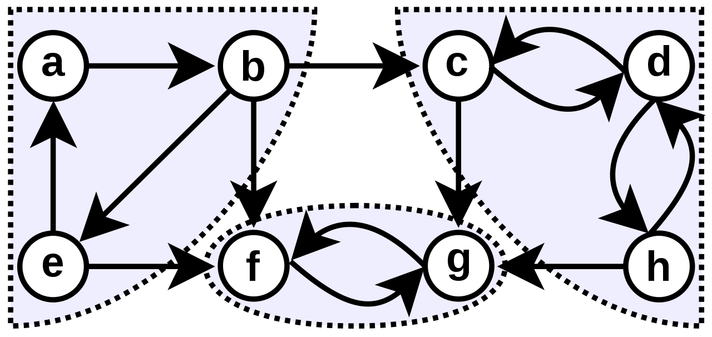

[TIL on March 15th, 2023](../../TIL/2023/03/03-15-2023.md)
# **강한 연결 요소(Strongly Connected Component)**
### 개요
* 상당히 어려운 개념이고 출제 빈도가 높진 않지만 흥미로운 개념임.

* SCC는 일종의 서브그래프임.
  - 하나의 SCC 안에 있는 어떤 두 정점 u, v를 골라도, SCC 안에서 u->v로 가는 직/간접적인 경로가 존재함.
  - 각 SCC는 최대로 커야 한다. 예를 들어, 최대 SCC가 {c, d, h}인 경우 부분 집합 {c, d}로 잡아도 임의의 두 정점에 대해서 도달 가능한 경로가 존재함이 보증된다(c -> d, d -> c). 그렇지만 여기에 정점 h를 추가해도 여전히 성질이 만족되기 때문에 SCC 정의에 따라 h가 반드시 포함되어야 함.

* 이같이 유향 그래프가 주어지면 파티션 분할하여 각각이 SCC가 되게 만드는 것이 항상 가능하며, 이를 $O(N)$ 안에 확인할 수 있음.
  - 싸이클을 이루는 정점들은 항상 서로에게 도달 가능하다는 성질이 존재했음. 
  - SCC는 싸이클 보다 상위개념이라 볼 수 있음.

* 위 그림 상에서 {a, b, e}나 {f, g}만 떼어놓고 보면 단순 싸이클이지만 {c, d, h}은 그렇지 않음.
  - 또한, 무향 그래프면 그냥 컴포넌트 자체가 SCC라고 볼 수 있기 때문에 이 개념이 필요 없음.
 

## 28장 그래프의 깊이 우선 탐색
### 28.7 이론적 배경과 응용
#### 개요
* 깊이 우선 탐색을 수행하면 그 과정에서 그래프의 모든 간선들을 한 번씩은 만나게 된다.
* 일부 간선은 탐색 중에 처음으로 발견한 정점으로 연결되어 있으며, 깊이 우선 탐색 중에는 이같은 간선을 따라 탐색하게 된다.
* 그외 나머지 간선에 대한 정보를 수집하면 그래프의 구조에 대해 많은 것을 알 수 있다.
* 깊이 우선 탐색 스패닝 트리(DFS Spanning Tree): 깊이 우선 탐색을 통해 따라가는 정점들과 간선들의 집합

#### 간선의 종류
1. 트리 간선: DFS 스패닝 트리에 포함된 간선
2. 순방향 간선: 스패닝 트리의 선조에서 자손으로 연결되지만 트리 간선이 아닌 간선
3. 역방향 간선: 스패닝 트리의 자손에서 선조로 연결되는 간선. 당연히 트리 간선이 아님(DFS 스패닝 트리의 부모-자식 관계가 깨지는 간선이므로).
4. 교차 간선: 위 세 분류에 속하지 않는 간선. 선조와 자손 관계가 아닌 정점들 간에 연결된 간선
- Note: 선조는 임의 정점에서 루트로 거슬러 올라갈 때 만나는 부모와 부모의 부모, 그리고 그 부모들의 부모들을 뜻한다.

#### 간선의 구분법
* 유향 그래프(단방향 그래프)
  - 최초로 방문하는 정점으로 연결되는 간선은 *트리 간선*이 된다.
  - 만약 이전에 방문했던 정점이라면 방문 순서와 DFS 호출 완료 여부에 따라 간선을 구분할 수 있다.

* 무향 그래프(양방향 그래프)
  - 간선이 양방향으로 통행 가능하기 때문에 교차 간선이 있을 수 없다: u와 v를 잇는 간선을 생각하자. dfs(u)를 호출했다고 생각하자. 이 경우, u에서 갈 수 있는 모든 정점을 방문한 뒤 종료하게 된다. 이 경우 v로 가는 경로가 있다면 무조건 v가 방문된다. 따라서 dfs(u)가 종료된 후 v를 방문하지 않았고, 이후에 dfs(v)가 실행되는 경우는 두 정점을 연결하는 경로가 없을 경우밖에 없다.
  - 또한, 순방향 간선과 역방향 간선의 구분도 없다. 트리 간선이 아닌 간선이 자손에서 선조로 연결되는 경우, 선조에서 자손도 연결이 되며 자손에서 선조로도 연결이 되기 때문이다.
 

### 구종만 알고리즘 책 859페이지
* 강결합 컴포넌트 분리를 위한 타잔의 알고리즘
  - 모든 정점에서 한 번씩 깊이 우선 탐색을 수행하는 방식으로 문제를 풀 수 있음. 이 경우 $O(|V|×|E|)$ 시간이 걸리며, 그래프의 정점과 간선 수가 어느 정도 커지면 활용할 수가 없게 됨.
  - 타잔(Tarjan)의 알고리즘은 한 번의 깊이 우선 탐색으로 각 정점을 SCC별로 분리함. 유도 과정이 까다로움.

* 풀이 과정
  - 임의의 정점에서부터 깊이 우선 탐색을 수행해 DFS 스패닝 트리를 만듦. 처음으로 수행한 DFS 스패닝 트리는 적절히 자르면 SCC로 분리가 가능함.
  - 만약 DFS 수행 중에 SCC에 속한 정점 x를 처음으로 만났다고 보자. SCC에 속한 두 정점 간에는 항상 경로가 있기 때문에, 깊이 우선 탐색은 dfs(x)가 종료되기 전 같은 SCC에 속한 정점을 모두 방문하게 됨. 따라서 이 SCC에 속한 정점들은 모두 x를 루트로 하는 서브트리에 포함됨.
  - 타잔의 알고리즘은 깊이 우선 탐색을 수행하면서 각 정점을 SCC로 묶음. 이를 위해 간선을 따라 재귀 호출이 *반환될 때마다* 이 간선을 자를지 말지 여부를 결정함(탐색을 수행하면서 각 서브트리에 대한 정보를 수집한 후에야 간선을 자를지 말지 결정할 수가 있음).
  - 간선을 자르기로 하면 하나의 SCC를 새로 만듦.
  - 어떤 정점 v를 루트로 하는 서브트리를 탐색한 뒤, 그 부모인 u로 재귀호출을 반환하며 트리 간선 (u, v)를 자르기로 결정했다고 하자. v를 루트로 하는 서브트리는 모두 탐색한 후이므로, 서브트리의 어떤 간선을 잘라야 할지 이미 모두 파악한 상태임. 타잔의 알고리즘은 아직 잘리지 않은 간선으로 v와 연결된 정점들을 모두 모아서 하나의 SCC로 묶어줌.

* 간선을 자를지 말지 여부 결정법
  - 트리 간선 (u, v)를 자른다는 것은 v에서 u로 갈 수 있는 경로가 없다는 것. v에서 u로 가는 경로에는 항상 역방향 간선이 하나 이상 포함되어 있어야 한다. 절단점 판단 알고리즘과 같이, v를 루트로 하는 서브트리를 탐색하면서 만나는 역방향 간선을 이용해 닿을 수 있는 가장 높은 정점을 찾음. 이 정점이 u 혹은 그보다 높이 있는 정점이라면 이 역방향 간선을 통해 v에서 u로 갈 수 있고, 이 경우 간선 (u, v)를 잘라선 안 됨.

* 트리 간선 (u, v)를 끊을 수 없는 경우: v를 루트로 하는 서브트리에서 v보다 먼저 발견된 정점으로 가는 역방향 간선이 있다면 (u, v)를 끊어선 안 됨. 또, 그런 역방향 간선이 없다고 해도, v보다 먼저 발견되었으면서 아직 SCC로 묶여 있지 않은 정점으로 가는 교차 간선이 있다면 (u, v)를 끊어선 안 됨.