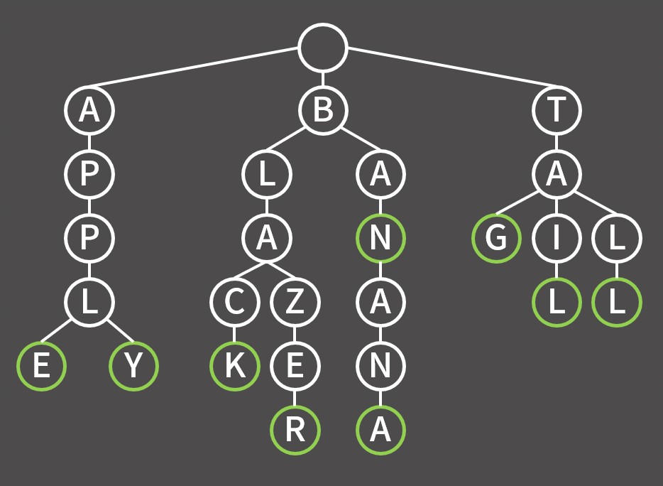

[TIL on October 1st, 2022](../../TIL/2022/10/10-01-2022.md)
# **Trie Data Structure**
### Introduction

- Trie is a data structure to be used to deal string efficiently
- Better than hash or binary search tree in theory: no risk of collision
  * But, practically, it's not faster than those data structures
- Cons: Memory inefficiency-need "4×(no. of used characters)" times of memory than simple array
  * For example, if the capital alphabet is used for trie, 104 times of simple array is needed
  * Can be reduced by some method: decreases calculation speed

### Implementation
- [Trie implementation](./trie-imp-10-01-2022.cpp)

#### Basic parameters
```cpp
const int ROOT = 1;
int unused = 2;
const int MX = 10000*500 + 5;
bool chk[MX];
int nxt[MX][26];

for(int i = 0; i < MX; i++)
  fill(nxt[i], nxt[i] + 26, -1);

int ctoi(char c){
  return c - 'A';
}
```

#### Insert
```cpp
void insert(string& s){
  int idx = ROOT;
  for(int i = 0; i < s.size(); i++){
    if(nxt[idx][s[i]] == -1)
      nxt[idx][s[i]] = unused++;
    idx = nxt[idx][s[i]];
  }
  chk[idx] = 1;
} 
```

___

### References
1. [[실전 알고리즘] 0x1F강 - 트라이](https://blog.encrypted.gg/1059)
