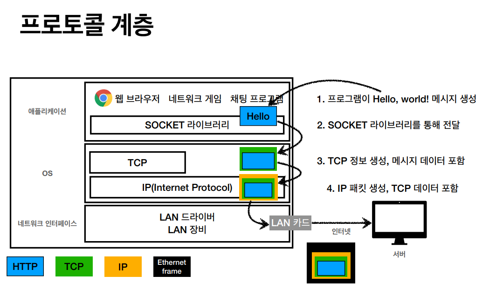
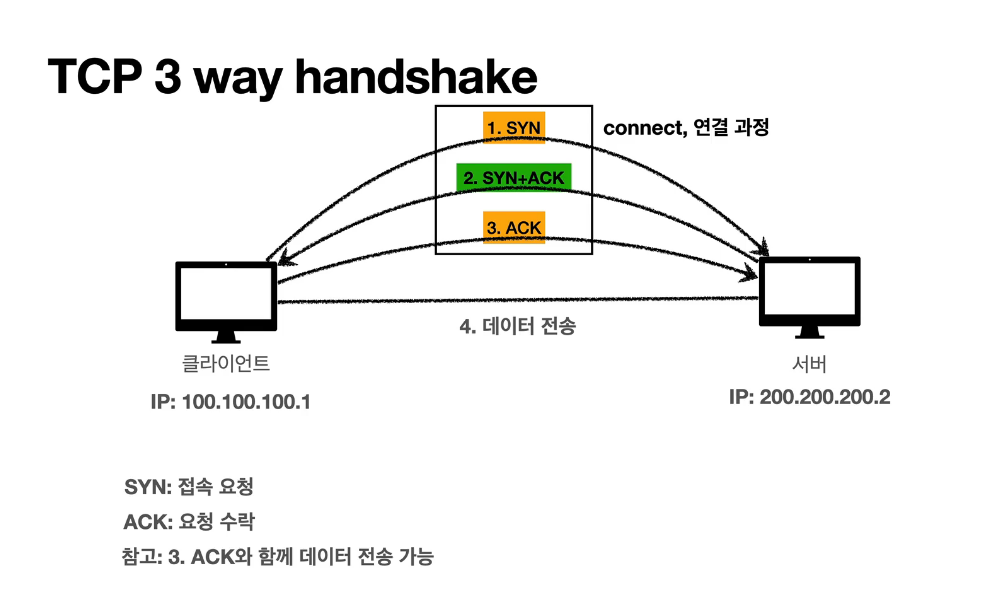

[TIL on March 13th, 2023](../../TIL/2023/03/03-13-2023.md)
## 섹션 1. 인터넷 네트워크
### 인터넷 통신
* 인터넷 상에서 컴퓨터 둘은 어떻게 통신할까?
  - 직접 데이터를 주고 받을 수 있는 케이블로 연결되어 있다면 직접 소통이 가능할 것.
  - 그러나, 우리는 보통 인터넷을 통해 정보를 주고받는다. 어떻게 메시지를 안전하게 주고받을 수 있나? 어떤 규칙으로 어떻게 정보를 주고받는 걸까?
  - 이를 이해하기 위해선 IP를 알아야 한다.
 

### IP (Internet Protocol)
* IP 자체가 프로토콜이라 부를 거면 IP라고만 하거나 인터넷 프로토콜이라고 풀로 말하는 게 올바름.
* 클라이언트에는 IP 주소가 부여되어야 한다. IP는 지정한 IP 주소에 데이터를 전달한다. 패킷이라는 통신 단위로 데이터를 전달한다.

* IP 패킷이라는 규칙이 있음. 패킷은 마치 우편과 같아서 출발지 IP, 목적지 IP를 명시해 전송해야 한다.
  - 이 패킷을 인터넷 상으로 보내면 중계 서버들을 거쳐서 목적지 IP로 도달하게 된다(이 과정에 대한 공부가 필요)
* 요청과 전달은 서로 다른 경로로 진행될 수도 있음.

#### IP만 활용했을 때의 한계점
* 비연결성: 패킷을 받을 대상이 없거나 서비스 불능 상태여도 패킷을 전송하게 됨.
  - 친구가 이사 갔든 가지 않았든 그냥 우편을 보내는 것.
* 비신뢰성
  - 중간에 서버 문제로 인해 패킷 로스가 발생할 수 있음.
  - 1500 byte가 넘는 용량의 패킷은 끊어서 전송하게 됨. 이 패킷들은 서로 다른 경로로 전달될 수도 있다. 이에 따라 두 패킷의 도착 속도가 달라져서 순서가 깨질 수 있다.
* 프로그램 구분: 같은 IP를 사용하는 서버에서 통신하는 어플리케이션이 둘 이상이면 다른 어플리케이션에 패킷이 전달될 수 있다는 건가?
* 이러한 한계를 극복할 수 있도록 도와주는 것이 TCP와 UDP이다.
 

### TCP, UDP
* TCP는 IP의 문제를 해결해준다.

* 인터넷 프로토콜 스택의 4계층
  - 애플리케이션 계층(Socket 라이브러리): HTTP, FTP
  - 전송 계층: TCP, UDP
  - 인터넷 계층: IP
  - 네트워크 인터페이스 계층(LAN 드라이버, LAN 장비)
* 포장하고 필요한 정보들을 달아준다 생각하면 될 듯. 
  - 프로그램이 메시지를 생성하면 이를 socket 라이브러리를 통해 전달함
  - TCP 정보를 생성하고 메시지 데이터를 포함
  - IP 패킷을 만들고 LAN 카드로 발송함. 이 발송되는 데이터에는 TCP 데이터가 포함되어 있어서 보내는 순서에 알맞게 읽어들일 수 있음.
* 최하위에는 이더넷 프레임(ethernet frame)이라는 게 존재. 이 계층에 물리 주소인 MAC 주소 등이 연관됨.

#### 패킷 구성
* IP 패킷 정보: 출발지 IP, 목적지 IP, 기타
* TCP 패킷 정보: **출발지 PORT**, **목적지 PORT**, 전송 제어, 순서, 검증 정보
  - 어떤 어플리케이션에서 주고 받는 정보인지 PORT로 구분됨.
* 이렇게 TCP와 IP 패킷으로 포장된 데이터를 인터넷을 통해 주고 받는 것.

#### TCP 특징(Transmission Contorl Protocol): 전송 제어 프로토콜
* 3가지 특징
  - 연결지향 - TCP 3 way handshake (가상 연결)
  - 데이터 전달 보증 - 내가 메시지를 보냈을 때 누락 여부를 알 수 있음
  - 순서 보장
* 신뢰할 수 있는 프로토콜이며, 현재는 대부분 TCP 사용

##### TCP 3 way handshake

1. SYN: 클라이언트가 서버에 접속 요청을 보냄
2. SYN+ACK: 서버가 접속 요청을 승인하며 클라이언트에게 접속 요청을 보냄
3. ACK: 클라이언트가 서버에 접속 요청을 수락함

* 이러한 과정을 거쳐야 하기 때문에, 데이터를 보내야 하는 곳이 데이터를 받지 못하는 상태인 경우를 인지하고 전송하지 않을 수 있다.

* 현재는 최적화가 돼서 마지막으로 접속 요청을 수락할 때 클라이언트가 요청한 데이터도 함께 보내준다.

* 이것은 '개념적'으로 연결된 상태이다. 당연히 이전에도 물리적으로는 도달할 수 있는 상태였지만, 상호 간 연결 상태를 확인한 뒤인 이때부터 연결이 된 상태라고 말하는 듯함.

##### 데이터 전달 보증 및 순서 보장
* 서버에서 데이터를 잘 전달 받았다는 것을 확인시켜준다. 또한 주고 받는 데이터의 순서를 보장해준다. 잘못된 순서로 데이터가 오는 경우, '기본적'으로는, 서버가 클라이언트에게 데이터를 재요청한다.
  - 이는 TCP/IP 패킷 정보 상에 기록하기 때문이다.

#### UDP 특징: 사용자 데이터그램 프로토콜(User Datagram Protocol)
* 기능이 거의 없음.
  - 이는 IP와 거의 같지만 여기에 PORT가 추가됨.
* UDP는 TCP에 비해서 단순하고 빠르다.

* 인터넷이 다 TCP 기반이기 때문에 뭔가 손을 대기 어려움.
  - 이제는 UDP로 최적화를 수행. HTTP 3.0에서는 UDP를 기반으로 이전에 있던 Handshake도 단축하는 등 간소화함.
 

### PORT (TCP/UDP)
* 포트의 필요성
  - 동일한 IP 주소 상에서 여러 서버에 데이터를 요청함. 이때, 이 전송되는 데이터를 처리할 어플리케이션을 어떻게 인식할 수 있는가? IP만 가지곤 불가능하다.
  - TCP와 UDP는 포트를 제공한다. 이 포트를 통해 IP 주소로 전달된 인터넷 데이터를 각 어플리케이션으로 구분해서 전달해준다.
* IP는 목적지 서버를 찾는 것. 포트는 동일 IP 내에서 프로세스를 구분함.
* IP는 아파트 건물 구분, 포트는 호수 구분.

* 포트는 0~65535까지 할당 가능함. 0~1023은 잘 알려진 포트로 이는 임의로 활용하지 않는 것이 좋음.

 

### DNS
* IP는 기억하기 어렵고 유동적이다. 그래서 DNS(도메인 네임 시스템)를 통해 도메인 이름을 IP로 바꿀 수 있음.