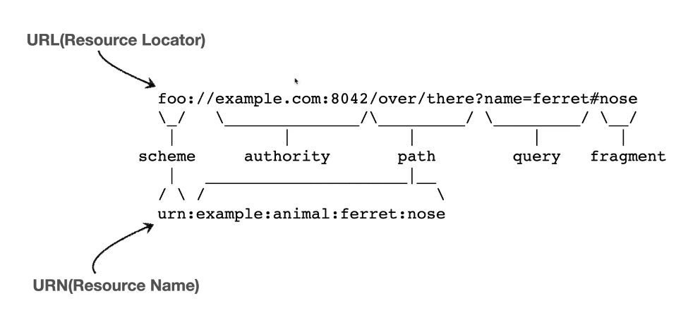

[TIL on March 14th, 2023](../../TIL/2023/03/03-14-2023.md)
## 섹션 2. URI와 웹 브라우저 요청 흐름
### URI(Uniform Resource Identifier)
* 리소스를 식별하는 통합된 방법
* URI, URL, URN?
  - URI는 로케이터, 이름 또는 둘 다를 추가로 분류될 수 있다.
  - URI라는 개념 안에 URL과 URN이 있음.
  - URL: Resource Locator, 리소스가 있는 위치
  - URN: Resource Name, 리소스 이름.
* [1.1.3. URI, URL, and URN](https://www.ietf.org/rfc/rfc3986.txt)

  - URL은 위치를 특정 구조에 따라 서술한다고 이해할 수 있을 듯함. 도메인이 들어가고, 그 뒤에 경로가 이어지며, 이후 그 경로에서 찾고자 하는 내용을 query로 물어보고 그 중 단락과 같은 부분은 # 뒤로 이어지는 fragment로 표현됨.
  - URN은 매핑이 어려움. 마치 디렉토리 안에 있는 폴더들을 찾아가는 느낌인데, 그 중간에 이어지는 이름들을 다 알고 있기란 매우 어려움.

* URI의 뜻
  - Uniform: 리소스 식별하는 통일된 방식
  - Resoure: 자원, URI로 식별할 수 있는 모든 것(제한 없음)
  - Identifier: 다른 항목과 구분하는 데 필요한 정보. '식별자'

* URL, URN
  - URL은 Locator로, 리소스가 있는 위치를 지정
  - URN은 Name, 리소스에 이름을 부여
  - URN 이름만으로 실제 리소스를 찾을 수 있는 방법이 보편화되진 않았음.
  - 위 두 체계를 특별히 구분하기보다는 적당히 명명 방식을 결정하고 그것을 따르는 식으로 활용하는 듯함.

* URL 분석
  - https://www.google.com/search?q=hello&hl=ko에 대해 분석해보자.
  - `scheme://[userinfo@]host[:port][/path][?query][#fragment]`
  - scheme: 주로 프로토콜 자리. http, https, ftp 등. 
  - userinfo는 거의 사용하지 않음.
  - port: http는 80 포트, https는 443 포트를 주로 사용함. 생략 가능하다.
  - path: 리소스 경로. 계층적 구조
  - query: query parameter, query string 등으로 불림. 웹서버에 제공하는 파라미터.
  - fragment: html 내부 북마크 등에 사용. 서버에 전송하는 정보는 아니고 웹 브라우저에 표시하는 데 활용되는 것이라 생각됨.
 

### 웹브라우저 요청 흐름
* URL을 입력했을 때 웹 브라우저가 어떻게 동작하는지 살펴보자.
  - https://www.google.com/search?q=hello&hl=ko
  - host를 조회함. DNS 조회
  - HTTP 요청 메시지를 웹 브라우저가 생성함: `GET /search?q=hello&hl=ko HTTP/1.1 Host: www.google.com`
  - 이렇게 생성된 HTTP 메시지를 SOCKET 라이브러리를 통해 전달. TCP/IP 연결, 데이터 전달.
  - 이 데이터를 포함하여 TCP/IP 패킷을 생성함: `HTTP/1.1 200 OK, Content-Type: text/html;charset=utf-8`
  - 응답 데이터를 만들고 웹 브라우저에 보내줌.
  - 받은 데이터를 웹 브라우저가 HTML 렌더링 수행.
 