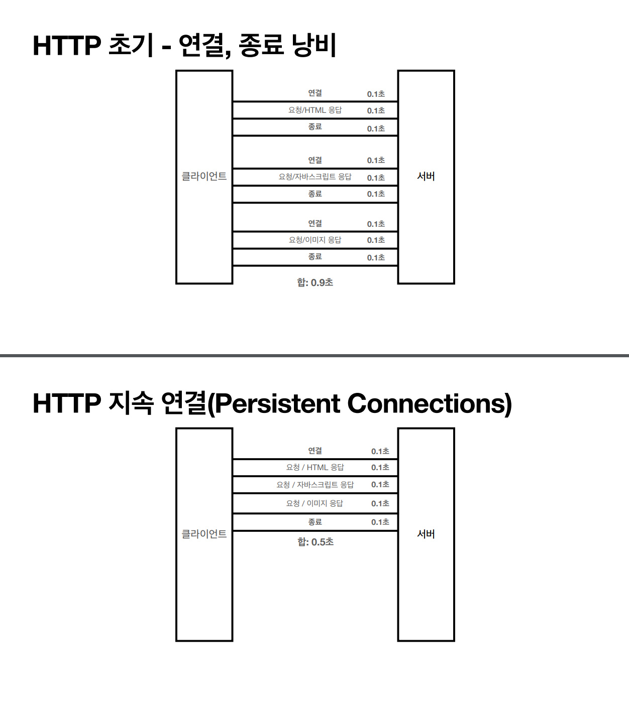
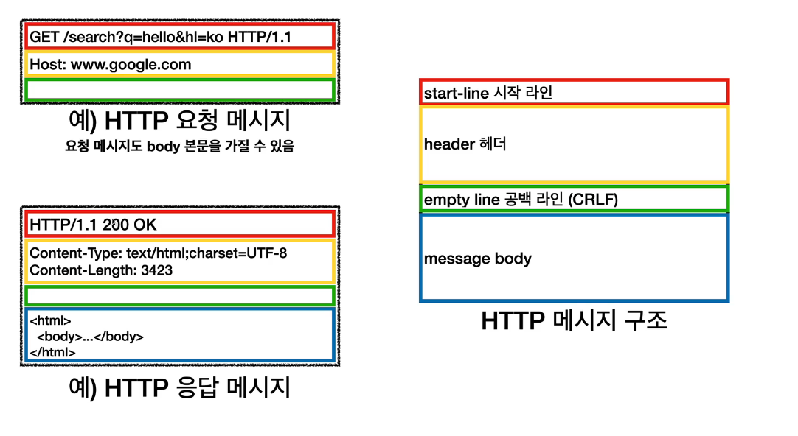

[TIL on March 14th, 2023](../../TIL/2023/03/03-14-2023.md)
## 섹션 3. HTTP 기본
### HTTP
* The Hypertext Transfer Protocol (HTTP) is a stateless application-level protocol for distributed, collaborative, hypertext information systems.
  - 무상태성의 어플리케이션 수준 규약임.
* This document describes the overall architecture of HTTP, establishes common terminology, and defines aspects of the protocol that are shared by all versions. In this definition are core protocol elements, extensibility mechanisms, and the "http" and "https" Uniform Resource Identifier (URI) schemes.
 

### 모든 것이 HTTP
* HTTP 메시지에 모든 것을 전송
* HTML, TEXT
* IMAGE, 음성, 영상, 파일
* JSON, XML (API)
* 거의 모든 형태의 데이터 전송 가능
* 서버 간 데이터를 주고 받을 때도 대부분 HTTP 사용

* 특수한 경우에만 TCP 연결을 직접적으로 수행한다고 함.
* HTTP도 프로토콜, TCP도 프로토콜, IP도 프로토콜.
  - IP 단일로는 여러가지가 보장이 안 되기 때문에 TCP를 입혀서 TCP/IP라고 얘기하는 듯하고.
  - HTTP는 또다른 연결 방식이라는 건가?

* HTTP/1.1 1997년: 가장 많이 사용함. 우리에게 가장 중요한 버전.
  - RFC2068 (1997) -> RFC2616 (1999) -> RFC7230~7235 (2014)
  - RFC2616 버전을 주로 다룬다.

* 기반 프로토콜
  - TCP: HTTP/1.1, HTTP/2
  - UDP: HTTP/3
  - 현재 HTTP/1.1 주로 사용, 이후 버전도 점점 증가 중

* HTTP 특징
  - 클라이언트-서버 구조로 이루어져 있음. 이에 대해 이어서 설명
  - 무상태 프로토콜(스테이트리스), 비연결성
  - HTTP 메시지
  - 단순함, 확장 가능
 

### 클라이언트 서버 구조
* Requset-Response 구조
  - 클라이언트는 서버에 요청을 보내고, 응답 대기
  - 서버가 요청에 대한 결과를 만들어서 응답

* 예전에는 클라이언트와 서버가 구분되지 않았었음.
  - 비즈니스 로직과 데이터를 서버에 다 넣어둠.
  - 클라이언트는 UI를 그리고 사용성에 특화됨
  - 이렇게 분화함으로써 클라이언트가 가벼워질 수 있음. 복잡한 비즈니스 로직 등이 필요가 없음.

* 트래픽이 폭주했다고 생각하면, 서버 측면에서 개선하면 되는 것. 클라이언트는 이에 대해 알 필요가 없음.
  - 양쪽에 대해 독립적인 개발이 가능하다.
 

### Stateful, Stateless
* HTTP는 '무상태 프토토콜'을 지향한다.
  - "서버가 클라이언트의 상태를 보존하지 않는다."

* 우리가 보통 의사소통을 할 때는 상태를 유지하며, 그러니까 고객과 점원의 대화를 생각할 때, 점원이 고객의 의사를 인지하는 게 당연함. 그러나, HTTP는 서버가 점원의 역할을 하지만 고객의 상태를 계속 추적하는 게 아님. 서버는 맥락을 파악하지 않음.

* 상태를 유지하는 데 점원이 중간에 바뀐다고 생각하면, 맥락을 파악하지 못함.
  - 중간에 요청을 처리하는 서버의 스레드?가 바뀔 수도 있으니, 상호작용 하면서 현재 상태를 명시하며 요청을 수행하는 방법이라 생각하면 될 듯함.
  - '무상태는 응답 서버를 쉽게 바꿀 수 있다.' -> 무한한 서버 증설이 가능하다. 또한, 원래 응답해주던 서버가 나가더라도 중계서버를 통해서 정상 동작하는 서버와 '장애 없이' 소통할 수 있게 된다.

* 실무적 한계: 최대한 무상태로 설계하고, 어쩔 수 없는 경우에 한해서 상태를 유지한다.
  - 모든 것을 무상태로 설계할 수 있는 경우도 있고, 없는 경우도 있다.
  - 무상태: 로그인이 필요 없는 단순한 서비스 소개 화면
  - 상태 유지: 로그인이 된 상태에서만 접근 가능한 컨텐츠에 로그인 후 접근 시도
  - 로그인한 사용자의 경우 로그인 했다는 상태를 서버에 유지
  - 일반적으로 브라우저 쿠키와 서버 세션 등을 활용해서 상태를 유지함
  - 상태 유지는 최소한만 사용
 

### 비 연결성(connectionless)
* TCP/IP와는 다른 성질임: TCP/IP는 연결을 '유지'한다. 이에 따라 서버는 계속 자원을 소모한다(어떤 자원이 소모되는지 궁금함).
* 연결을 유지하지 않는 모델을 생각하자.
  - 서로 필요한 것만 주고 받고, 연결을 끊어버림. 최소한의 자원만 활용된다. 다만, 이러한 경우 속도의 문제가 생길 수 있을 것 같음.

* HTTP는 기본적으로 연결을 유지하지 않는 모델임
* 1시간 동안 수천 명이 서비스를 사용한다 해도 실제 서버에서 동시에 처리하는 요청은 수십 개 이하로 아주 적은 양이다.
  - 작정하고 서버에 과도한 요청을 할 수는 있긴 할 듯.

* 비연결성 단점과 이에 대한 보완점
  - TCP/IP 연결을 매번 새로 맺어야 한다. 이건 사용자 측면에서 발생하는 문제로, 서버의 부하를 줄인 데 대한 트레이드 오프임.
  - 웹 브라우저가 요청을 하면 서버에서는 다양한 자료들을 보내준다. HTML 뿐 아니라, 자바스크립트, CSS, 첨부 이미지 등이 함께 다운로드 됨.
  - 지금은 HTTP 지속 연결을 활용해서 이런 문제를 해결하였음. 그러니까, 이전에는 서버에서 보내오는 모든 데이터가 클라이언트와 다시 TCP/IP 연결을 수행한 뒤에 전송되었단 말인가? 이제는 그렇게까지 하진 않고?

* HTTP 초기 - 연결, 종료 낭비

  - 예전 방식: HTML을 확인. 확인해보니 필요한 CSS와 자바스크립트 파일이 있었음. 다시 연결을 설정하고 서버에 필요한 파일들을 요청함.
  - 지속 연결: HTML 파일을 다 받을 때까지는 연결을 쭉 유지함. HTTP 2, HTTP 3은 이를 훨씬 개선함.

* 스테이트리스를 기억하자
  - 시간에 딱 맞춰서 대량 트래픽이 발생하는 경우. 동시에 많은 양의 연산을 처리해야 함.
  - 이런 대용량 트래픽 처리 과정을 풀어가려면 최대한 스테이트리스하게 설계해야 한다.
 

### HTTP 메시지(가장 중요하다고 함)
* '모든 것이 HTTP다.'
  - HTTP 요청 메시지와 응답 메시지는 구성이 다르다.

#### 시작 라인
* 시작 라인은 요청 라인과 상태 라인이 있다.
  - start-line = request-line / status-line
* 원문: An HTTP message can be either a request from client to server or a response from server to client.  Syntactically, the two types of message differ only in the start-line, which is either a request-line (for requests) or a status-line (for responses), and in the algorithm for determining the length of the message body (Section 3.3).
  - HTTP message는 클라이언트가 서버에 보내는 요청이 될 수도, 서버가 클라이언트에 보내는 응답이 될 수도 있다. 이들은 시작 라인(start-line) 구문과, 메시지 바디의 길이를 결정하는 알고리즘만 다르다.

* 클라이언트가 서버에 보내는 요청의 경우
  - 포맷: request-line = method SP request-target SP HTTP-version CRLF / SP: 스페이스, CRLF: 줄바꿈
  - HTTP 메소드와 요청 대상, HTTP Version이 요청 메시지 안에 들어간다. 이에 대해 아래에 상세히 서술한다.
  - HTTP 메소드
    * 종류: GET, POST, PUT, DELETE
    * 서버가 수행해야 할 동작 지정
  - 요청 대상
    * 절대경로로 요청 대상을 지정한다.
  - HTTP 버전

* 서버가 클라이언트에 보내는 응답의 경우
  - HTTP-version SP status-code SP reason-phrase CRLF
  1. HTTP 버전
  2. HTTP 상태 코드
  3. 이유 문구: 사람이 이해할 수 있는 짧은 상태 코드 설명 글

#### HTTP 헤더
* header-field = `field-name ":" OWS field-value OWS` / OWS가 가능하단 의미
  - `Host: www.google.com`이어도 되고 `Host:www.google.com`이어도 되지만, `Host : www.google.com`는 안 된다.

* 헤더의 용도
  - HTTP 전송에 필요한 모든 부가 정보를 담아둠. body가 json인지, html인지, xml인지
  - 메시지 바디의 내용, 크기, 압축 포맷, 인증, 요청 클라이언트(브라우저) 정보, 서버 애플리케이션 정보, 캐시 관리 정보 등
  - 표준 헤더는 굉장히 많음
  - 필요하다면 임의로 헤더를 추가할 수 있음.

* HTTP 메시지 바디는 실제 전송할 데이터를 포함하고 있다.

* HTTP는 단순하다. 스펙도 읽어 볼 만하다. 메시지 역시 단순하다. 포맷을 기억하고, 어떤 내용을 주고 받는지 파악하고 있어야 한다.
  - 크게 성공하는 표준 기술은 단순하지만 확장 가능한 기술. 이제 UDP 기반으로 옮겨가는 이유도 그와 같은 걸까