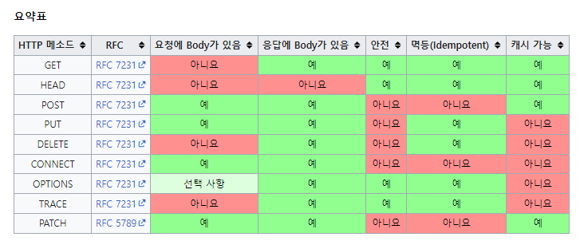

[TIL on March 14th, 2023](../../TIL/2023/03/03-14-2023.md)
## 섹션 4. HTTP 메서드
### HTTP API를 만들어보자
* 요구사항: 회원 정보 관리 API를 만들어라.
  - 회원 목록 조회 /read-member-list
  - 회원 조회 /read-member-by-id
  - 회원 등록 /create-member
  - 회원 수정 /update-member
  - 회원 삭제 /delete-member

* 과연 이는 좋은 URI 설계일까?
  - 위 같이 만들 경우엔 member라는 단어가 너무 중복되는 것 같음.
  - 가장 중요한 건 '리소스 식별'이다. URI 자체가 리소스 식별자임.

* 리소스를 어떻게 식별하는 게 좋을까?
  - 회원을 등록하고 수정하고 조회하는 것을 모두 배제
  - 회원이라는 리소스만 식별하면 된다: 이 리소스를 매핑함.

* 설계 예시
  - **회원** 목록 조회 /members
  - **회원** 조회 /members/{id}
  - **회원** 등록 /members/{id}
  - **회원** 수정 /members/{id}
  - **회원** 삭제 /members/{id}
  - 이 경우엔 구분을 할 수가 없는데, 어떻게 구분해야 하나?

* URI는 리소스만 식별한다. 리소스와 해당 리소스를 대상으로 하는 행위를 분리
  - 리소스: 회원
  - 행위: 조회, 등록, 삭제, 변경

* 리소스는 명사, 행위는 동사. 이 행위는 어떻게 구분하는가?
  - HTTP 메서드가 이 역할을 해준다.

* URI의 리소스만 식별해주면 메서드가 필요한 행동을 취한다.
<br>

* HTTP 메서드 종류
  1. GET: 리소스 조회
  2. POST: 요청 데이터 처리, 주로 등록에 사용
  3. PUT: 리소스를 대체, 해당 리소스가 없으면 생성
  4. PATCH: 리소스 부분 변경
  5. DELETE: 리소스 삭제
  6. HEAD: GET과 동일하지만 메시지 부분 제외. 상태 줄과 헤더만 반환
  7. OPTIONS: 대상 리소스에 대한 통신 가능 옵션(메서드)을 설명(주로 CORS에서 사용)
  - 그외 CONNECT, TRACE 등.

### HTTP 메서드 - GET, POST
#### GET
* 리소스 조회
* 서버에 전달하고 싶은 데이터는 query(쿼리 파라미터)를 통해 전달
* 메시지 바디를 사용해서 데이터를 전달할 수 있지만, 지원하지 않는 곳이 많아서 권장하지 않음.

```http
GET /members/100 HTTP/1.1
Host: localhost:8080
```

이에 대한 정보는 
```json
{
  "username": "young",
  "age": 20
}
```
으로 주어졌다고 하자. 그러면 이 내용을 포함해서 응답 데이터를 보낸다.

```http
HTTP/1.1 200 OK
Content-Type: application/json
Content-Length: 34

{
  "username": "young",
  "age": 20
}
```

#### POST
* 요청 데이터 처리
* 메시지 바디를 통해 서버로 요청 데이터 전달
* 서버는 요청 데이터를 처리
  - 메시지 바디를 통해 들어온 데이터를 처리하는 모든 기능을 수행함.
* 주로 전달된 데이터로 신규 리소스 등록, 프로세스 처리에 사용

* 리소스 등록 1 - 메시지 전달
```http
POST /members HTTP/1.1
Content-Type: application/json

{
  "username": "young",
  "age": 20
}
```
* 리소스 등록 2 - 신규 리소스 생성
```json
{
  "username": "young",
  "age": 20
}
```

* 신규 리소스 식별자 생성 후 응답
```http
HTTP/1.1 201 Created
Content-Type: application/json
Content-Length: 34
Location: /members/100

{
  "username": "young",
  "age": 20
}
```

* POST는 요청 데이터를 어떻게 처리한다는 뜻인가?
  - 스펙: POST 메서드는 대상 리소스가 리소스의 고유한 의미 체계에 따라 요청에 포함되니 표현을 처리하도록 요청합니다.
  - 예를 들어 POST는 다음과 같은 기능에 사용됩니다.
    1. HTML 양식에 입력된 필드와 같은 데이터 블록을 데이터 처리 프로세스에 제공
    2. 게시판, 뉴스 그룹, 메일링 리스트, 블로그 또는 유사한 기사 그룹에 메시지 게시
    3. 서버가 아직 식별하지 않은 새 리소스 생성
    4. 기존 자원에 데이터 추가
  - 이 리소스 URI에 POST 요청이 오면 요청 데이터를 어떻게 처리할지 결정해야 한다.

* 단순히 데이터를 생성하거나 변경하는 것을 넘어서 프로세스를 처리해야 하는 경우
  - 주문에서 결제완료 -> 배달 시작 -> 배달 완료처럼 단순히 값 변경을 넘어 프로세스의 상태가 변경되는 경우

* 컨트롤 URI: POST /orders/{orderId}/start-delivery
  - 배달을 시작하라는 URI를 만들 수 있음. 리소스만 URI로 만들라고 권했지만, 그렇게 하지 못할 수 있다.

* GET 메서드로는 body를 처리하지 못하는 경우가 굉장히 많다. 이럴 경우엔 POST를 활용하는 게 좋다.
  - cachable한지에 따라서 GET을 활용하는 게 유리한 경우도 있다. 특정 행동은 그에 부합하는 메서드로 설계하는 것이 유리한 경우가 많다(자원적인 측면의 이야기일 듯).

<br>

### HTTP 메서드 - PUT, PATCH, DELETE
#### PUT
* 리소스를 대체함.
  - 리소스가 있으면 대체 / 리소스가 없으면 생성: '덮어쓰기'
* 클라이언트가 리소스 URI를 정확히 알고 있다. 이 점이 POST와 다른 점임.
  - 클라이언트가 리소스 위치를 알고 URI 지정
  - POST와 차이점

```http
PUT /members/100 HTTP/1.1
Content-Type: application/json

{
  "username": "old",
  "age": 50
}
```
* 만약 명시된 URI인 /members/100에 리소스가 있었다면 아래 json 파일로 대체됨.
```json
{
  "username": "old",
  "age": 50
}
```

* 만약에 누락된 필드가 있다면 이 역시도 없는 상태로 덮어쓴다. 아래와 같은 데이터를 보내면 이전에 있던 필드가 사라진다.
```json
{
  "age": 50
}
```

* 즉, PUT은 리소스를 갱신하기엔 부적절하다.

#### PATCH, DELETE
* PATCH: 부분적으로 리소스를 부분적으로 변경할 수 있다(update).
  - 간혹 PATCH를 받지 못하는 서버도 있다. 이 경우엔 POST를 활용해야 한다.
* DELETE: 리소스를 완전히 지운다.
<br>

### HTTP 메서드의 속성(3가지)

* NOTE
  - GET은 요청에 Body를 넣을 수도, 안 넣을 수도 있음. 그러나 사용하지 않는 편이 좋다.

* 안전(Safe Methods)
  - 호출해도 리소스를 변경하지 않는다.
  - 주요 메서드: GET, HEAD

* 멱등(Idempotent Methods)
  - 한 번 호출하든, 두 번 호출하든, 100번 호출하든 결과가 같다.
  - 멱등 메서드: GET, PUT, DELETE
  - 멱등이 아닌 메서드: POST
  - 왜 이런 개념이 필요한가? 자동 복구 메커니즘. 서버가 TIMEOUT 등으로 정상 응답을 못 주었을 때, 클라이언트가 같은 요청을 다시 해도 되는가 판단하는 근거가 됨.

* 캐시가능(Cacheable Methods)
  - 응답 결과를 캐시해서 사용해도 되는가?: 웹 브라우저가 다운 받은 이미지를 보유하고 있다고 생각하자.
  - GET, HEAD, POST, PATCH의 캐시는 이론상 가능. 그러나 실제로는 GET, HEAD 정도만 캐시로 사용함.
  - POST와 PATCH는 바디까지 캐시를 해둬야 하는데 이에 대한 구현이 쉽지 않다고 함.