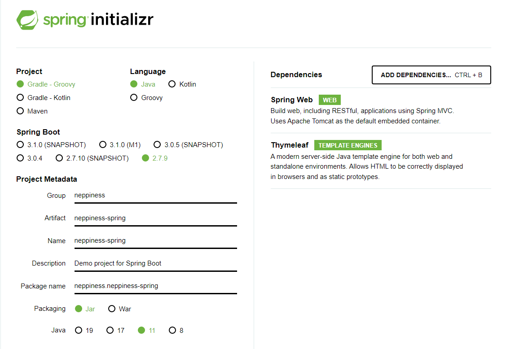

[TIL on March 19th, 2023](../../TIL/2023/03/03-19-2023.md)
## 섹션 1. 프로젝트 환경설정
### 프로젝트 생성
* Java 11 설치, IDE: IntelliJ
* [spring initializr](https://start.spring.io/)에서 프로젝트를 간단히 생성할 수 있다.

  - Spring Boot 3.0.4 버전은 호환 문제가 있는 건지 제대로 동작되지 않아서 2.7.9로 설정함.

* 스프링 부트가 나오면서 많이 편리해졌다: 어떤 부분이 스프링 부트며, 어떤 부분 덕분에 편해진 건지 알 필요는 있을 듯.

* gradle 파일 내용은 아래와 같다.
```
plugins {
	id 'java'
	id 'org.springframework.boot' version '2.7.9'
	id 'io.spring.dependency-management' version '1.0.15.RELEASE'
}

group = 'neppiness'
version = '0.0.1-SNAPSHOT'
sourceCompatibility = '11'

repositories {
	mavenCentral()
}

dependencies {
	implementation 'org.springframework.boot:spring-boot-starter-thymeleaf'
	implementation 'org.springframework.boot:spring-boot-starter-web'
	testImplementation 'org.springframework.boot:spring-boot-starter-test'
}

tasks.named('test') {
	useJUnitPlatform()
}

```
  - `sourceCompatibility = '11'`는 java 11로 작성되었다는 의미.
  - `implementation 'org.springframework.boot:spring-boot-starter-thymeleaf'`은 html 템플릿 엔진으로 thymeleaf를 선택했다는 것.
  - `implementation 'org.springframework.boot:spring-boot-starter-web'`은 Spring Web을 추가했다는 의미.
  - JUnit5가 기본으로 쓰임.

* 버전 관리를 위한 깃 관련된 설정도 `.gitignore` 파일에 잘 작성되어 있음.

* 메인 파일 실행 시 아래와 같이 동작함을 확인할 수 있음.
```
PM 3:39:47: Executing ':NeppinessSpringApplication.main()'...

Starting Gradle Daemon...
Gradle Daemon started in 1 s 100 ms
> Task :compileJava
> Task :processResources
> Task :classes

> Task :NeppinessSpringApplication.main()

  .   ____          _            __ _ _
 /\\ / ___'_ __ _ _(_)_ __  __ _ \ \ \ \
( ( )\___ | '_ | '_| | '_ \/ _` | \ \ \ \
 \\/  ___)| |_)| | | | | || (_| |  ) ) ) )
  '  |____| .__|_| |_|_| |_\__, | / / / /
 =========|_|==============|___/=/_/_/_/
 :: Spring Boot ::                (v2.7.9)

2023-03-19 15:39:56.211  INFO 21160 --- [           main] n.n.NeppinessSpringApplication           : Starting NeppinessSpringApplication using Java 11.0.17 on Neppiness with PID 21160 (C:\Users\Neppiness\Desktop\Be_a_programmer\neppiness-spring\build\classes\java\main started by Neppiness in C:\Users\Neppiness\Desktop\Be_a_programmer\neppiness-spring)
2023-03-19 15:39:56.214  INFO 21160 --- [           main] n.n.NeppinessSpringApplication           : No active profile set, falling back to 1 default profile: "default"
2023-03-19 15:39:56.913  INFO 21160 --- [           main] o.s.b.w.embedded.tomcat.TomcatWebServer  : Tomcat initialized with port(s): 8080 (http)
2023-03-19 15:39:56.921  INFO 21160 --- [           main] o.apache.catalina.core.StandardService   : Starting service [Tomcat]
2023-03-19 15:39:56.921  INFO 21160 --- [           main] org.apache.catalina.core.StandardEngine  : Starting Servlet engine: [Apache Tomcat/9.0.71]
2023-03-19 15:39:56.996  INFO 21160 --- [           main] o.a.c.c.C.[Tomcat].[localhost].[/]       : Initializing Spring embedded WebApplicationContext
2023-03-19 15:39:56.996  INFO 21160 --- [           main] w.s.c.ServletWebServerApplicationContext : Root WebApplicationContext: initialization completed in 743 ms
2023-03-19 15:39:57.257  INFO 21160 --- [           main] o.s.b.w.embedded.tomcat.TomcatWebServer  : Tomcat started on port(s): 8080 (http) with context path ''
2023-03-19 15:39:57.264  INFO 21160 --- [           main] n.n.NeppinessSpringApplication           : Started NeppinessSpringApplication in 1.366 seconds (JVM running for 1.659)

```

* Tomcat started on port(s): 8080 (http) with context path ''
  - Tomcat에 의해서 포트 8080에 서버가 열린 상태라고 이해하면 될 듯.
  - 정상 동작 중이라면 localhost:8080으로 접근 시 아래와 같은 화이트라벨 에러 페이지를 볼 수 있음.


* Build-and-run 옵션의 경우, gradle을 거쳐서 돌리는 것보다 intelliJ에서 직접 실행하는 게 빠르다. 설정은 아래 화면에서 수정할 수 있다.

<br>


### 라이브러리 살펴보기
#### 직접 gradle에서 살펴본 라이브러리들
* External Libraries를 가면 엄청 많은 외부 라이브러리들이 import 된 것을 확인할 수 있음.
* spring-boot의 starter-web을 라이브러리로 삽입하려 하면, 그에 관련된 모든 외부 라이브러리들을 함께 가져오게 된다.

* Gradle의 Dependencies를 열어보면 관련 라이브러리를 모두 확인할 수 있다.
  - start-web에 tomcat으로 잘 들어가 있는 것을 확인할 수 있음.


* 지금까지 배워왔던 것처럼 콘솔 상에 출력해선 안 된다.
  - 실무에선 반드시 메시지들을 로그 형태로 출력해야 한다.

* JUnit5: `testCompileClasspath > org.junit.jupiter:junit-jupiter:5.8.2`


#### 스프링 부트 라이브러리
* spring-boot-starter-web
  - spring-boot-starter-tomcat: 톰캣(웹서버)
  - spring-webmvc: 스프링 웹 MVC
* spring-boot-starter-thymeleaf: 타임리프 템플릿 엔진(View)
* spring-boot-starter(공통): 스프링 부트 + 스프링 코어 + 로깅
  - spring-boot > spring core
  - spring-boot-starter-logging > logback, slf4j

#### 테스트 라이브러리
* spring-boot-starter-test
  - junit: 테스트 프레임워크
  - mockito: 목 라이브러리
  - assertj: 테스트 코드 작성을 돕는 라이브러리
  - spring-test: 스프링 통합 테스트 지원
<br>

### View 환경설정
* Welcome page 만들기
```html
<!DOCTYPE HTML>
<html>
<head>
    <title>Hello</title>
    <meta http-equiv="Content-Type" content="text/html;charset=UTF-8"/>
</head>
<body>
Hello
<a href="/hello">hello</a>
</body>
</html>
```
* 스프링 부트는 welcome page의 역할을 할 static/index.html을 먼저 찾음
* thymeleaf 템플릿 엔진을 활용하면 
  - [스프링 공식 튜토리얼](https://spring.io/guides/gs/serving-web-content/)

```java
package neppiness.neppinessspring.controller;

import org.springframework.stereotype.Controller;
import org.springframework.web.bind.annotation.GetMapping;

@Controller
public class HelloController {

    @GetMapping("hello")
    public String hello(Model model) {
        model.addAttribute("data", "hello!!");
        return "hello";
    }
}
```

* 동작 방식 설명


  - localhost:8080/hello를 톰캣 내장 서버를 통해 접근함. `@GetMapping("hello")`를 통해서 `hello`를 받았을 때 `public String hello(Model model)` 메서드가 동작하도록 설정됨.

```java
    @GetMapping("hello")
    public String hello(Model model) {
        model.addAttribute("data", "hello!!");
        return "hello";
    }
```

  - 이때 `model.addAttribute("data", "hello!!");` 명령을 통해 변수명 data에 hello!!라는 문자열을 전달함.
  - `return "hello";`라고 한 명령은 `resources/templates`의 하위인 hello를 찾음.
  - 컨트롤러에서 리턴 값으로 문자를 반환하면 뷰 리졸버(`viewResolver`)가 화면을 찾아서 처리한다.
    * 스프링 부트 템플릿엔진 기본 viewName 매핑
    * `resources:templates/` + {ViewName} + `.html`
<br>

### 빌드하고 실행하기
<br>