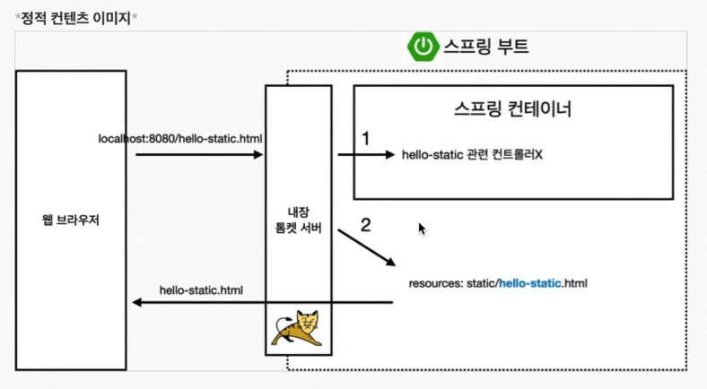
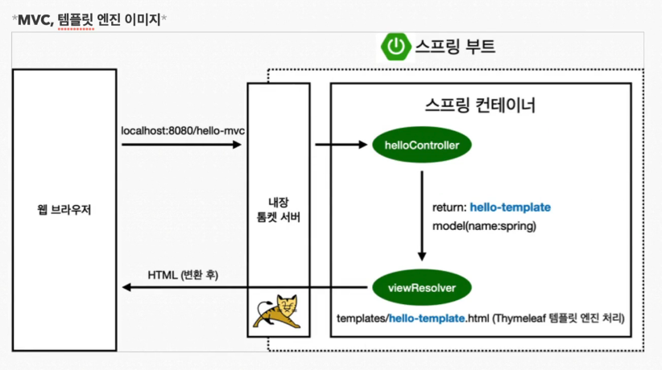
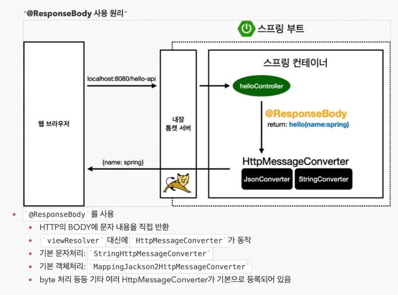

[TIL on March 20th, 2023](../../TIL/2023/03/03-20-2023.md)
## 섹션 2. 스프링 웹 개발 기초
* 웹을 개발한다는 건 크게 세 가지가 있다.
  1. 정적 컨텐츠: welcome page와 같이 서버에서 별다른 하는 것 없이 파일을 그대로 브라우저에 내려주는 것
  2. MVC와 템플릿 엔진: html을 그냥 주는 것이 아니라 서버에서 가공한 뒤 내리는 것을 의미. thymeleaf를 설정하고, 그 안에 키워드를 바꿔서 반환했던 것과 같은 것.
  3. API: 안드로이드나 아이폰 클라이언트를 개발해야 한다면, 정보를 json이라는 데이터 포맷으로 내려줌. viewjs, react 등을 활용할 때 사용. 서버끼리 소통할 때도 html을 내릴 필요가 없기 때문에 이 정보 교환 방식을 활용

### 1. 정적 컨텐츠
* [스프링 부트 정적 컨텐츠 기능](https://docs.spring.io/spring-boot/docs/current/reference/htmlsingle/#web.servlet.spring-mvc.static-content)
* url: `hello\src\main\resources\static`에 아래와 같은 내용으로 `hello-static.html`이라는 파일을 만들었다고 하자.

```html
<!DOCTYPE HTML>
<html>
<head>
    <title>static content</title>
    <meta http-equiv="Content-Type" content="text/html;charset=UTF-8"/>
</head>
<body>
정적 컨텐츠입니다.
</body>
</html>
```
* 위 컨텐츠는 서버를 동작시킨 후 `http://localhost:8080/hello-static.html`를 통해 접근할 수 있음.
* `hello\src\main\resources\static`에 둔 파일은 다른 프로그래밍을 할 수가 없음.



* 내장 톰캣 서버에서 hello-static에 관련된 컨트롤러가 있는지 먼저 확인한다. 이것이 없다는 것을 확인했으니 `resources: static/hello-static.html`에서 탐색하고, 해당 html 파일을 띄워주는 것임.
  - 만약 컨트롤러가 존재했다면 이는 `templates` 폴더에서 html 파일을 찾으려 했을 것.
<br>

### 2. MVC와 템플릿 엔진
* MVC: Model, View, Controller
  - 과거에는 컨트롤러와 뷰가 분리되지 않았었고, 뷰에 모든 것을 다 넣었었다(Model 1 방식).
  - 뷰(View)는 화면을 그리는 데 모든 역량을 집중해야 함.
  - 컨트롤러는 내부 로직을 처리하는 데 집중해야 함.

* 컨트롤러에 다음 로직을 구현했다고 하자.
```java
    @GetMapping("hello-mvc")
    public String helloMvc(@RequestParam("name") String name, Model model) {
        model.addAttribute("name", name); // addAttribute(key, name)
        return "hello-template";
    }
```
  - 이를 통해서 `hello-template.html`을 호출하게 된다. 아래 내용은 그 html 파일의 본문이다.

```html
<html xmlns:th="http://www.thymeleaf.org">
<body>
<p th:text="'hello. ' + ${name}" >hello. username</p>
</body>
</html>
```
  - `<p th:text="'hello. ' + ${name}" >hello. username</p>` 구문에서, p 태그 안에 있는 `hello. username`은 서버가 실행 중이지 않을 때 상태를 확인하기 위한 문자열이라 할 수 있음. 서버가 동작 중일 때는 설정해 둔 th에 의해서 `${name}`이 전달 받은 변수가 되고, `'hello. {name}'` 문자열을 출력하게 된다.
  - ex) hello. 김정현
  - `http://localhost:8080/hello-mvc`로 접근하면 에러가 발생함. 이는 name 변수를 인자로 전달하지 않았기 때문임.
  - `hello-mvc?name=JH`로 name 인자를 전달할 수 있음.

* 동작 방식



* `localhost:8080/hello-mvc`로 서버에 접근함. 내장 톰캣 서버를 통해 스프링 컨테이너로 전달. helloController가 이를 받아서 hello-template을 반환함. `viewResolver`가 `templates/hello-template.html`을 찾은 뒤, 전달 받은 인자와 함께 Thymeleaf 템플릿 엔진 처리를 수행 후 html로 변환. 이후 브라우저에 전달해줌.
<br>

### 3. API
* 아래와 같이 구현함.
```java
    @GetMapping("hello-string")
    @ResponseBody
    public String helloString(@RequestParam("name") String name) {
        return "hello " + name;
    }
```
  - @ResponseBody 태그가 필요함.
  - Model model을 인자로 전달하지 않음. 그리고 model.addAttribute을 구현하지도 않음. 그리고 static contents도 template도 아님. html을 따로 작성할 필요 없이 문자 그대로 전달해주고, 브라우저에서 열었을 때 소스를 봐도 문자 그 자체가 소스로 존재: `http://localhost:8080/hello-string?name=neppiness`라고 전달 시, 페이지 소스는 `hello neppiness` 뿐임.

* 본격적으로 활용해보기 위해 class를 선언하고, 안에 name이라는 변수를 두자. 인텔리제이의 generate 기능을 활용해서(윈도우즈 단축키 `Alt + insert`) Getter and Setter를 바로 세팅할 수 있음.
  - '기본적으로' 아래와 같이 객체를 반환하면 key-value로 구성된 json 형식으로 반환됨. 객체 활용 방식과 굉장히 유사함.

```java
    @GetMapping("hello-api")
    @ResponseBody
    public Hello helloApi(@RequestParam("name") String name) {
        Hello hello = new Hello();
        hello.setName(name);
        return hello;
    }

    static class Hello {
        private String name;

        public String getName() {
            return name;
        }

        public void setName(String name) {
            this.name = name;
        }
    }
```

* `http://localhost:8080/hello-api?name=neppiness`로 접근하면 아래와 같은 body를 보내줌.
```json
{"name":"neppiness"}
```

* @ResponseBody 태그가 있기 때문에 HttpMessageConverter를 통해 변환됨. 단순 문자는 StringConverter를 통해 변환. 객체는 JsonConverter를 통해 변환.

  - HTTP의 BODY부에 문자 내용을 직접 반환함.
  - 기본 문자처리: `StringHttpMessageConveter`
  - 기본 객체처리: `MappingJackson2HttpMessageConverter`
  - byte 처리 등등 기타 여러 HttpMessageConverter가 기본으로 등록되어 있음
* 실무에서 이대로 쓴다고 함. 그러니 이것을 익혀두면 실무에서도 무난히 쓸 수 있을 듯.

  - 이렇게 보고나니까 2번의 MVC와 템플릿 엔진 부분의 hello-mvc에 대한 GetMapping에서 이름들을 뒤죽박죽 구분 덜한 채로 작성한 것 같은데, 어느 부분이 어떤 의미인지는 들여다 볼 필요가 있을 듯.

* 클라이언트의 HTTP Accept 헤더와 서버의 컨트롤러 반환 타입 정보 둘을 종합해서 `HttpMessageConverter`가 선택됨.
  - 지금은 다 쓰고 있는 json이 아닌 xml과 같은 포맷이라면 변환 시에 고려해야 함.