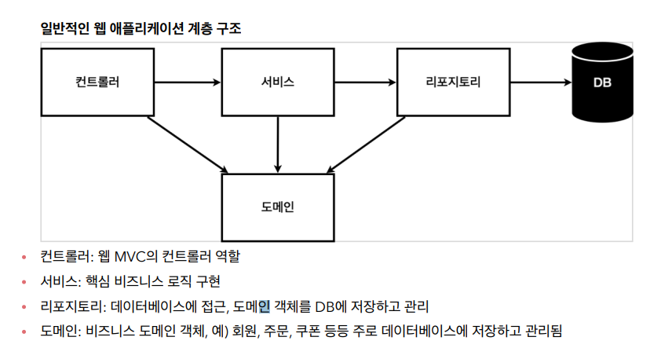
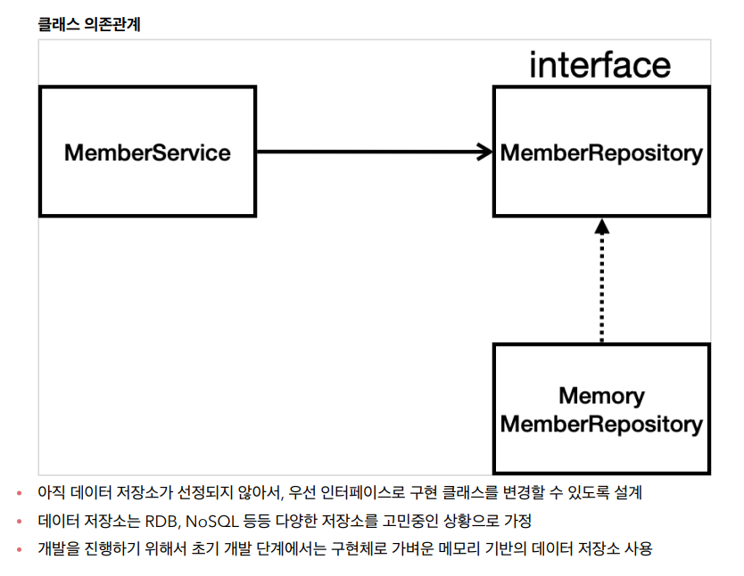

[TIL on March 20th, 2023](../../TIL/2023/03/03-20-2023.md)
## 섹션 3. 회원 관리 예제 - 백엔드 개발
* 목차
  - 비즈니스 요구사항 정리
  - 회원 도메인과 리포지토리 만들기
  - 회원 리포지토리 테스트 케이스 작성
  - 회원 서비스 개발
  - 회원 서비스 테스트

### 비즈니스 요구사항 정리
* 데이터: 회원ID, 이름
* 기능: 회원 등록, 조회
* 아직 데이터 저장소가 선정되지 않음(가상의 시나리오): SQL을 사용할지 NoSQL을 사용할지 아직 정해지지 않은 상태라고 가정.



* 컨트롤러: 웹 MVC의 컨트롤러 역할
* 서비스: 핵심 비즈니스 로직 구현 / 회원의 중복 가입을 방지하는 등
  - 비즈니스 도메인 객체를 가지고 핵심 비즈니스 로직을 구현한 계층이라 이해하면 됨.
* 리포지토리: 데이터베이스에 접근, 도메인 객체를 DB에 저장하고 관리
* 도메인: 비즈니스 도메인 객체, 예) 회원, 주문, 쿠폰 등등 주로 데이터베이스에 저장하고 관리됨


* 아직 데이터 저장소가 선정되지 않아서, 우선 인터페이스로 구현 클래스를 변경할 수 있도록 설계
* 데이터 저장소는 RDB, NoSQL 등등 다양한 저장소를 고민중인 상황으로 가정
* 개발을 진행하기 위해서 초기 개발 단계에서는 구현체로 가벼운 메모리 기반의 데이터 저장소 사용

* 일단 개발은 해야하니, 

* repository 로직
  - Optional이라는 java 8 기능을 활용함. 찾은 값이 null일 수 있는데, 이때 null을 

```java
package hello.hello.repository;

import hello.hello.domain.Member;

import java.util.List;
import java.util.Optional;

public interface MemberRepository {
    Member save(Member member);
    Optional<Member> findById(Long id);
    Optional<Member> findByName(String name);
    List<Member> findAll();
}
```

* 위에서 미리 구현한 인터페이스를 아래 class로 구현할 수 있음.
```java
package hello.hello.repository;

import hello.hello.domain.Member;

import java.util.*;

public class MemoryMemberRepository implements MemberRepository {

    private static Map<Long, Member> store = new HashMap<>();
    private static long sequence = 0L;

    @Override
    public Member save(Member member) {
        member.setId(++sequence);
        store.put(member.getId(), member);
        return member;
    }

    @Override
    public Optional<Member> findById(Long id) {
        return Optional.ofNullable(store.get(id));
    }

    // 루프를 돌면서, 같은 값을 하나라도 찾게 되면 반환하는 로직.
    @Override
    public Optional<Member> findByName(String name) {
        return store.values().stream()
                .filter(member -> member.getName().equals(name))
                .findAny();
    }

    @Override
    public List<Member> findAll() {
        return new ArrayList<>(store.values());
    }
}

```
  - `alt + shift + enter`를 통해 `select methods to implement` 선택창을 띄울 수 있음(왠지 모르겠는데 됐다 안 됐다 그럼).
  - 위 코드는 메모리 상에 `Map<Long, Member>` 형태로 회원 정보를 저장하는 방식을 구현함.
  - 이제 이에 대한 테스트 케이스를 작성함으로써 검증이 가능함.