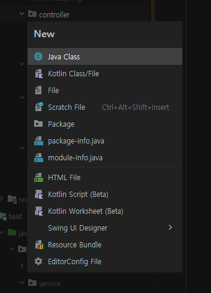

[TIL on March 21st, 2023](../../TIL/2023/03/03-21-2023.md)
## 섹션 4. 스프링 빈과 의존관계
* 강의 자료 27페이지부터

### 컴포넌트 스캔과 자동 의존관계 설정
* Controller와 View Template의 연결을 수행하고자 함.
* member controller가 member service를 통해서 member 정보를 조회할 수 있어야 함.
  - 이런 경우 member controller가 의존성을 갖는다고 함.

* Alt + Insert를 통해서 새로운 파일들을 만들 수 있음.


```java
package hello.hellospring.controller;
import org.springframework.stereotype.Controller;

@Controller
public class MemberController {

}
```
* 위 같은 코드로 어노테이션 컨트롤러(annotation controller)를 만들어 두기만 하면 `MemberController` 객체를 생성해서 스프링 내부 컨테이너에 넣어준다.
  - 스프링 '컨테이너'에서 스프링 '빈(Bean, 콩)'이 관리된다고 표현함.


* 어노테이션 서비스: `@Service`
  - 스프링 컨테이너로 관리해야 하는 대상이라 지정해주는 태그.
  - 원래는 인식할 수 없는 단순한 코드였지만, @Service를 넣으면 class가 스프링 컨테이너의 관리 대상이 됨.

* 어노테이션 리포지토리: `@Repository`

* 정형화된 패턴임
  - 컨트롤러 통해서 외부 요청을 받음
  - 서비스에서 비즈니스 로직을 만듦
  - 리포지토리에서 데이터를 저장

* 어노테이션 오토 와이어드: `@Autowired`, 생성자에 걸어두면 필요한 인자를 스프링 컨테이너에서 확인 후 주입해줌.

* 이런 작업을 의존성 주입이라 하며, 스프링이 처리해준다.

* Ctrl + N: go to class


#### 스프링 빈을 등록하는 2가지 방법
1. 컴포넌트 스캔과 자동 의존관계 설정
  - 어노테이션을 작성해서 빈에 등록해둔 우리가 활용한 방법이 이 방법임. `@Service`에 들어가보면 `@Component` 어노테이션이 걸려있음을 확인할 수 있다.
  - `@Service`: 이 어노테이션은 컴포넌트의 특별 케이스다.
  - `@Controller, @Repository` 다 마찬가지다.
  - `@Autowired`는 상호 어노테이션이 걸려있는 클래스 사이를 연결해준다.
  - 스프링 빈으로 활용하는 경우의 장점은 나중에 설명할 것.
  - 만약에 예약어가 아닌 패키지에 클래스를 구현한 경우엔 스프링의 컴포넌트 스캔 대상이 아니라 자동 등록이 안 될 수 있음.

* 참고: 스프링은 스프링 컨테이너에 스프링 빈을 등록할 때, 기본으로 싱글톤으로 등록한다(유일하게 하나만
등록해서 공유한다) 따라서 같은 스프링 빈이면 모두 같은 인스턴스다. 설정으로 싱글톤이 아니게 설정할 수
있지만, 특별한 경우를 제외하면 대부분 싱글톤을 사용한다.
  - 이 특성을 유지하기 위해서 테스트 할 때도 이를 활용했었음.

2. 자바 코드로 직접 스프링 빈 등록하기
  - 지금까지 어노테이션으로 자동 연결을 수행했는데, 이제는 자바 코드로 하나씩 직접 스프링 빈에 등록하고자 함.
  - 이는 설정 파일에서 수행하는 것.


* Member controller에는 어쩔 수 없이 `@Controller`가 들어가야 함. 그리고, memberService를 의존성 주입에 의해 주입하도록 설정.
```java
package hello.hellospring.controller;

import hello.hellospring.service.MemberService;
import org.springframework.beans.factory.annotation.Autowired;
import org.springframework.stereotype.Controller;

@Controller
public class MemberController {

    private final MemberService memberService;

    @Autowired
    public MemberController(MemberService memberService) {
        this.memberService = memberService;
    }
}

```

* 나머지와 연결시키기 위한 SpringConfig 클래스는 아래와 같이 작성됨.
```java
package hello.hellospring;

import hello.hellospring.repository.MemberRepository;
import hello.hellospring.repository.MemoryMemberRepository;
import hello.hellospring.service.MemberService;
import org.springframework.context.annotation.Bean;
import org.springframework.context.annotation.Configuration;

@Configuration
public class SpringConfig {

    @Bean
    public MemberService memberService() {
        return new MemberService(memberRepository());
    }

    @Bean
    public MemberRepository memberRepository() {
        return new MemoryMemberRepository();
    }
}
```
  - XML로 설정할 수 있으나, 이에 대한 설명은 생략함.
  - DI에는 필드 주입, setter 주입, 생성자 주입 이렇게 3가지 방법이 있다.
    1. 필드 주입: `@Autowired private MemberService memberService;`로 선언. 필드 주입 시에는 중간에 바꿀 수 있는 방법이 아예 없다고 함.
    2. setter 주입: 아래와 같은 형식으로 세터를 설정할 수 있음. 다만, setter 메서드가 퍼블릭으로 열리기 때문에 다른 데서 접근이 가능해져버린다. 개발은 호출되면 안 되는 메서드가 호출되지 않도록 잘 닫아야 한다.

```java
    private MemberService memberService;

    @Autowired
    public void setMemberService(MemberService memberService) {
        this.memberService = memberService;
    }
```
    3. 생성자 주입: 우리가 처음에 해본 방식. 의존관계가 실행 중에 동적으로 변하는 경우가 없기 때문에 생성자 주입을 권장함. 구조가 바뀔 경우에는 실행 중에 바뀌는 것이 아니라, 실행을 멈추고 새로 빌드한 파일을 올릴 때나 일어난다고 함.

* 정형화된 패턴에 활용되는 컨트롤러, 서비스, 리포지토리 같은 코드는 컴포넌트 스캔을 활용하는 게 매우 편리하다.
* 현 시나리오 상, MemoryMemberRepository를 DB로 깔끔하게 바꾸기 위해서는 config 파일을 통해 스프링 빈을 등록 및 관리하는 것이 좋다.
* 컴포넌트 스캔의 경우 구현 클래스를 변경할 때 여러 코드를 바꿔야 한다는 걸 인지할 것.

* 스프링 빈으로 등록이 안 된 클래스는 내부 메서드에 관련된 어노테이션이 있더라도 스프링이 관리하지 않는다. 인식할 수 없다.

* 스프링 컨테이너, DI 관련된 자세한 내용 역시 배워둬야 할 듯. 이는 스프링 핵심 원리 강의에서 설명한다 함.

___

* 완강일: 2023년 3월 22일