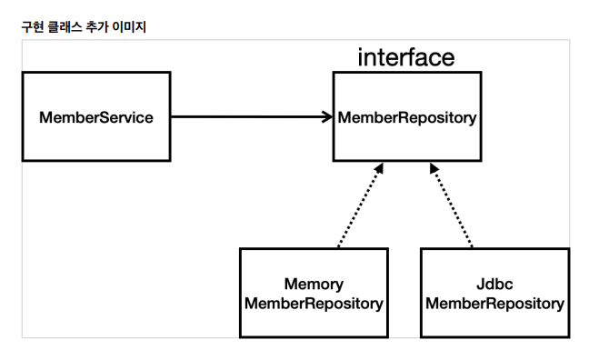
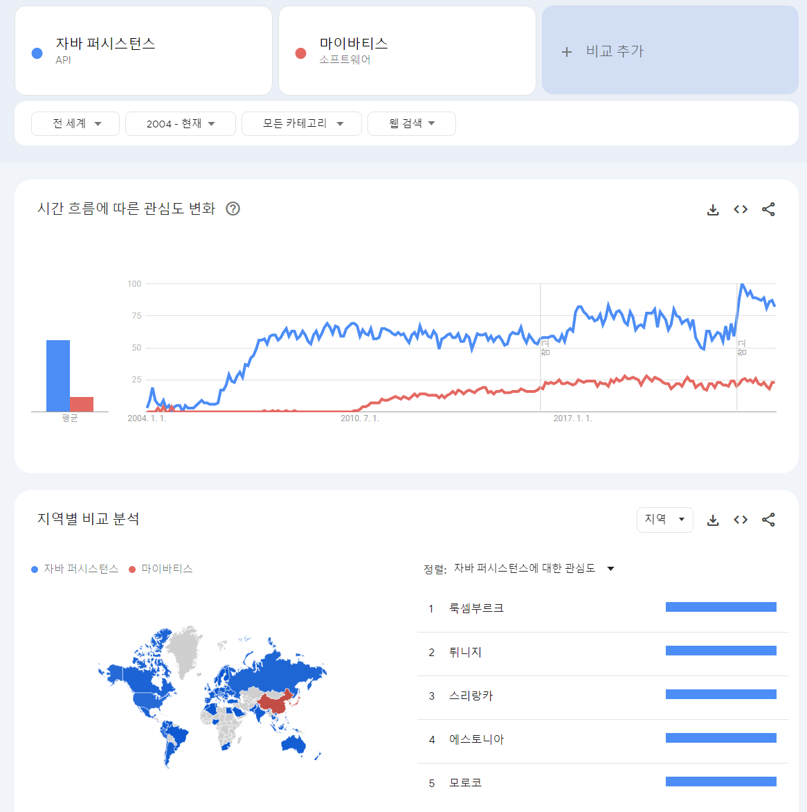
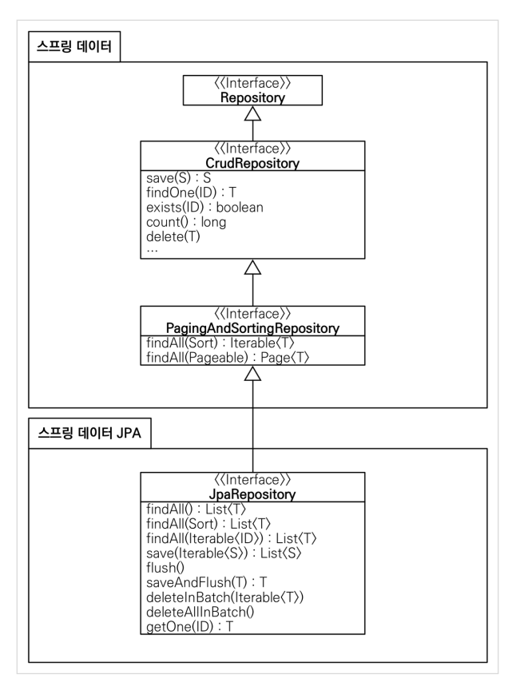

[TIL on March 22nd, 2023](../../TIL/2023/03/03-21-2023.md)
## 섹션 6. 스프링 DB 접근 기술
* 개요
- '순수 JDBC'부터 시작해 발전하는 과정을 따라가는 것이라 이해하면 됨.
- 메모리에서 시작해서 한 단계씩 진화하는 과정을 보여주고자 함.
<br>

### H2 데이터베이스 설치
* DB는 보통 mySQL이나 NoSQL을 활용.
* JDCB URL을 `jdbc:h2:tcp://localhost/~/test`로 설정함. 이를 통해서 파일에 직접 접근하는 방식이 아니라, 소켓을 통해 접근하는 방식으로 수정해야 오류가 발생하지 않음.

```sql
drop table if exists member CASCADE;
create table member
(
    id bigint generated by default as identity,
    name varchar(255),
    primary key (id)
);
```

* DB에서는 long 타입이 bigint 타입임.
* `generated by default as identity`를 설정하면 이 값이 비어있는 경우 DB가 자동으로 할당해줌.
* `insert into member(name) values('spring')` 명령을 통해 이름이 spring인 데이터를 저장할 수 있음.
* 이 과정은 H2의 웹 콘솔을 통한 제어임. 다음부터는 우리가 만들어 둔 어플리케이션을 제어해서 직접 DB를 제어하고자 함.
<br>


### 순수 JDBC
* 옛날에는 이렇게 작업했었다는 수준으로 이해하면 된다. *편하게 들어라.*
* `build.gradle`에 의존성 추가
```
dependencies {
	implementation 'org.springframework.boot:spring-boot-starter-thymeleaf'
	implementation 'org.springframework.boot:spring-boot-starter-web'

	implementation 'org.springframework.boot:spring-boot-starter-jdbc' // added
	runtimeOnly 'com.h2database:h2' // added

	testImplementation 'org.springframework.boot:spring-boot-starter-test'
}
```
* `src/main/resources` 안에 있는 `application.properties`에 아래와 같은 내용을 입력함.
```
spring.datasource.url=jdbc:h2:tcp://localhost/~/test
spring.datasource.driver-class-name=org.h2.Driver
```
  - 이를 통해 소스의 위치를 알려주고 이를 h2로 구동시킴. h2.Driver를 인식하지 못하는 경우 build.gradle을 갱신해주면 됨.

* 이렇게 설정해주고 나면 spring이 알아서 DB와 연결해줌.
* 이후 명령이 복잡함.
  - 쿼리할 것에 대해 `String sql = "insert into member(name) values(?)";` 형식으로 작성함.
  - conn으로 connection을 받고, pstmt에 PreparedStatement를 받음. 이후 pstmt를 setString 한 뒤 executeUpdate 수행.
  - 생성된 키를 rs로 받고, 확인 작업. 조회 실패 시 SQLException을 던짐. 이 모든 과정에 대해 try-catch로 잡아주고 finally로는 connection을 끊어줘야 함.

```java
    @Override
    public Member save(Member member) {
        String sql = "insert into member(name) values(?)";
        Connection conn = null;
        PreparedStatement pstmt = null;
        ResultSet rs = null;
        try {
            conn = getConnection();
            pstmt = conn.prepareStatement(sql,
                    Statement.RETURN_GENERATED_KEYS);
            pstmt.setString(1, member.getName());
            pstmt.executeUpdate();
            rs = pstmt.getGeneratedKeys();
            if (rs.next()) {
                member.setId(rs.getLong(1));
            } else {
                throw new SQLException("id 조회 실패");
            }
            return member;
        } catch (Exception e) {
            throw new IllegalStateException(e);
        } finally {
            close(conn, pstmt, rs);
        }
    }
```
* 커넥션은 아래와 같이 스프링을 통해 수행하는 게 좋다. 매번 새로운 연결을 수행하는 게 좋지 않다고 함.
```java
    private Connection getConnection() {
        return DataSourceUtils.getConnection(dataSource);
    }
```

* 이후 SpringConfig 클래스에 구현체를 바꿔치기 함.
```java
    private final DataSource dataSource;

    @Autowired
    public SpringConfig(DataSource dataSource) {
        this.dataSource = dataSource;
    }
```
```java
    @Bean
    public MemberRepository memberRepository() {
        // return new MemoryMemberRepository();
        return new JdbcMemberRepository(dataSource);
    }
```

* 요점: 스프링을 왜 쓰는가?
  - 객체 지향적 설계의 장점, 다형성 활용.
  - 스프링 컨테이너가 이를 지원한다.



* 인터페이스는 그대로 활용하고 구현체만 바뀌어서 넘어간다.
* 개방-폐쇄 원칙(OCP, Open-Closed Principle)
  - 확장에는 열려있고, 수정에는 닫혀있다.
  - 수정 또는 변경이라 함. 그런데, 수정을 해야 확장을 할 것 아닌가?
* 기존 코드를 전혀 손대지 않고, 설정만으로 구현 클래스를 변경할 수 있다.

* 이것이 객체 지향의 가장 큰 장점이라 설명함.
<br>

### 스프링 통합 테스트
* DB까지 연결해 수행하는 통합 테스트를 할 것.
* 지금까지 작성한 테스트들은 순수한 자바 코드에 대한 테스트였음.
  - 이제부터 스프링과 엮어서 테스트하는 방식을 배울 것.

* 일단은 어떤 테스트가 이루어지는지만 배워두자.

* `@SpringBootTest`와 `@Transactional`을 어노테이션으로 걸어야 한다.
  - class 바깥에 적어둬야 함.
* Test는 내가 필요한 것을 주입하고 시험해보면 끝남.
* 이전에 메모리 상에서 테스트용 데이터를 지워주는 로직을 썼었는데, `@Transactional` 덕분에 그런 작업이 필요가 없어짐.

* 테스트는 시험용 데이터베이스 또는 로컬 PC 안에 있는 데이터베이스에서 수행해야 함.

* 테스트는 반복할 수 있어야 한다. 그러나, 데이터베이스에 특정 데이터를 추가하는 테스트를 수행한다고 하면, 이를 반복해서 수행헀을 때 결과가 달라질 수가 있음.
  - 이를테면, 지금처럼 중복 가입을 막은 경우에, 테스트를 여러 번 수행하면 이미 있던 데이터로 재가입을 시도하려는 로직이 되고, 이에 따라 가입에 실패하게 됨.

* 이럴 경우 beforeEach, afterEach로 DB를 정리해도 됨. 그러나, 데이터베이스는 트랜잭션이라는 게 있음. commit을 하기 전엔 데이터가 확정되지 않음. 따라서 작업을 모두 해놓고 commit을 하지 않으면 저절로 롤백됨.
  - 변경사항을 반영하지 않도록 제어할 수 있게 된다.

* 강의 노트에서 발췌(p.47)
  - `@SpringBootTest`: 스프링 컨테이너와 테스트를 함께 실행한다.
  - `@Transactional`: 테스트 케이스에 이 애노테이션이 있으면, 테스트 시작 전에 트랜잭션을 시작하고,
테스트 완료 후에 항상 롤백한다. 이렇게 하면 DB에 데이터가 남지 않으므로 다음 테스트에 영향을 주지
않는다.

* 순수하게 자바 코드로 된 부분에 대한 테스트를 '유닛 테스트'라고 함. 이에 반대되는 개념이 '통합 테스트'임. 자바 스프링과 DB까지 모두 연동돼서 수행하는 테스트를 '통합 테스트'라고 지칭하는 것.

* 단위 테스트가 좋은 테스트다. 이처럼 잘 나눠서 수행하는 테스트가 좋은 테스트일 수 있다.
  - 통합 테스트가 필요하긴 하다. 그렇지만 그럴 필요가 없는 부분에서 고도화된 테스트를 수행하면 자원 낭비라고 말하고 싶으신 듯.
<br>

### 스프링 JdbcTemplate
* 실무에서도 많이 쓰이는 방식
  - 주입은 아래와 같이 수행한다.
  - 생성자를 만드는데, DataSource를 주입시킴.
```java
    private final JdbcTemplate jdbcTemplate;

    @Autowired
    public JdbcTemplateMemberRepository(DataSource dataSource) {
        jdbcTemplate = new JdbcTemplate(dataSource);
    }
```
* 생성자가 하나인 경우에는 `@Autowired`를 생략할 수 있다.

* Jdbc의 더럽고 복잡한 부분을 간략화한 게 아래 결과라 이해하면 됨.
```java
    @Override
    public Optional<Member> findById(Long id) {
        List<Member> result = jdbcTemplate.query("select * from member where id = ?", memberRowMapper());
        return result.stream().findAny();
    }
```
```java
    private RowMapper<Member> memberRowMapper() {
        return (rs, rowNum) -> {
            Member member = new Member();
            member.setId(rs.getLong("id"));
            member.setName(rs.getString("name"));
            return member;
        };
    }
```
* RowMapper를 위같이 작성해두긴 해야 함.
  - RowMapper가 열을 매핑하는 역할.
  - rs: resultSet, rowNum: 열 번호


* template인 이유: 템플릿-메서드 패턴이라는 디자인 패턴에서 차용한 것으로 이해됨.
* save 기능은 아래와 같이 구현된다.

```java
    @Override
    public Member save(Member member) {
        SimpleJdbcInsert jdbcInsert = new SimpleJdbcInsert(jdbcTemplate);
        jdbcInsert.withTableName("member").usingGeneratedKeyColumns("id");

        Map<String, Object> parameters = new HashMap<>();
        parameters.put("name", member.getName());
        
        Number key = jdbcInsert.executeAndReturnKey(new MapSqlParameterSource(parameters));
        member.setId(key.longValue());
        return member;
    }
```
* SimpleJdbcInsert
  - `jdbcInsert.withTableName("member").usingGeneratedKeyColumns("id");`로 설정하면 쿼리를 짤 필요가 없다. 테이블 명과 primary key가 있으면 바로 insert할 수 있음. 이후 추가 작업을 위해서 parameters라는 이름의 Map 인터페이스를 구현함.
  - 이를 MapSqlParameterSource의 인자로 전달해 인스턴스를 생성하고, jdbcInsert의 executeAndReturnKey 메서드를 통해 map 형태의 인자를 입력하고 key 값을 돌려받을 수 있음. 이 돌려 받은 키를 member의 Id로 설정한 뒤에 member를 반환.
  - 다만, 이 save가 member를 반환할 필요가 있는지, 어떻게 활용되는지 알 필요가 있을 듯함.
<br>

### JPA | 자바 퍼시스턴스 API
* 위의 jdbcTemplate의 경우에는 SQL을 사용자가 직접 작성할 필요가 있었음. 그러나 JPA를 도입하게 되면 이를 완전히 대체해준다.
* 단순히 SQL을 만들어주는 것을 넘어서서 SQL 보다 객체 중심의 설계를 가능하게 도와줌. 이러한 패러다임 전환이 가능함.


* 전세계적으로 볼 때, JPA의 활용도가 훨씬 높음. 다만, 우리나라에서 초기에 도입됐을 때 관성에 의해 아직도 마이바티스를 많이 활용하고 있는 것으로 나타나는 듯함.

* Spring framework는 엄청나게 큰 기술이다. JPA도 스프링만큼 기술적인 넓이와 깊이가 있는 기술이다.

* build.gradle에 아래와 같은 의존성을 추가하자.
```
implementation 'org.springframework.boot:spring-boot-starter-data-jpa'
```

* application properties에는 아래와 같이 설정하자.
```
spring.jpa.show-sql=true
spring.jpa.hibernate.ddl-auto=none
```

* JPA란 인터페이스다. 구현체로 hibernate나 eclipse 등이 있는 것. 여기서는 hibernate를 쓴다.
  - JPA는 자바 진영의 표준 인터페이스임.

* ORM: Object Relational-database Mapping, 객체와 관계형 데이터베이스를 매핑한다는 의미. 이를 어노테이션으로 수행한다.
  - 이 매핑을 관리할 도메인에 설정하는 것. 그 구현은 아래와 같음.

* Identity 전략: DB에서 아이디를 자동으로 생성해서 관리하는 방식이라 생각하면 될 듯.
  - 오라클 같은 경우엔 sequence라고 하기도 함.

```java
package hello.hellospring.domain;

import javax.persistence.Entity;
import javax.persistence.GeneratedValue;
import javax.persistence.GenerationType;
import javax.persistence.Id;

@Entity
public class Member {

    @Id @GeneratedValue(strategy = GenerationType.IDENTITY)
    private Long id;

    private String name;

    public Long getId() {
        return id;
    }

    public void setId(Long id) {
        this.id = id;
    }

    public String getName() {
        return name;
    }

    public void setName(String name) {
        this.name = name;
    }
}
```

* 이후 이 도메인을 가지고 Repository를 구현하기 시작함. `JpaMemberRepository` 클래스를 구현한다고 하자.

* `private final EntityManager em;`
  - build.gradle에 data-jpa를 설정해둬서 스프링 부트가 자동으로 EntityManager라는 것을 생성해준다.
  - 우리는 이 만들어진 것을 주입 받으면 된다. DB랑 통신하는 등의 일을 엔티티매니저가 처리해준다.

```java
    private final EntityManager em;

    public JpaMemberRepository(EntityManager em) {
        this.em = em;
    }
```

* save 메서드 구현은 아래와 같다.
  - persist를 하면 DB에 넣고, member의 id까지 세팅해준다고 함.

```java
    @Override
    public Member save(Member member) {
        em.persist(member);
        return member;
    }
```

* Primary key로 찾는 경우 아래와 같이 구현함.
  - em의 find 메서드를 활용하는데, Member 클래스의 리터럴과 찾고자 하는 단서인 id를 인자로 전달.
  - find의 경우 null일 수 있기 때문에, Optional.ofNullable로 한 번 감싸서 처리한다.

```java
    @Override
    public Optional<Member> findById(Long id) {
        Member foundMember = em.find(Member.class, id);
        return Optional.ofNullable(foundMember);
    }
```

* findAll() 메서드는 아래와 같이 구현된다.
  - 원래는 SQL 쿼리를 테이블 대상으로 던지는데, 그렇지 않고 엔티티(객체)를 대상으로 쿼리를 날리는 것.
  - 보통 SQL은 테이블의 column에 대해 select를 수행해야 하는데, 여기선 select m 하나로 끝난다.
```java
    @Override
    public List<Member> findAll() {
        return em.createQuery("select m from Member m", Member.class)
                .getResultList();
    }
```

* Introduce variable (Ctrl + Alt + V)은 내가 대신해서 변수를 도입시킬 라인 전체를 블록 지정해 선택한 후 수행해야 한다.

* findByName은 아래와 같이 구현한다.
  - 선택할 객체 m (Member 타입)의 name 프로퍼티가 :name인 m을 선택하는 것. 
  - setParameter를 할 때 첫 번째 인자 `"name"`와 두 번째 인자 `name`의 차이를 알 수가 없음. 툴에 대한 이해 없이 쓰려고 하다보면 이런 문제가 꼭 발생함.
  - 다시 한 번 상기하자면 findAny 자체가 Optional임.

```java
    @Override
    public Optional<Member> findByName(String name) {
        List<Member> result = em.createQuery("select m from Member m where m.name = :name", Member.class)
                .setParameter("name", name)
                .getResultList();

        return result.stream().findAny();
    }
```

* 스프링 데이터 JPA를 통해서 쿼리 자체를 완전히 배제시킬 수 있다.

* 주의사항: 서비스 계층에도 트랜잭션이 들어가야 한다. JPA는 모든 데이터 변경이 트랜잭션 안에서 수행되어야 한다고 설명함.

* 이를 활용하기 위한 SpringConfig 파일 변경 사항은 아래와 같음.
  - SpringConfig에서 JpaMemberRepository 인스턴스를 생성하며, 이때 em을 주입함.
  - JpaMemberRepository 클래스에서는 엔티티매니저를 받는 것으로 생성자를 세팅한 상태임.
```java

@Configuration
public class SpringConfig {

    private EntityManager em; // 엔티티 매니저 em 생성

    // Autowired 어노테이션과 함께 SpringConfig 생성자에 em을 주입하는 식으로 작성.
    // 이건 SpringConfig 클래스에 대한 것이니 생성자도 SpringConfig(param)
    @Autowired
    public SpringConfig(EntityManager em) {
        this.em = em;
    }


    @Bean
    public MemberService memberService() {
        return new MemberService(memberRepository());
    }

    @Bean
    public MemberRepository memberRepository() {
        return new JpaMemberRepository(em); // 
    }
}
```

<br>

### 스프링 데이터 JPA
* JPA를 스프링으로 한 번 감싼 것.
  - 스프링 부트와 JPA만 사용해도 개발 생산성이 대폭 향상됨. 또, 구현해야하는 코드 양도 확연히 줄어듦.
  - 여기에 스프링 데이터 JPA를 사용하면, 리포지토리에 구현 클래스 없이 인터페이스 만으로 개발을 완료할 수 있다고 함.
  - 스프링 부트와 JPA 기반 위에 '스프링 데이터 JPA'라는 프레임 워크를 씌우는 것.
* 관계형 데이터베이스를 사용하는 경우 스프링 데이터 JPA가 필수적이다-라고 함.

* JPA를 먼저 익힌 뒤에 활용해야 한다.
  - JPA에서 설정해둔 것을 그대로 활용할 수 있다.

* `SpringDataJpaMemberRepository.java`에는 아래와 같이 구현한다.
```java
package hello.hellospring.repository;

import hello.hellospring.domain.Member;
import org.springframework.data.jpa.repository.JpaRepository;

import java.util.Optional;

public interface SpringDataJpaMemberRepository extends JpaRepository<Member, Long>, MemberRepository {

    @Override
    Optional<Member> findByName(String name);
}
```
* '인터페이스를 만들어서' `extends JpaRepository`를 설정해두면; 스프링 부트가 인식해서 구현체를 자동으로 만들어준다고 함.
* 엔티티 매니저 관련 로직이 없어지기 때문에 이를 조정해야 함. 또한 `memberRepository`의 생성자를 불렀던 걸 `memberRepository`만 호출하는 식으로 `memberService`를 바꿔야 함. `SpringConfig` 파일에서 수정된 코드는 아래와 같음.
```java
    @Bean
    public MemberService memberService() {
        return new MemberService(memberRepository);
    }
```

.

* `JpaRepository` 안에 기본적인 메서드들이 제공됨. 이 메서드들과 이름을 일치시키면서 작업하는 것도 중요할 듯함.
  - 기본적 CRUD를 비롯한 메서드들이 다 갖춰져있다. 그래도 만들지 못하는 것들이 있긴 하다.

* findByEmail, findByName과 같은 비즈니스별로 다른 로직들은 당연히 공통으로 만들 수가 없다. 다만 findByName이라고 메서드 이름을 지어두면 프레임워크의 규칙에 따라 아래와 같은 쿼리를 만들어 준다.
```java
    @Override
    Optional<Member> findByName(String name);
    Optional<Member> findByNameAndId(String name, Long id);
```
```SQL
-- JPQL
select m from Member m where m.name = ?
select m from Member m where m.name AND m.id = ?
```

* 실무에서는 JPA와 스프링 데이터 JPA를 기본으로 사용하고, 복잡한 동적 쿼리는 Querydsl이라는 라이브러리를 사용한다.
* 또다른 옵션으로: JPA에서 제공하는 네이티브 쿼리도 사용하거나, 앞서 학습한 스프링 JdbcTemplate를 활용한다.