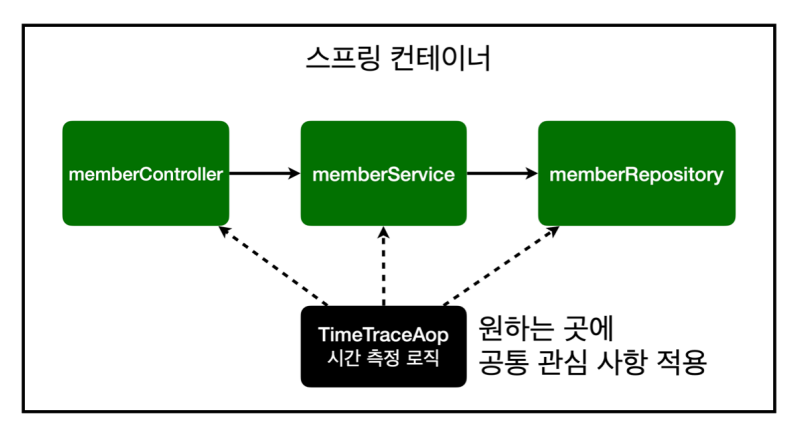

[TIL on April 6th, 2023](../../TIL/2023/04/04-06-2023.md)
## 섹션 7. AOP
### AOP가 필요한 상황
* 모든 메소드의 호출 시간을 측정하고 싶다면?
  - 시간 측정 로직을 모든 메소드에 넣어둘 순 없지 않나.
  - 만약 메소드가 1000개 있다고 하자. 이에 대한 로직 시작 시각과 로직 마치는 시각을 잡아놓고 초 단위로 계산하게 했다. 이미 여기까지 하는 것도 끔찍한데, 여기에다 갑자기 ms 단위로 바꾸자고 하면... 디지털 노가다 그 자체일 것이다.

* 아래와 같이 join 메소드에 시간 측정 로직을 추가한다고 하자.
```java
    public Long join(Member member) {

        long start = System.currentTimeMillis();
        try {
            validateDuplicateMember(member); // 중복 회원 검증
            memberRepository.save(member);
            return member.getId();
        } finally {
            long finish = System.currentTimeMillis();
            long timeMs = finish - start;
            System.out.println("join = " + timeMs + "ms");
        }
    }
```
  - 이를 통해서 테스트했을 때, join 로직을 수행하는 데 2ms가 걸린다고 확인이 되었음.
  - 이런 로직을 메소드 마다 적용한다 생각하면 끔찍한 일임.

* 공통 관심 사항(cross-cutting concern) vs 핵심 관심 사항(core concern)
  - 이같이 구현하는 것은 아래 문제들을 내포한다.
    - 회원가입, 회원 조회에 시간을 측정하는 기능은 핵심 관심 사항이 아니다.
    - 시간을 측정하는 로직은 공통 관심 사항이다.
    - 시간을 측정하는 로직과 핵심 비즈니스의 로직이 섞여서 유지보수가 어렵다(끔찍함).
    - 시간을 측정하는 로직을 별도의 공통 로직으로 만들기 매우 어렵다.
    - 시간을 측정하는 로직을 변경할 때 모든 로직을 찾아가면서 변경해야 한다.
* 이런 끔찍한 반복 작업을 덜어줄 것이 바로 AOP이다.
<br>

### AOP 적용
* AOP란?: Aspect-oriented programming, 관점 지향 프로그래밍
* 공통 관심 사항과 핵심 관심 사항을 분리하는 것.
* 


* 스프링은 이를 잘 적용할 수 있게 지원한다. 어노테이션 `@Aspect`를 통해 이 AOP를 활용할 수 있다.
  - hello.hellospring의 하위 패키지인 aop에 아래와 같은 코드를 작성함.
```java
package hello.hellospring.aop;

import org.aspectj.lang.ProceedingJoinPoint;
import org.aspectj.lang.annotation.Aspect;

@Aspect
public class TimeTraceAop {

    public Object execute(ProceedingJoinPoint joinPoint) throws Throwable {
        long start = System.currentTimeMillis();
        System.out.println("Start: " + joinPoint.toString());
        try {
            return joinPoint.proceed();
        } finally {
            long finish = System.currentTimeMillis();
            long timeMs = finish - start;
            System.out.println("End: " + joinPoint.toString() + " " + timeMs + "ms");
        }
    }
}
```
* SpringConfig 파일에는 아래와 같이 코드를 작성해서 AOP를 등록했다고 명시해줌.
```java
    @Bean
    public TimeTraceAop timeTraceAop() {
        return new TimeTraceAop();
    }
```

* SpringConfig에 두지 않고 컴포넌트 어노테이션을 활용해 TimeTraceAop를 스캔하도록 할 수도 있음.
  - 결국 누군가 SpringConfig 파일을 열어보면서 Bean으로 등록된 것들을 파악할 일이 있을 텐데, 그럴 경우에는 한 눈에 구조를 파악하기 위해선 위와 같이 구현하는 게 좋을 듯함.

* 여기서는 @Component로 구현하기로 함. 이를 위해 execute 메소드에 아래와 같은 Around 어노테이션이 들어가야 함. 그 이후에 붙는 인자는 매뉴얼 보면서 작성하면 어렵지 않다고 함.

```java
@Around("execution(* hello.hellospring..*(..))")
```

<br>