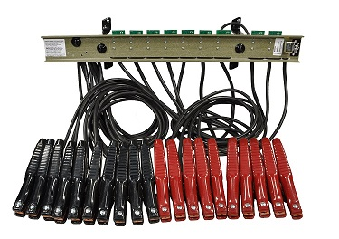

[TIL on June 9th, 2022](../TIL/2022/06/06-09-2022.md)
# **Memory address**

### Memory addresses
- Memory addresses are fixed-length sequences of digits conventionally displayed and manipulated as unsigned integers
- Computer programs use memory addresses to execute machine code, and to store and retrieve data
- In early computers logical and physical addresses corresponded, however, they are seperated in these days

#### Physical addresses
- The CPU (or other devices) can use the code to access the corresponding memory location
- Generally only system software* or some specialized utility programs (e.g., memory testers) address physical memory
  * System softwares like BIOS, OS and some specialized utility programs
- They address physical memory using machine code operands or processor registers, instructing the CPU to direct a hardware device, called the memory controller

#### Memory controllers
- Memory controllers manage the memory bus or system bus
- Also memory controllers separate control, address and data busses
- Memory controllers' bus consists of a number of parallel lines, each represented by a bit
- The width of the bus varies among computers

#### Logical addresses
- A computer program uses memory addresses to execute machine code, and to store and retrieve data.
- After the introduction of virtual memory, most application programs only address logical addresses using the computer's memory management unit and OS memory mapping

### Unit of address resolution
- Each address identifies a single byte (eight bits) of storage in these days
- Data larger than a single byte may be stored in a sequence of consecutive addresses
- The efficiency of addressing of memory depends on the bit size of the bus used for addresses
- The more bits are used for the bus, the more addresses are available to the computer

#### Example
- let's assume that a machine which could one byte (8 bits) with single memory address:
  * With a 20-bit address bus, this machine can address 2^20 (1,048,576) memory locations which is equal to 2^20 bytes of memory
- Likewise, a 32-bit bus (e.g. Intel 80386) addresses 2^32 locations which is equal to 4 GB of memory

 

### Appendix A-i. Bus (computing)
- In computer architecture, a bus (historically also called databus) is a communication system that transfers data between components inside a computer, or between computers
- Bus is now used for any physical arrangement that provides the same logical function as a parallel electrical busbar like the picture below:

### Appendix A-ii. Address bus
- An address bus is a bus used to specify a physical address
- When a processor needs to read or write to a memory location, it specifies that memory location on the address bus

___

### References
- [Wikipedia: Memory address](https://en.wikipedia.org/wiki/Memory_address)
- [Wikipedia: Bus (computing)](https://en.wikipedia.org/wiki/Bus_(computing))