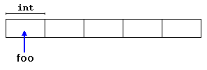

[TIL on September 13th, 2022](../../TIL/2022/09/09-13-2022.md)
# **Dynamic memory**

### Operators new and new[]
- Dynamic memory is allocated using operator `new`. `new` is followed by a data type specifier and, if a sequence of more than one element is required, the number of these within brackets `[]`. It returns a pointer to the beginning of the new block of memory allocated. Its syntax is:
```
pointer = new type
pointer = new type [number_of_elements]
```
- The first expression is used to allocate memory to contain one single element of type `type`. The second one is used to allocate a block (an array) of elements of type `type`, where `number_of_elements` is an integer value representing the amount of these. For example:
```cpp
int *foo;
foo = new int [5];
```
- In this case, the system dynamically allocates space for five elements of type int and returns a pointer to the first element of the sequence, which is assigned to foo (a pointer). Therefore, foo now points to a valid block of memory with space for five elements of type `int`.



- Here, `foo` is a pointer, and thus, the first element pointed to by foo can be accessed either with the expression `foo[0]` or the expression `*foo` (both are equivalent). Likewise, the *i*th element can be accessed either with `foo[i]` or `*(foo+i)`.

#### Dynamic allocation vs. normal declaration
- The size of a regular array needs to be a constant expression, and thus its size has to be determined at the moment of designing the program, before it is run
- Whereas the dynamic memory allocation performed by new allows to assign memory during runtime using any variable value as size

<br>

### Check if the allocation was successful
- The dynamic memory requested by our program is allocated by the system from the memory heap, however, computer memory can be exhausted
- Therefore, there are no guarantees that all requests to allocate memory using operator new are going to be granted by the system

- C++ provides two standard mechanisms to check if the allocation was successful:

#### Handling exceptions:
- Using this method, an exception of type bad_alloc is thrown when the allocation fails. Exceptions are a powerful C++ feature explained later in these tutorials. But for now, you should know that if this exception is thrown and it is not handled by a specific handler, the program execution is terminated.
- This exception method is the method used by default by new, and is the one used in a declaration like:
```cpp
foo = new int [5];  // if allocation fails, an exception is thrown  
```

#### `nothrow` method
- Then, what happens when it is used is that when a memory allocation fails, instead of throwing a `bad_alloc` exception or terminating the program, the pointer returned by `new` is a *null pointer*, and the program continues its execution normally.
- This method can be specified by using a special object called `nothrow`, declared in header `<new>`, as argument for new:
```cpp
foo = new (nothrow) int [5]; 
```

- In this case, if the allocation of this block of memory fails, the failure can be detected by checking if foo is a null pointer:
```cpp
int * foo;
foo = new (nothrow) int [5];
if (foo == nullptr) {
  // error assigning memory. Take measures.
}
```
- This `nothrow` method is likely to produce less efficient code than exceptions, since it implies explicitly checking the pointer value returned after each and every allocation. *Therefore, the exception mechanism is generally preferred*, at least for critical allocations. Still, most of the coming examples will use the nothrow mechanism due to its simplicity.
___

### References
- [Dynamic memory: cplusplus](https://cplusplus.com/doc/tutorial/dynamic/)