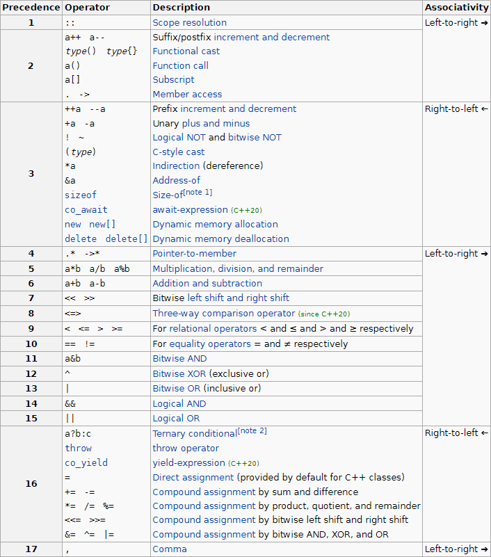

[TIL on July 12th, 2022](../../TIL/2022/07/07-12-2022.md)
# **Ternary Operator wsith `cout`**

### Source code
- [boj.kr/18258](../../Problem%20Solving/boj/Queue/18258-1-07-12-2022.cpp)

### Test case
```shell
$ 2
$ push 1
$ front
```

### Bug
```cpp
cout << q.empty() ? -1 : q.front() << '\n'; // result: $ 0 (cout << q.empty();)
```

### Reason: C++ operator precedence
- Operator precedence is unaffected by operator `overloading`
- For example, std::cout << a ? b : c; parses as (std::cout << a) ? b : c; because the precedence of arithmetic left shift is higher than the conditional operator

### Debugging
```cpp
cout << (q.empty() ? -1 : q.front()) << '\n'; // result: $ 1
```

### Table. C++ operator precedence


___

### References
1. [C++ Operator Precedence](https://en.cppreference.com/w/cpp/language/operator_precedence#:~:text=In%20C%2C%20the%20ternary%20conditional,or%20semantic%20constraints%20in%20C.)