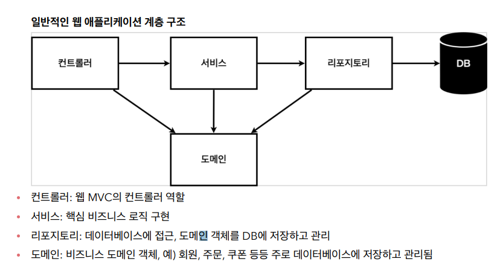
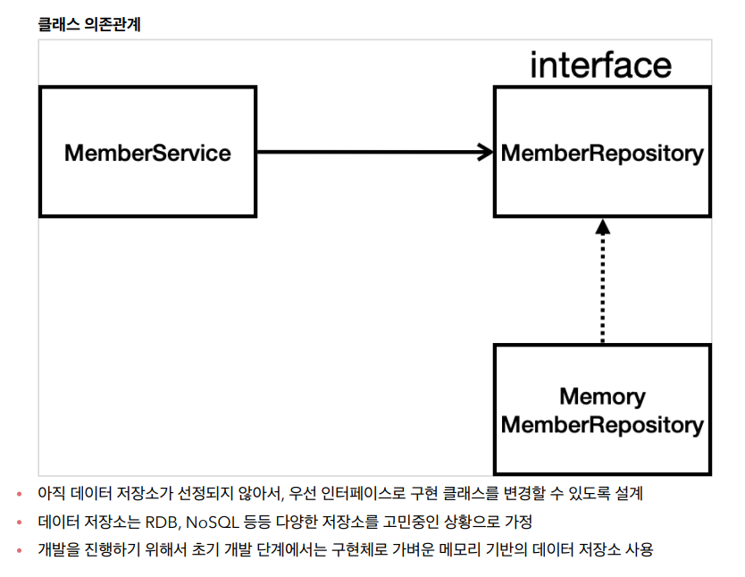

[TIL on March 20th, 2023](../../../TIL/2023/03/03-20-2023.md)
## 섹션 3. 회원 관리 예제 - 백엔드 개발
* 목차
  - 비즈니스 요구사항 정리
  - 회원 도메인과 리포지토리 만들기
  - 회원 리포지토리 테스트 케이스 작성
  - 회원 서비스 개발
  - 회원 서비스 테스트

### 비즈니스 요구사항 정리
* 데이터: 회원ID, 이름
* 기능: 회원 등록, 조회
* 아직 데이터 저장소가 선정되지 않음(가상의 시나리오): SQL을 사용할지 NoSQL을 사용할지 아직 정해지지 않은 상태라고 가정.



* 컨트롤러: 웹 MVC의 컨트롤러 역할
* 서비스: 핵심 비즈니스 로직 구현 / 회원의 중복 가입을 방지하는 등
  - 비즈니스 도메인 객체를 가지고 핵심 비즈니스 로직을 구현한 계층이라 이해하면 됨.
* 리포지토리: 데이터베이스에 접근, 도메인 객체를 DB에 저장하고 관리
* 도메인: 비즈니스 도메인 객체, 예) 회원, 주문, 쿠폰 등등 주로 데이터베이스에 저장하고 관리됨


* 아직 데이터 저장소가 선정되지 않아서, 우선 인터페이스로 구현 클래스를 변경할 수 있도록 설계
* 데이터 저장소는 RDB, NoSQL 등등 다양한 저장소를 고민중인 상황으로 가정
* 개발을 진행하기 위해서 초기 개발 단계에서는 구현체로 가벼운 메모리 기반의 데이터 저장소 사용

* 일단 개발은 해야하니, 

* repository 로직
  - Optional이라는 java 8 기능을 활용함. 찾은 값이 null일 수 있는데, 이때 null을 

```java
package hello.hello.repository;

import hello.hello.domain.Member;

import java.util.List;
import java.util.Optional;

public interface MemberRepository {
    Member save(Member member);
    Optional<Member> findById(Long id);
    Optional<Member> findByName(String name);
    List<Member> findAll();
}
```

* 위에서 미리 구현한 인터페이스를 아래 class로 구현할 수 있음.
```java
package hello.hello.repository;

import hello.hello.domain.Member;

import java.util.*;

public class MemoryMemberRepository implements MemberRepository {

    private static Map<Long, Member> store = new HashMap<>();
    private static long sequence = 0L;

    @Override
    public Member save(Member member) {
        member.setId(++sequence);
        store.put(member.getId(), member);
        return member;
    }

    @Override
    public Optional<Member> findById(Long id) {
        return Optional.ofNullable(store.get(id));
    }

    // 루프를 돌면서, 같은 값을 하나라도 찾게 되면 반환하는 로직.
    @Override
    public Optional<Member> findByName(String name) {
        return store.values().stream()
                .filter(member -> member.getName().equals(name))
                .findAny();
    }

    @Override
    public List<Member> findAll() {
        return new ArrayList<>(store.values());
    }
}

```
  - `alt + shift + enter`를 통해 `select methods to implement` 선택창을 띄울 수 있음(왠지 모르겠는데 됐다 안 됐다 그럼).
  - 위 코드는 메모리 상에 `Map<Long, Member>` 형태로 회원 정보를 저장하는 방식을 구현함.
  - 이제 이에 대한 테스트 케이스를 작성함으로써 검증이 가능함.


### 회원 리포지토리 테스트 케이스 작성
* `test/java/hello.hellospring/repository` 경로에 `HelloSpringApplicationTests` 클래스를 만듦

```java
package hello.hellospring.repository;

import hello.hellospring.domain.Member;
import org.junit.jupiter.api.Assertions;
import org.junit.jupiter.api.Test;

class MemoryMemberRepositoryTest {

    MemoryMemberRepository repository = new MemoryMemberRepository();

    @Test
    public void save() {
        Member member = new Member();
        member.setName("spring");

        repository.save(member);

        Member result = repository.findById(member.getId()).get();
        Assertions.assertEquals(member, result); // assertEquals(expected, actual)
    }
}
```
* 반환 값이 optional인데, 이 경우 get으로 값을 꺼내야 함.
  - 원칙대로면 isPresent()를 확인한 뒤에 가져오는 게 안전함.

* 아래 직접 콘솔에 띄우는 방식으로도 확인은 가능함.
  - `System.out.println("result = " + (result == member));`
  - 그러나 이를 assert를 활용해 체크하면 확인이 더 편함.

* `import org.assertj.core.api.Assertions;`에는 assertThat이라는 함수가 있음. 이를 활용하면 인자 순서를 기억할 필요 없이 다음과 같이 표현 가능
  - `Assertions.assertThat(member).isEqualTo(result);`
  - 이같이 표현하는 경우, member가 result와 같은지 확인한다는 의미로 자연스럽게 읽힘.

* 이것도 `import static org.assertj.core.api.Assertions.assertThat;` 명령을 통해 static method로써 assertThat을 가져오면 다음과 같이 축약해서 활용 가능.
  - `assertThat(member).isEqualTo(result);`

* 현재까지 테스트 코드를 아래와 같이 작성했다고 두자.
  - 테스트 코드 함수의 동작 순서는 우리가 제어할 수 없음. 따라서, 각 테스트가 개별적으로 온전하게 동작하도록 코딩해야 함.
```java
package hello.hellospring.repository;

import hello.hellospring.domain.Member;
import org.junit.jupiter.api.Test;

import java.util.List;

import static org.assertj.core.api.Assertions.assertThat;

class MemoryMemberRepositoryTest {

    MemoryMemberRepository repository = new MemoryMemberRepository();

    @Test
    public void save() {
        Member member = new Member();
        member.setName("spring");

        repository.save(member);
        Member result = repository.findById(member.getId()).get();
        assertThat(member).isEqualTo(result);
    }

    @Test
    public void findByName() {
        Member member1 = new Member();
        member1.setName("spring1");
        repository.save(member1);

        Member member2 = new Member();
        member2.setName("spring2");
        repository.save(member2);

        Member result = repository.findByName("spring1").get();

        assertThat(result).isEqualTo(member1);
    }

    @Test
    public void findAll() {
        Member member1 = new Member();
        member1.setName("spring1");
        repository.save(member1);

        Member member2 = new Member();
        member2.setName("spring2");
        repository.save(member2);

        List<Member> result = repository.findAll();

        assertThat(result.size()).isEqualTo(2);
    }
}
```

  - 따라서 위 코드에 afterEach라는 태그를 설정하고, 각 테스트 후에 남는 것 없이 정리하는 로직을 넣음.
  - afterEach와 그때 활용되는 clearStore 함수는 아래와 같이 정의됨.

```java
    @AfterEach
    public void afterEach() {
        repository.clearStore();
    }
```

```java
    public void clearStore() {
        store.clear();
    }
```

* 개발 후 테스트 케이스를 작성하는 게 이번에 수행한 방식이라면, 테스트 케이스를 먼저 작성한 후에 그에 맞는 개발을 하는 것이 TDD(테스트 주도 개발, Test Driven Development)이다.
  - 테스트 케이스가 많다면 gradlew 띄우고 테스트를 하거나 전체 테스트를 진행하도록 설정함.
<br>

### 회원 서비스 개발
* TIP: Ctrl + Alt + V, Introduce variable인데, `memberRepository.findByName(member.getName());`에다 적용하는 경우, `Optional<Member> byName = memberRepository.findByName(member.getName());`로 바꿔줌. 즉, 관용적으로 사용하는 적당한 이름으로 바꾸면서 이를 받아주는 변수를 도입하는 것.
  - command가 ctrl이고, option이 alt인 듯함. 사실 맥에서는 윈도우와 같은 위치에 컨트롤 키가 있음. 대신 윈도우 키에 커맨드 키가 있고, 알트 키 위치에 옵션 키가 있음.

* 중복 회원 가입을 막기 위한 코드 작성
```java
    public Long join(Member member) {
        // 같은 이름이 있는 중복 회원은 안 된다.
        Optional<Member> result = memberRepository.findByName(member.getName());
        result.ifPresent(m -> {
            throw new IllegalStateException("이미 존재하는 회원입니다.");
        });

        memberRepository.save(member);
        return member.getId();
    }
```
* 반환 값이 없을 수 있는 경우에는 Optional로 감싸주는 것이 좋다고 함. 이를 활용해 ifPresent를 써서 위와 같은 코드를 작성할 수 있음.
  - get을 직접 쓰는 경우는 많지 않고, orElseGet을 쓰기도 함.

* 일단 실무자 입장에서는 result로 Optional을 받고, 이에 대한 판단을 하는 것 자체가 별로 예쁘지 않다고 함. 그래서 권장하는 스타일로 작성하면 아래와 같이 됨.

```java
    public Long join(Member member) {
        // 같은 이름이 있는 중복 회원은 안 된다.
        memberRepository.findByName(member.getName())
                        .ifPresent(m -> {
                            throw new IllegalStateException("이미 존재하는 회원입니다.");
                        });

        memberRepository.save(member);
        return member.getId();
    }
```

* 변수를 딱히 설정할 필요가 없기 때문에 찾은 Optional 형식 데이터에 대해서 곧장 ifPresent를 수행하는 것.
  - refactor 단축키: Ctrl + Alt + Shift + T (⌃ + ⌥ + ⇧ + T)
  - Extract method: Ctrl + Alt + M (⌥⌘M)
* TIP: mac keys to win keys
  - mac의 키 중에 win와 위치가 일치하는 곳과 기능적으로 활용되는 의미를 짝지어 둔 표

|key| mac   | win (location)   | win (function) |
|---|-------|------------------|----------------|
|⌘ | Cmd   | alt              | ctrl           |
|⇧  | Shift | Shift            | shift          |
|⌥ | Option | win             | alt            |
|⌃  | Ctrl  | Ctrl             |                |
|⇪  | Caps  | Caps             | Caps           |
|Fn | Fn    | Fn               | Fn             |

* Extract method 키를 한 번 동작해서 메서드를 간편하게 분리할 수 있음.

```java
    public Long join(Member member) {
        // 같은 이름이 있는 중복 회원은 안 된다.
        validateDuplicateMember(member);
        memberRepository.save(member);
        return member.getId();
    }

    private void validateDuplicateMember(Member member) {
        memberRepository.findByName(member.getName())
                        .ifPresent(m -> {
                            throw new IllegalStateException("이미 존재하는 회원입니다.");
                        });
    }
```
<br>

### 회원 서비스 테스트
* Ctrl + Shift + T: 테스트 생성
  - 대략적으로 의도하는 위치에 현재까지 생성된 메서드 기반으로 테스트 할 수 있는 틀을 만들어줌.

* 테스트 케이스의 이름은 영어권 사람들이랑 일하는 것이 아니면 한글로 적는 경우도 많다.
  - 테스트 코드는 빌드될 때 포함되지 않는다.
  - 이는 우테코 프리코스에서도 살짝 보여줬던 건데, 이를 무시했던 것이 조금 엇나갔을 수도 있겠단 생각이 듦.

* 테스트 코드는 다음과 같은 세 단계로 구분해서 작성할 수 있다.
  - //given, //when, //then
  - '주어진 상황에서, 어떤 동작이 실행되면, 어떤 결과가 나와야 한다'라는 수순으로 이해됨.


* //when 아래 파트에 대해서 아래와 같이 코드를 작성함
```java
//when
memberService.join(member1);
try {
    memberService.join(member2);
    fail();
} catch (IllegalStateException e) {
    assertThat(e.getMessage()).isEqualTo("이미 존재하는 회원입니다.");
}
```

  - try-catch 구문을 위와 같이 작성할 수 있음. 아니면,

```java
//when
memberService.join(member1);
IllegalStateException e = assertThrows(IllegalStateException.class, () -> memberService.join(member2));
assertThat(e.getMessage()).isEqualTo("이미 존재하는 회원입니다.");
```

  - asserThrows 구문 하나로 이렇게 압축시킬 수 있음. 람다식을 활용하는 것에 대해선 추후 더 공부를 해야할 것.

* Shift + F10: 이전에 돌렸던 프로그램 재실행
* Alt + Shift + Arrow: 줄 이동

* 현재 MemoryMemberRepository 클래스에는 아래와 같이 클래스 정적 변수로 store와 sequence를 작성해둠.

```java
    private static Map<Long, Member> store = new HashMap<>();
    private static long sequence = 0L;
```

  - 이에 대해서 new로 새로운 인스턴스를 만들어 활용한다는 것은 썩 자연스러운 일이 아니라고 함.
  - 엄밀히 따지면 서로 다른 객체를 테스트 하고 있는 것이기 때문임.

* Alt + Insert를 통해서 generate를 할 수 있음. 이를 통해 constructor를 바로 생성하는 것도 가능함.
  - 이런 방식으로 외부에서 주입하는 식으로 작성하는 것을 의존성 주입(DI, Dependency Injection)이라고 하는 듯함.

___

* 첫번째 완강일: 2023년 3월 21일