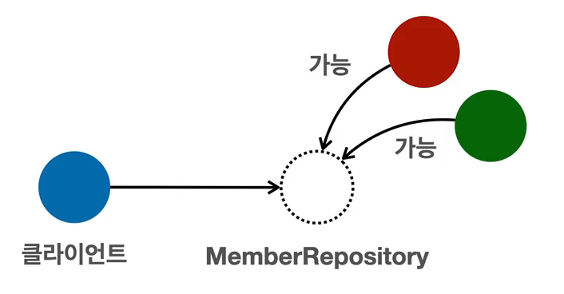
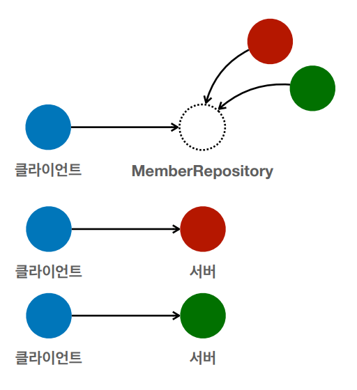

[TIL on April 8th, 2023](../../../TIL/2023/04/04-08-2023.md)
## 섹션 1. 객체 지향 설계와 스프링
### 이야기 | 자바 진영의 추운 겨울과 스프링의 탄생
* Enterprise Java Beans: 자바 진영의 표준 기술이었다.
  - 트랜잭션을 걸고, 분산하는 등의 강점이 있긴 했음.
  - ORM 기술도 가지고 있었음.
  - 한 대당 수천만원씩 했었다.

* EJB는 정말 복잡하고 어렵고 느림.
  - EJB에서 제공하는 인터페이스에 맞게 개발해야 하는 등 문제가 많았음.

* POJO: Plan Old Java Object, 옛날 자바로 돌아가자는 말까지 나왔었음.

* 로드 존슨: 스프링을 만듦.
  - EJB 컨테이너 대체
  - 단순함의 승리
  - 사실상 현재의 표준 기술이 됨.

* 하이버네이트
  - EJB 엔티티빈 기술을 대체
  - JPA 새로운 표준 정의

* EJB 엔티티빈이 망했음을 인지하고, 하이버네이트 저자를 데리고 옴. 이후 자바 표준으로써 JPA를 만듦.

* 자바 진영 ORM 시장을 JPA가 먹고 있음.

* 하이버네이트는 실무 개발자들이 답답해서 만든 것.
  - 오픈 소스의 단점: 용어 같은 것들이 표준화되지 않는 경우가 많음.
  - 하이버네이트를 통해 정제해서 JPA를 만든 것: 많은 사람들이 논의하며 만든 것이기에 깔끔함.

#### 스프링의 역사
* 로드 존슨(Rod Johnson)의 책이 나오면서 시작함
  - EJB의 문제점 지적
* EJB 없이도 충분히 고품질의 확장 가능한 애플리케이션을 개발할 수 있음을 보여줌.
* 여기에 지금의 스프링 핵심 개념과 기반 코드가 들어 있음.

* 책이 출간된 후 유겐 휠러, 얀 카로프가 오픈소스 프로젝트를 제안함.
* 스프링의 핵심 코드 상당수는 유겐 휠러가 지금도 개발 중
* 전통적인 J2EE라는 겨울을 넘어 새로운 시작이라는 뜻으로 봄(spring, 스프링)이라 지음

* 스프링의 역사: 릴리즈
  - 2003년 스프링 프레임워크 1.0 출시 - 설정을 XML로 했어야 했음.
  - 2006년 스프링 프레임워크 2.0 출시 - XML 편의 기능 지원
  - 2009년 스프링 프레임워크 3.0 출시 - 자바 코드로 설정 가능하게 수정됨.
  - 2013년 스프링 프레임워크 4.0 출시 - 자바 8 기반으로 전환
  - 2014년 스프링 부트 1.0 출시
  - 2017년 스프링 프레임워크 5.0, 스프링 부트 2.0 출시 - 리액티브 프로그래밍 지원
  - 2020년 9월 현재 스프링 프레임워크 5.2.x, 스프링 부트 2.3.x

* 비동기(async) / Non-blocking으로 개발도 가능하다 함.
<br>

### 스프링이란?
* 필수
  - 스프링 프레임워크: 가장 기본이 됨.
  - 스프링 부트: 여러 스프링 기술을 편리하게 사용할 수 있게 해줌.
* 선택
  - 스프링 데이터: 기본적인 CRUD는 비슷하기 때문에 어떤 데이터베이스든 편리하게 쓸 수 있도록 도와줌.
  - 스프링 시큐리티: 보안 관련
  - 스프링 Rest Docs: 스펙을 편하게 작성할 수 있도록 도움.
  - 스프링 배치: 배치처리 특화 기술
  - 스프링 클라우드: 클라우드 지원

#### 스프링 프레임워크
* 핵심 기술: 스프링 DI 컨테이너, AOP, 이벤트, 기타
* 웹 기술: 스프링 MVC, 스프링 WebFlux
* 데이터 접근 기술: 트랜잭션, JDBC, ORM 지원, XML 지원
* 기술 통합: 캐시, 이메일, 원격접근, 스케줄링
* 테스트: 스프링 기반 테스트 지원
* 언어: 코틀린, 그루비

#### 스프링 부트
* 스프링을 편리하게 사용할 수 있도록 지원함. 최근에는 기본으로 사용함.
* 단독으로 실행할 수 있는 스프링 어플리케이션을 쉽게 생성함.
* Tomcat 같은 웹 서버를 내장해 별도의 웹 서버를 설치하지 않아도 됨
  - 예전에는 빌드를 하고 Tomcat에 설치. 빌드한 파일을 Tomcat 특정 경로에 위치시킴.
  - 이제는 빌드 및 서버를 가동하는 것까지 모두 총괄해서 수행해줌.
* 손쉬운 빌드 구성을 위한 starter 종속성 제공
* 스프링과 써드 파티 라이브러리 자동 구성
  - 스프링 프레임워크 3.1이 어떤 라이브러리 버전과 호환이 잘 안 된다더라-같은 문제가 정말 골치 아팠음. 이를 이제 손쉽게 처리해줌.
* 매트릭, 상태 확인, 외부 구성 같은 프로덕션 준비 기능 제공
* 관례에 의한 간결한 설정
  - 스프링 프레임워크 단독으로 하는 경우 설정이 정말 손이 많이 갔음. 이젠 아님.

* 많은 사람들이 하는 오해: 스프링 부트는 기본적으로 스프링 프레임워크를 활용하기 쉽게 만들어주는 유틸리티임.

* 스프링 단어?
  - 스프링이라는 단어는 문맥에 따라 다르게 사용된다.
    1. 스프링 DI 컨테이너 기술
    2. 스프링 프레임워크
    3. 스프링 부트, 스프링 프레임워크 등을 모두 포함한 스프링 생태계

#### 스프링은 왜 만들었나요?
* 핵심 개념
  - 이 기술을 왜 만들었는가?
  - 이 기술의 핵심 컨셉은?

* 스프링의 핵심 개념, 컨셉
  - 스프링은 자바 언어의 프레임워크
  - 자바 언어의 가장 큰 특징은 **객체 지향 언어**라는 것이다.
  - 스프링은 객체 지향 언어가 가진 강력한 특징을 살려내는 프레임워크
  - 스프링은 좋은 객체 지향 어플리케이션을 개발할 수 있게 도와주는 프레임워크
<br>

### 좋은 객체 지향 프로그래밍이란?
* 객체 지향 특징
  - 추상화, 캡슐화, 상속, 다형성

* 객체 지향 프로그래밍
  - 객체 지향 프로그래밍은 컴퓨터 프로그램을 명령어의 목록으로 보는 시각에서 벗어나 여러 개의 독립된 단위, 즉 "객체"들의 모임으로 파악하고자 하는 것이다. 각각의 객체는 메시지를 주고받고, 데이터를 처리할 수 있다(협력).
  - 객체 지향 프로그래밍은 프로그램을 유연하고 변경이 용이하게 만들기 때문에 대규모 소프트웨어 개발에 많이 사용된다.

* 유연하고, 변경이 용이하다?
  - 레고 블럭 조립하듯이
  - 키보드, 마우스 갈아 끼우듯이
  - 컴퓨터 부품 갈아 끼우듯이
  - 컴포넌트를 쉽고 유연하게 변경하면서 개발할 수 있는 방법
  - **다형성(Polymorphism)**

* 다형성 비유
  - 역할(인터페이스)과 구현(객체)으로 세상을 구분

* 운전자-자동차: 이 둘은 역할임.
  - 자동차 역할을 할 수 있는 구현체: K3, 아반떼, 테슬라 모델 3
  - 자동차가 바뀌어도 운전자에겐 영향을 끼치지 않는다.
  - 자동차라는 인터페이스를 따라서 자동차를 구현했기 때문에 이것이 가능한 것.
  - 이것은 '운전자'를 위해 하는 것. 여기서 '운전자'가 곧 클라이언트다.
  - 운전자라는 대상을 바꾸지 않고 새롭게 확장 가능하다. 새로운 모델을 내고, 새로운 연료로 동작하는 자동차로 확장할 수 있는 것.

* 공연 무대: 로미오와 줄리엣 공연
  - 로미오, 줄리엣: 역할
  - 로미오 역할: 여러 배우들이 수행
  - 줄리엣 역할: 여러 배우들이 수행
  - 이 역할들이 대체 불가능해선 안 된다.
  - 로미오는 줄리엣을 누가 연기하든 상관 없이 자기 역할을 준비할 수 있다.

* 역할과 구현을 분리
  - 역할과 구현을 구분하면 세상이 단순해지고 유연해지며 변경도 편리해진다.
  - 장점
    1. 클라이언트는 대상의 역할만 알면 되고, 내부 구조를 몰라도 된다
    2. 클라이언트는 내부 구조가 변경되어도 영향을 받지 않는다
    3. 클라이언트는 대상 자체를 변경해도 영향을 받지 않는다

* 자바 언어
  - 역할: 인터페이스
  - 구현: 인터페이스를 구현한 클래스, 구현 객체
  - 객체를 설계할 때 역할과 구현을 명확히 분리
  - 객체 설계 시 역할(인터페이스)을 먼저 부여하고, 그 역할을 수행하는 구현 객체를 만듦

* 객체의 협력이라는 관계부터 생각
  - 혼자 있는 객체는 없다.
  - 클라이언트: 요청, 서버: 응답
  - 수많은 객체 클라이언트와 객체 서버는 서로 협력 관계를 가진다.

* 자바 언어의 다형성
  - 오버라이딩을 떠올려보자
  - 오버라이딩은 자바 기본 문법
  - 오버라이딩 된 메소드가 실행
  - 다형성으로 인터페이스를 구현한 객체를 실행 시점에 유연하게 변경할 수 있다.
  - 물론 클래스 상속 관계도 다형성, 오버라이딩 적용 가능

* 클라이언트가 MemberRepository를 의존한다.
  - 의존한다는 것은 인지한다는 것.



* 다형성에 의해서 아래와 같이 `MemberRepository` 인터페이스를 `MemoryMemberRepository` 클래스나 `JdbcMemberRepository` 클래스로 구현할 수 있다.
```java
public class MemberService {

  private MemberRepository memberRepository = new MemoryMemberRepository();
  // private MemberRepository memberRepository = new JdbcMemberRepository();
}
```
* 다형성의 본질
  - 인터페이스를 구현한 객체 인스턴스를 실행 시점에 유연하게 변경할 수 있다.
  - 다형성의 본질을 이해하려면 협력이라는 객체사이의 관계에서 시작해야함
  - 클라이언트를 변경하지 않고, 서버의 구현 기능을 유연하게 변경할 수 있다.
  - 아래 그림과 같이 `MemberRepository`라는 인터페이스를, 즉 구현체의 형태를 정해두면 인터페이스에 맞지만 서로 다른 성격을 가진 `MemoryMemberRepository`와 `JdbcMemberRepository` 모두 이 자리에 쓰일 수 있다. 이에 대해선 클라이언트가 전혀 알 필요가 없는 것.


* 요약 정리
  - 실세계의 역할과 구현이라는 편리한 컨셉을 다형성을 통해 객체 세상으로 가져올 수 있음
  - 유연하고, 변경이 용이
  - 확장 가능한 설계
  - 클라이언트에 영향을 주지 않는 변경 가능
  - 인터페이스를 안정적으로 잘 설계하는 것이 중요

* 한계: 역할(인터페이스) 자체가 변하면 클라이언트, 서버 모두 큰 변경이 발생한다.
  - 인터페이스를 변화가 없는 방식으로 설계하는 게 가장 중요하다.

* 스프링과 객체 지향
  - 다형성이 가장 중요하다.
  - 스프링은 다형성을 극대화하여 활용할 수 있게 돕는다.
  - 스프링에서 이야기하는 제어의 역전(IoC), 의존관계 주입(DI)은 다형성을 활용해서 역할과 구현을 편리하게 다룰 수 있도록 지원한다.
  - 스프링을 사용하면 구현을 편리하게 변경할 수 있다.
<br>

### 좋은 객체 지향 설계의 5가지 원칙(SOLID)
* 클린코드로 유명한 로버트 마틴이 좋은 객체 지향 설계의 5가지 원칙을 정리
  1. SRP: 단일 책임 원칙(single responsibility principle)
  2. OCP: 개방-폐쇄 원칙 (Open/closed principle)
  3. LSP: 리스코프 치환 원칙 (Liskov substitution principle)
  4. ISP: 인터페이스 분리 원칙 (Interface segregation principle)
  5. DIP: 의존관계 역전 원칙 (Dependency inversion principle)

#### SRP, 단일 책임 원칙
* 하나의 클래스는 하나의 책임만 가져야 한다.
* 사실 하나의 책임이라는 게 모호하다.
  - 클 수도 있고, 작을 수도 있음.
  - 문맥과 상황에 따라 다르다.
* 변경 시에 이 원칙을 잘 따랐는지 결과로 드러난다.
  - 변경이 있을 때 파급 효과가 적으면 단일 책임 원칙을 잘 따른 것이다.
* UI 변경, 객체의 생성과 사용을 분리

#### OCP, 개방-폐쇄 원칙
* 소프트웨어 요소는 확장에는 열려있으나, 변경에는 닫혀있어야 한다.
* 다형성을 활용해보자
* 인터페이스를 구현한 새로운 클래스 하나를 만들어서 새로운 기능을 구현함
  - 이는 기존 코드를 변경하는 게 아님.

* OCP 개방-폐쇄 원칙의 문제점
  - MemberService 클라이언트가 구현 클래스를 직접 선택
    * MemberRepository m = new MemoryMemberRepository();
    * MemberRepository m = new JdbcMemberRepository();
  - 구현 객체를 변경하려면 클라이언트 코드를 변경해야 한다.
  - 분명 다형성을 사용했지만 OCP 원칙을 지킬 수 없다.
  - Q. 이 문제를 어떻게 해결해야 하는가: 객체를 생성하고, 연관관계를 맺어주는 별도의 조립, 설정자가 필요하다. -> A: 스프링
  - 당연히 말로만 들어서는 이해할 수가 없는 개념임.

#### LSP, 리스코프 치환 원칙(Liskov substitution principle)
* 프로그램의 객체는 프로그램의 정확성을 깨뜨리지 않으면서 하위 타입의 인스턴스로 바꿀 수 있어야 한다.
* 다형성에서 하위 클래스는 인터페이스 규약을 다 지켜야 한다는 것, 다형성을 지원하기 위한 원칙, 인터페이스를 구현한 구현체는 믿고 사용하려면, 이 원칙이 필요하다.
* 단순히 컴파일에 성공하는 것을 넘어서는 이야기
* 예를 들어 Accelrator를 밟으면 사실 감속이 되게 할 수도 있긴 함. 그렇지만, 이는 LSP 위반이다. 느리더라도 앞으로 가야한다.

#### ISP: 인터페이스 분리 원칙(Interface segregation principle)
* 특정 클라이언트를 위한 인터페이스 여러 개가 범용 인터페이스 하나보다 낫다.
* 자동차 인터페이스 -> 운전 인터페이스, 정비 인터페이스로 분리
* 사용자 클라이언트 -> 운전자 클라이언트, 정비사 클라이언트로 분리
* 분리하면 정비 인터페이스 자체가 변해도 운전자 클라이언트에 영향을 주지 않음
* 인터페이스가 명확해지고, 대체 가능성이 높아진다.

#### DIP: 의존관계 역전 원칙(Dependency inversion principle)
* "프로그래머는 추상화에 의존해야지, 구체화에 의존하면 안 된다."
  - 쉽게 이야기해서 구현 클래스에 의존하지 말고, 인터페이스만 바라보라는 뜻.
* 앞에서 이야기한 역할(role)에 의존하게 해야 한다는 것과 같다. 객체 세상도 클라이언트가 인터페이스에 의존해야 유연하게 구현체를 변경할 수 있다. 구현체에 의존하게 되면 변경이 아주 어려워진다.

* `private MemberRepository memberRepository = new MemoryMemberRepository();` 코드는 사실 DIP를 위반한 코드다. 추상화된 `MemberRepository` 인터페이스에 의존하고 있지만, 구현체인 `MemoryMemberRepository`에도 의존하고 있기 때문이다.
  - 그래서 어떻게 해야하는데?

#### 정리
* 객체 지향의 핵심은 다형성
* 다형성만으로는 쉽게 부품을 갈아 끼우듯이 개발할 수 없다.
* 다형성만으로는 구현 객체를 변경할 때 클라이언트 코드도 함께 변경된다.
  - 다형성 만으로는 OCP, DIP를 지킬 수 없다. 
* **그래서 뭔가가 더 필요하다.**: 고민하고 또 고민하다보면 결과적으로 자바 언어만으로는 SOLID 원칙을 모두 지킬 수 없다는 사실을 알게 된다. 스프링을 제안한 사람들도 같은 고민을 했을 것이다.
<br>

### 객체 지향 설계와 스프링
* 스프링은 다음 기술로 다형성 + OCP, DIP를 가능하도록 만듦
  - DI: 의존관계, 의존성 주입
  - DI 컨테이너 제공

* 클라이언트 코드의 변경 없이 기능을 확장할 수 있음
* 쉽게 부품을 교체하듯이 개발 가능

* 스프링이 없던 시절 이야기
  - 옛날 어떤 개발자가 좋은 객체 지향 개발을 하려고 OCP, DIP 원칙을 지키면서 개발을 해보니, 너무 할일이 많았다. 배보다 배꼽이 크다. 그래서 프레임워크로 만들어버림
  - 순수하게 자바로 OCP, DIP 원칙들을 지키면서 개발을 해보면, 결국 스프링 프레임워크를 만들게 된다. (더 정확히는 DI 컨테이너)
  - DI 개념은 말로 설명해도 이해가 잘 안된다. 코드로 짜봐야 필요성을 알게된다!
  - 그러면 이제 스프링이 왜? 만들어졌는지 코드로 이해해보자

* 모든 설계의 역할과 구현을 분리하자.
* 어플리케이션 설계도 공연을 설계하듯이 배역만 만들어두고, 배우는 언제든지 유연하게 변경할 수 있도록 만드는 게 좋은 객체 지향 설계다.
* 이상적으로는 모든 설계에 인터페이스를 부여하자.

* 하지만 인터페이스를 도입하면 *추상화*라는 비용이 발생한다.
  - 성능에 대한 얘기가 아님.
  - 추상화가 되면 개발자가 코드를 한 번 더 확인해야 한다. 인터페이스만 확인하기 때문에, 결국 이 구현체가 무엇인지 다시 확인해야 한다고 함.

* 기능을 확장할 가능성이 없다면, 구체 클래스를 직접 활용하고, 향후 꼭 필요할 때 리팩터링해서 인터페이스를 도입하는 것도 방법이다.
  - 확장에 용이하기 때문에 인터페이스를 활용하는 것이라고 이해하면 좋을 듯함.