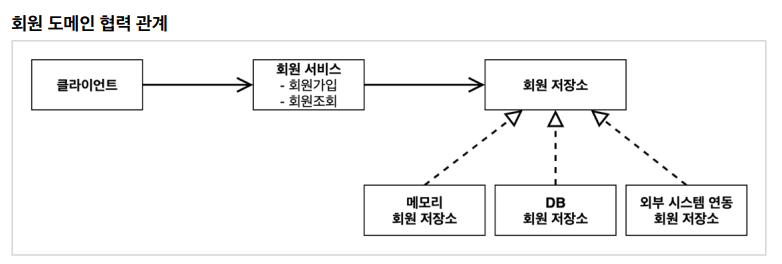
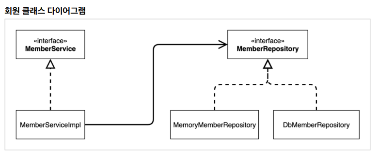

[TIL on April 10th, 2023](../../../TIL/2023/04/04-10-2023.md)
## 섹션 2. 스프링 핵심 원리 이해1 - 예제 만들기
### 프로젝트 생성
* [spring initializr](start.spring.io)를 활용해 프로젝트 초기화.
* [깃허브 Repo](https://github.com/neppiness/hello-core)에 기록할 것.
* Preference의 gradle 세팅을 intelliJ 통해서 바로 실행하도록 설정을 바꿀 것.
<br>

### 비즈니스 요구사항과 설계
* 회원
  - 회원을 가입하고 조회할 수 있다.
  - 회원은 일반과 VIP, 두 등급이 있다.
  - 회원 데이터는 자체 DB를 구축할 수도 있고, 외부 시스템과 연동시킬 수도 있다.

* 주문과 할인 정책
  - 회원은 상품을 주문할 수 있다.
  - 회원 등급에 따라 할인 정책을 적용할 수 있다.
  - 할인 정책으로 모든 VIP는 1000원을 할인해주는 고정 금액 할인을 적용
  - 할인 정책은 변경 가능성이 높다. 변경 가능성을 염두에 두자: 실제로도 오픈 직전까지 결정을 유보할 수도 있음.

* TIP: 인터페이스를 만들고 구현체를 언제든지 갈아끼울 수 있도록 설계하면 된다
<br>

### 회원 도메인 설계


* 회원 서비스: 회원가입, 회원조회 역할 수행
  - 인터페이스: MemberService
  - 구현체: MemberServiceImpl

* 이 구현체가 데이터를 주고 받을 인터페이스: MemberRepository
  - 이 인터페이스의 구현체는 MemoryMemberRepository가 될 수도 있고, DbMemberRepository가 될 수도 있음.



* 이렇게 될 때, 클라이언트는 회원 서비스를 바라보게 되고(회원 서비스에 의존하고), 회원 서비스는 메모리 회원 저장소를 바라보게 된다(메모리 회원 저장소는 임시방편 구현체).

* 클래스 다이어그램은 
* 회원 객체 다이어그램은 실제 *유효한* 인스턴스끼리의 참조 상황을 표현한 것이라고 이해하면 된다.

* 개인적인 생각: 회원 서비스 로직은 굳이 인터페이스를 둘 필요가 없어보이긴 함.
<br>

### 회원 도메인 개발
* 일단 회원의 등급을 만든다고 생각해놓고, enum을 바로 설정하는 것은 배워야 할 부분임.
  - domain으로 member라는 패키지를 만듦.
  - member 패키지 안에 Grade enum을 만듦. 그 내용은 아래와 같음.

```java
package hello.core.member;

public enum Grade {
    BASIC,
    VIP
}
```

* member 같은 경우엔 가뿐하게 필요한 정보 입력하고, 생성자와 게터/세터 설정함.
* 원래는 `MemberRepository` 인터페이스의 구현체를 다른 패키지에 두는 편이 좋다고는 함.
  - 그렇지만, 예제의 심플함을 위해 이를 배제함.
* 실무에서는 동시성 이슈가 발생할 수 있기 때문에, 이를 방지하기 위한 `ConcurrentHashMap` 구조를 사용해야 하지만, 예제의 단순성을 위해 마찬가지로 store를 `HashMap` 자료 구조로 구현했다.

* MemberService 역시 인터페이스를 아래와 같이 간략히 작성해둔다.

```java
package hello.core.member;

public interface MemberService {

    void join(Member member);

    Member findMember(Long memberId);

}
```

* 정리: 회원 서비스는 크게 추상화할 이유가 없는 듯함. 구현 방식이 다른 것도 딱히 아니기 때문에, 인터페이스를 만들어놓고, 단 하나 뿐인 구현체를 `MemberServiceImpl`로 명명하는 것이라 생각하면 될 듯함.
  - `MemberServiceImpl`에는 memberRepository를 필드에 두면서 활용해야 함.

```java
private final MemberRepository memberRepository = new MemoryMemberRepository();
```
<br>

### 회원 도메인 실행과 테스트
### 주문과 할인 도메인 설계
### 주문과 할인 도메인 개발
### 주문과 할인 도메인 실행과 테스트