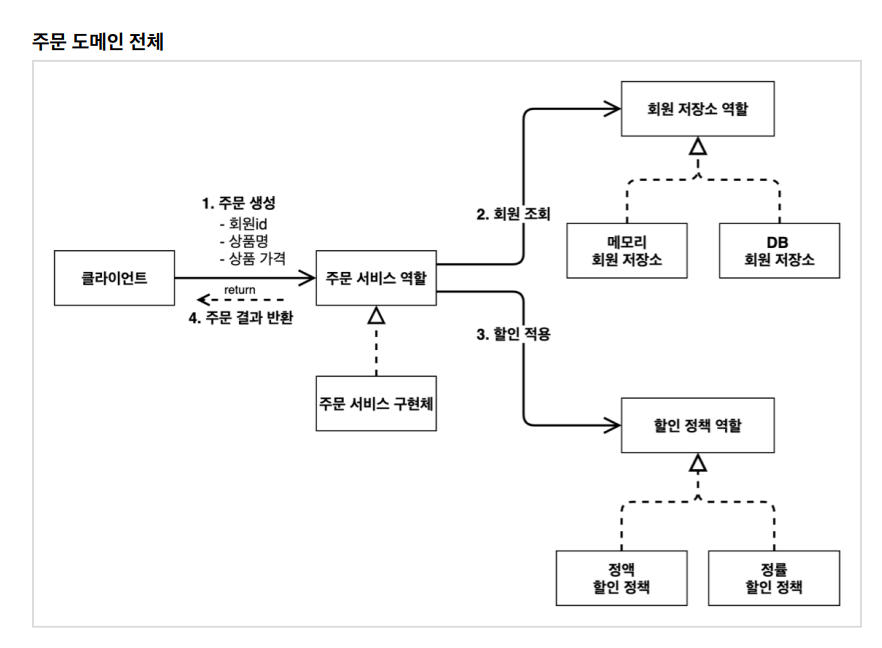
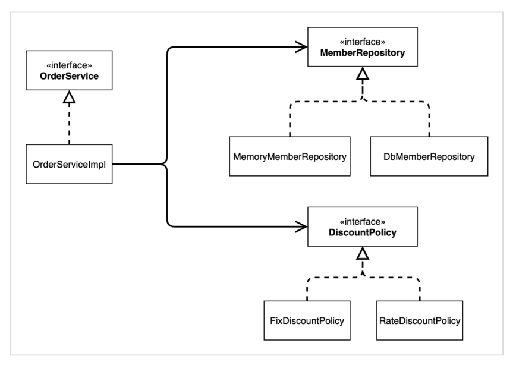
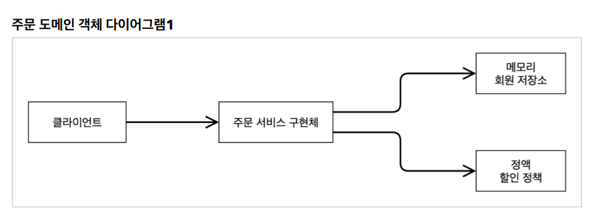

[TIL on April 10th, 2023](../../../TIL/2023/04/04-10-2023.md)
## 섹션 2. 스프링 핵심 원리 이해1 - 예제 만들기
### 프로젝트 생성
* [spring initializr](start.spring.io)를 활용해 프로젝트 초기화.
* [깃허브 Repo](https://github.com/neppiness/hello-core)에 기록할 것.
* Preference의 gradle 세팅을 intelliJ 통해서 바로 실행하도록 설정을 바꿀 것.
<br>

### 비즈니스 요구사항과 설계
* 회원
  - 회원을 가입하고 조회할 수 있다.
  - 회원은 일반과 VIP, 두 등급이 있다.
  - 회원 데이터는 자체 DB를 구축할 수도 있고, 외부 시스템과 연동시킬 수도 있다.

* 주문과 할인 정책
  - 회원은 상품을 주문할 수 있다.
  - 회원 등급에 따라 할인 정책을 적용할 수 있다.
  - 할인 정책으로 모든 VIP는 1000원을 할인해주는 고정 금액 할인을 적용
  - 할인 정책은 변경 가능성이 높다. 변경 가능성을 염두에 두자: 실제로도 오픈 직전까지 결정을 유보할 수도 있음.

* TIP: 인터페이스를 만들고 구현체를 언제든지 갈아끼울 수 있도록 설계하면 된다
<br>

### 회원 도메인 설계


* 회원 서비스: 회원가입, 회원조회 역할 수행
  - 인터페이스: MemberService
  - 구현체: MemberServiceImpl

* 이 구현체가 데이터를 주고 받을 인터페이스: MemberRepository
  - 이 인터페이스의 구현체는 MemoryMemberRepository가 될 수도 있고, DbMemberRepository가 될 수도 있음.


* 이렇게 될 때, 클라이언트는 회원 서비스를 바라보게 되고(회원 서비스에 의존하고), 회원 서비스는 메모리 회원 저장소를 바라보게 된다(메모리 회원 저장소는 임시방편 구현체).

* 클래스 다이어그램은 
* 회원 객체 다이어그램은 실제 *유효한* 인스턴스끼리의 참조 상황을 표현한 것이라고 이해하면 된다.

* 개인적인 생각: 회원 서비스 로직은 굳이 인터페이스를 둘 필요가 없어보이긴 함.
<br>

### 회원 도메인 개발
* 일단 회원의 등급을 만든다고 생각해놓고, enum을 바로 설정하는 것은 배워야 할 부분임.
  - domain으로 member라는 패키지를 만듦.
  - member 패키지 안에 Grade enum을 만듦. 그 내용은 아래와 같음.

```java
package hello.core.member;

public enum Grade {
    BASIC,
    VIP
}
```

* member 같은 경우엔 가뿐하게 필요한 정보 입력하고, 생성자와 게터/세터 설정함.
* 원래는 `MemberRepository` 인터페이스의 구현체를 다른 패키지에 두는 편이 좋다고는 함.
  - 그렇지만, 예제의 심플함을 위해 이를 배제함.
* 실무에서는 동시성 이슈가 발생할 수 있기 때문에, 이를 방지하기 위한 `ConcurrentHashMap` 구조를 사용해야 하지만, 예제의 단순성을 위해 마찬가지로 store를 `HashMap` 자료 구조로 구현했다.

* MemberService 역시 인터페이스를 아래와 같이 간략히 작성해둔다.

```java
package hello.core.member;

public interface MemberService {

    void join(Member member);

    Member findMember(Long memberId);

}
```

* 정리: 회원 서비스는 크게 추상화할 이유가 없는 듯함. 구현 방식이 다른 것도 딱히 아니기 때문에, 인터페이스를 만들어놓고, 단 하나 뿐인 구현체를 `MemberServiceImpl`로 명명하는 것이라 생각하면 될 듯함.
  - `MemberServiceImpl`에는 memberRepository를 필드에 두면서 활용해야 함.

```java
private final MemberRepository memberRepository = new MemoryMemberRepository();
```
<br>

### 회원 도메인 실행과 테스트
* 클래스 다이어그램은 정적인 것이며, 회원 객체 다이어그램은 동적인 것이다.

* 순수하게 자바 코드만으로 MemberApp이라는 클래스를 구성하면 아래와 같이 된다.
  - member를 만들어놓고, 이에 대한 멤버가 일치하는지 단순하게 콘솔 출력을 통해 확인하는 과정.

```java
package hello.core;

import hello.core.member.Grade;
import hello.core.member.Member;
import hello.core.member.MemberService;
import hello.core.member.MemberServiceImpl;

public class MemberApp {

    public static void main(String[] args) {
        MemberService memberService = new MemberServiceImpl();
        Member member = new Member(1L, "neppiness", Grade.VIP);
        memberService.join(member);

        Member foundMember = memberService.findMember(1L);
        System.out.println("created member = " + member.getName());
        System.out.println("found member = " + foundMember.getName());
    }
}
```

* 이를 좀 더 보완해서, MemberServiceImpl의 메소드들을 Ctrl + Shift + T로 추출해내 테스트케이스틀을 작성하자.
  - given, when, then에 따라서 테스트 코드 작성하기.

```java
package hello.core.member;

import org.junit.jupiter.api.Test;
import static org.assertj.core.api.Assertions.assertThat;

package hello.core.member;

import org.junit.jupiter.api.Test;
import static org.assertj.core.api.Assertions.assertThat;

class MemberServiceTest {

    @Test
    void 회원가입_테스트() {
        // given
        MemberService memberService = new MemberServiceImpl();
        Member member = new Member(1L, "memberA", Grade.VIP);

        // when
        memberService.join(member);
        Member foundMember = memberService.findMember(1L);

        // then
        assertThat(member).isEqualTo(foundMember);
    }
}
```

* 이렇게 테스트를 작성해서 확인하게 되면, 정상 작동 여부를 쉽게 파악할 수 있게 된다.
  - 테스트 코드 작성 방법은 필수로 알아야 한다. 실무에서 60% 정도 개발 인력이 테스트 코드를 붙잡고 있는 걸 본다고 함.

* 회원 도메인 설계의 문제점
  - 이 코드의 설계상 문제점이 무엇일까?
  - 다른 저장소로 변경할 때 OCP 원칙을 잘 준수할까?
  - DIP를 잘 지키고 있나?

* MemberServiceImpl을 살펴보자.
  - `private final MemberRepository memberRepository = new MemoryMemberRepository();`
  - 위 코드는 인터페이스인 MemberRepository를 의존하긴 하지만, 오른편에 구현체인 MemoryMemberRepository에 의존하고 있음을 확인할 수 있다.
  - 이로 인해 SOLID 원칙을 전부 지킬 수 없는 상태인 것.
  - 변경이 있을 때 분명히 작업할 게 많다.
<br>

### 주문과 할인 도메인 설계
* 주문과 할인 정책
  - 회원은 상품을 주문할 수 있다.
  - 회원 등급에 따라 할인 정책을 적용할 수 있다.
  - 할인 정책은 모든 VIP는 1000원을 할인해주는 고정 금액 할인을 적용해달라(나중에 변경 될 수 있다).
  - 할인 정책은 변경 가능성이 높다. 회사의 기본 할인 정책을 아직 정하지 못했고, 오픈 직전까지 고민을 미루고 싶다.
  - 최악의 경우 할인을 적용하지 않을 수도 있다(미확정)

* 설계된 클래스 관계를 나타낸 다이어그램을 유심히 보자. 밑바닥에서 이런 방식으로 계획하는 게 결코 쉽지 않을 것.

* 실무에서는 상품에 대한 정보가 따로 있어야 하지만, 여기선 주문을 생성할 때 단순하게 상품명과 가격을 넘겨주는 방식으로 구현할 것.

1. 주문 생성: 클라이언트는 주문 서비스에 주문 생성을 요청한다.
2. 회원 조회: 할인을 위해서는 회원 등급이 필요하다. 그래서 주문 서비스는 회원 저장소에서 회원을 조회한다.
  - findById를 통해서 회원을 검색하고, 회원 등급을 확인할 수 있음.
3. 할인 적용: 주문 서비스는 회원 등급에 따른 할인 여부를 할인 정책에 위임한다.
4. 주문 결과 반환: 주문 서비스는 할인 결과를 포함한 주문 결과를 반환한다.
* 참고: 실제로는 주문 데이터를 DB에 저장하겠지만, 예제가 너무 복잡해 질 수 있어서 생략하고, 단순히 주문 결과를 반환한다.



* 보면 역할들을 명기해두고, 아래에는 부품인 구현체를 준비함.
  - 클라이언트(역할) -> 주문 서비스 역할 -> 회원 저장소 역할 / 할인 정책 역할로 이어짐.
  - 역할 먼저 만들고, 이후 구현체를 만듦

* 역할과 구현을 분리해서 자유롭게 구현 객체를 조립할 수 있게 설계했다. 이를 통해 회원 저장소는 물론이고, 할인 정책도 유연하게 변경할 수 있다.



* 구현체가 하나 밖에 없을 때는 Impl이라고 많이 쓴다 함.
  - 그림에서 나타낸 것처럼, 할인 정책을 바꿔끼울 때도 이렇게 할인 정책 인터페이스에서 해당 정책만 구현하면 됨.



* 구현체를 직접적으로 드러나게 위와 같이 다이어그램을 그릴 수도 있음. 이는 우리가 직접 활용하는 구현체에 따라 바뀌게 됨.
  - 구현체만 바꾸더라도 **협력 관계는 그대로 재사용할 수 있다**: 
<br>

### 주문과 할인 도메인 개발
* 할인 정책이라는 인터페이스를 구현함.
  - 안에는 할인 대상 금액이라는 것을 리턴하는 메소드인 discount만 배치
* 이를 정액 할인 정책으로 구현함
  - 회원 등급이 VIP인 경우(enum에 대한 확인은 직접 `==` 비교 연산자를 쓰는 게 맞음) 정해진 할인 금액을 반환한다.

```java
    @Override
    public int discount(Member member, int price) {
        if (member.getGrade() == Grade.VIP)
            return discountFixAmount;
        return 0;
    }
```

* Order에는 주문 정보들을 필드로 넣는데, 이를 쉽게 출력하기 위해서 toString() 메소드를 오버라이딩함.

* 주문 서비스 인터페이스는 아래와 같이 작성함

```java
package hello.core.order;

public interface OrderService {

    Order createOrder(Long memberId, String itemName, int itemPrice);
}
```

* 이는 이전에 주문을 생성할 때 들어가는 정보들인 회원 id, 상품명, 상품 가격을 넣는 것.
  - 오더 서비스는 아래와 같이 구현함.
```java
package hello.core.order;

import hello.core.discount.DiscountPolicy;
import hello.core.discount.FixDiscountPolicy;
import hello.core.member.Member;
import hello.core.member.MemberRepository;
import hello.core.member.MemoryMemberRepository;

public class OrderServiceImpl implements OrderService {

    private final MemberRepository memberRepository = new MemoryMemberRepository();
    private final DiscountPolicy discountPolicy = new FixDiscountPolicy();

    @Override
    public Order createOrder(Long memberId, String itemName, int itemPrice) {
        Member member = memberRepository.findById(memberId);
        int discountPrice = discountPolicy.discount(member, itemPrice);

        return new Order(memberId, itemName, itemPrice, discountPrice);
    }
}
```
<br>

### 주문과 할인 도메인 실행과 테스트
* OrderApp이라는 클래스를 두고, 이를 통해 테스팅. 작성한 코드는 아래와 같음.

```java
package hello.core;

import hello.core.member.Grade;
import hello.core.member.Member;
import hello.core.member.MemberService;
import hello.core.member.MemberServiceImpl;
import hello.core.order.Order;
import hello.core.order.OrderService;
import hello.core.order.OrderServiceImpl;

public class OrderApp {

    public static void main(String[] args) {
        MemberService memberService = new MemberServiceImpl();
        OrderService orderService = new OrderServiceImpl();

        Long memberId = 1L;
        Member member = new Member(memberId, "neppiness", Grade.VIP);
        memberService.join(member);

        Order order = orderService.createOrder(memberId, "i9-9900k", 600_000);

        System.out.println("order = " + order);
        System.out.println("order.calculatePrice = " + order.calculatePrice());
    }
}

```

* 결과는 아래와 같음.

```
order = Order{memberId=1, itemName='i9-9900k', itemPrice=600000, discountPrice=1000}
order.calculatePrice = 599000
```