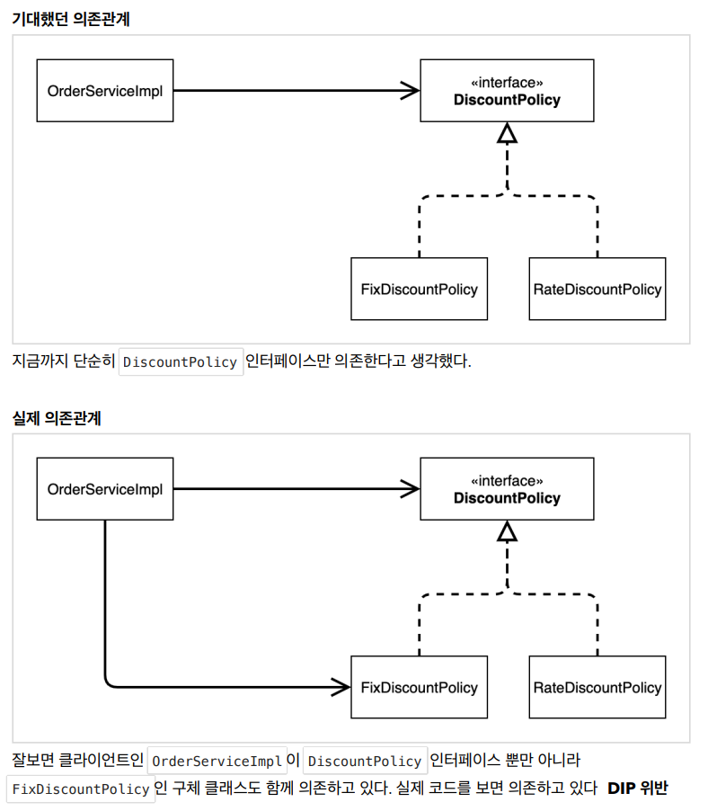

[TIL on April 11th, 2023](../../../TIL/2023/04/04-11-2023.md)
## 섹션 3. 스프링 핵심 원리 이해2 - 객체 지향 원리 적용

### 개요
* 새로운 할인 정책이 제시되고 그에 맞게 개발을 수행
  - 이에 따라 발생하는 문제들을 보게 됨.
  - 그러한 문제들을 해결하기 위해 아래와 같은 과정을 거칠 것.
    1. 새로운 할인 정책 적용과 문제점
    2. 관심사의 분리
    3. AppConfig 리팩터링
<br>

### 새로운 할인 정책 개발
* 주문 금액 당 퍼센트로 할인하고 싶다 함. VIP가 10% 할인을 받도록.
* FixDiscountPolicy를 RateDiscountPolicy로 바꾸면 됨.

* Assertions에서 assertThat만 간단하게 가져와 쓰고 싶은 경우, `Add on-demand static import for 'org.assertj.core.api.Assertions`를 활용하면 됨.
  - 이에 따라 다음 import 문이 생김: `import static org.assertj.core.api.Assertions.*;`

* 별도로 할인을 담당하는 로직을 떼놨기 때문에 아래와 같은 좋은 테스트 코드를 작성할 수 있음.
```java
package hello.core.discount;

import hello.core.member.Grade;
import hello.core.member.Member;
import org.junit.jupiter.api.DisplayName;
import org.junit.jupiter.api.Test;

import static org.assertj.core.api.Assertions.*;

class RateDiscountPolicyTest {

    RateDiscountPolicy discountPolicy = new RateDiscountPolicy();

    @Test
    @DisplayName("VIP는 10% 할인이 적용되어야 한다")
    void vip_o() {
        // given
        Member member = new Member(1L, "VIPmember", Grade.VIP);
        // when
        int discount = discountPolicy.discount(member, 10000);
        // then
        assertThat(discount).isEqualTo(1000);
    }

    @Test
    @DisplayName("BASIC은 할인이 적용되면 안 된다")
    void basic_x() {
        // given
        Member member = new Member(1L, "BASICmember", Grade.BASIC);
        // when
        int discount = discountPolicy.discount(member, 10000);
        // then
        assertThat(discount).isEqualTo(0);
    }
}
```
<br>

### 새로운 할인 정책 적용과 문제점
* 이를 적용하기 위해선 클라이언트인 OrderServiceImpl 클래스의 코드를 수정해야함.

```java
package hello.core.order;

import hello.core.discount.DiscountPolicy;
//import hello.core.discount.FixDiscountPolicy;
import hello.core.discount.RateDiscountPolicy;
import hello.core.member.Member;
import hello.core.member.MemberRepository;
import hello.core.member.MemoryMemberRepository;

public class OrderServiceImpl implements OrderService {

    private final MemberRepository memberRepository = new MemoryMemberRepository();
    //    private final DiscountPolicy discountPolicy = new FixDiscountPolicy();
    private final DiscountPolicy discountPolicy = new RateDiscountPolicy();

    @Override
    public Order createOrder(Long memberId, String itemName, int itemPrice) {
        Member member = memberRepository.findById(memberId);
        int discountPrice = discountPolicy.discount(member, itemPrice);

        return new Order(memberId, itemName, itemPrice, discountPrice);
    }
}

```

* 이로써 새로운 할인 정책 구현체인 `RateDiscountPolicy`를 주입할 수 있음.
  - 그러나, 이는 좋은 수정 방향이 아니다.

* 우리는 역할과 구현을 충실하게 분리했다. 다형성도 활용하고, 인터페이스와 구현 객체를 분리했다. OCP, DIP 같은 객체지향 설계 원칙을 충실히 준수했다.
  - 그런 줄 알았지만, 사실은 그렇지 않다. 왜냐?

* DIP: 주문서비스 클라이언트(`OrderServiceImpl`)는 `DiscountPolicy` 인터페이스에 의존하면서 DIP를 지킨 것 같은데?
  - 클래스 의존관계를 분석해 보자. 추상(인터페이스) 뿐만 아니라 구체(구현) 클래스에도 의존하고 있다.
  - 추상(인터페이스) 의존: `DiscountPolicy`
  - 구체(구현) 클래스: `FixDiscountPolicy` , `RateDiscountPolicy`

* OCP: 변경하지 않고 확장할 수 있다고 했는데(간접적으로 연결된 코드들은 바꿀 필요가 없다고 함)
  - 지금 코드는 기능을 확장해서 변경하면, 클라이언트 코드에 영향을 준다. 따라서 OCP를 위반한다.



* 위와 같은 관계로 되어 있기 때문에, 정책을 바꾸려면 `OrderServiceImpl`에 선언된 구현체도 수정해야 한다.
  - 예시: 기름차에서 전기차로 바꾸려 할 때, 운전자가 뭔가 다른 조치를 취해야 한다.

* 그런데, 완전히 인터페이스만 의존할 수가 있나?
  - 구체 클래스를 지워내야 한다.
  - 하지만, 다른 조치를 취하지 않은 채로 구체 클래스만 지워버리면 절대로 코드가 동작하지 않는다.

```java
private DiscountPolicy discountPolicy;
```

* **결국 이 문제를 해결하려면 누군가가 구현 객체를 대신 생성해야 한다.**
<br>

### 관심사의 분리
* 어플리케이션을 하나의 공연이라고 생각하자. 각각의 인터페이스를 배역이라 생각하자.
  - 이 배역에 맞는 배우를 선택하는 건 누가 해야하는가?
  - 배우들이 정하는 건 아니다. 디카프리오를 로미오로 캐스팅했다고 할 때, 줄리엣을 디카프리오가 섭외하는 건 아니다.
  - 이전에 작성했던 코드는 배우가 직접 자기와 호흡을 맞출 배우를 데려오는 것과 같은 형태다.
  - 현재까지 작성한 OrderServiceImpl 코드는 아래와 같다.

```java
public class OrderServiceImpl implements OrderService {

    private final MemberRepository memberRepository = new MemoryMemberRepository();
//    private final DiscountPolicy discountPolicy = new FixDiscountPolicy();
//    private final DiscountPolicy discountPolicy = new RateDiscountPolicy();

    @Override
    public Order createOrder(Long memberId, String itemName, int itemPrice) {
        Member member = memberRepository.findById(memberId);
        int discountPrice = discountPolicy.discount(member, itemPrice);

        return new Order(memberId, itemName, itemPrice, discountPrice);
    }
}
```

* **별도의 공연 기획자가 필요하다**: 이를 AppConfig 클래스가 수행하도록 조정하려 한다.
* 서비스와 각종 클래스들을 연결 지어주는 것을 AppConfig가 다 하도록 수정.

* 생성자 주입을 통해서 외부에서 넣어주는 방식으로 수정함. AppConfig가 이를 주입해줌.
  - 예약어 final이 달려있는 경우, 기본으로 넣어주거나 생성자를 통해서 주입을 시켜야 함.

```java
    // 생략
    private final MemberRepository memberRepository;

    public MemberServiceImpl(MemberRepository memberRepository) {
        this.memberRepository = memberRepository;
    }
    // 생략
```

* 마찬가지로 OrderServiceImpl에는 아래와 같은 방식으로 구현

```java
    private final MemberRepository memberRepository;
    private final DiscountPolicy discountPolicy;

    public OrderServiceImpl(MemberRepository memberRepository, DiscountPolicy discountPolicy) {
        this.memberRepository = memberRepository;
        this.discountPolicy = discountPolicy;
    }
```

* 이후 AppConfig는 아래와 같은 인터페이스를 반환하는 코드가 된다.

```java
package hello.core;

// import 하는 것들 생략
public class AppConfig {

    public MemberService memberService() {
        return new MemberServiceImpl(new MemoryMemberRepository());
    }

    public OrderService orderService() {
        return new OrderServiceImpl(new MemoryMemberRepository(), new FixDiscountPolicy());
    }
}

```
#### MemberServiceImpl - 생성자 주입
* 이렇게 되면 `OrderServiceImpl` 등의 클라이언트에는 구체 클래스에 대한 정보가 없어진다.

* AppConfig는 애플리케이션의 실제 동작에 필요한 구현 객체를 생성한다.
  - `MemberServiceImpl`
  - `MemoryMemberRepository`
  - `OrderServiceImpl`
  - `FixDiscountPolicy`

* AppConfig는 생성한 객체 인스턴스의 참조(레퍼런스)를 생성자를 통해서 주입(연결)해준다.
  - `MemberServiceImpl` -> `MemoryMemberRepository`
  - `OrderServiceImpl` -> `MemoryMemberRepository` , `FixDiscountPolicy`
  - 이렇게 생성자를 통해서 주입하는 방식을 '생성자 주입'이라고 한다.


* 설계 변경으로 `MemberServiceImpl`은 `MemoryMemberRepository`를 의존하지 않는다! 단지 `MemberRepository` 인터페이스만 의존한다.
  - `MemberServiceImpl` 입장에서 생성자를 통해 어떤 구현 객체가 주입될지 알 수 없다.
  - `MemberServiceImpl` 의 생성자를 통해서 어떤 구현 객체를 주입할지는 오직 외부(`AppConfig`)에서 결정된다.
  - `MemberServiceImpl` 은 이제부터 의존관계에 대한 고민은 외부에 맡기고 실행에만 집중하면 된다.

* 더이상 `MemberServiceImpl`은 `MemoryMemberRepository`에 관심을 갖지 않는다: 관심사가 분리된다.

* Dependency Injection, DI: '의존관계 주입'

#### OrderServiceImpl - 생성자 주입
* `OrderServiceImpl`은 실행에만 집중하게 된다.

* 
```java
package hello.core;

import hello.core.member.Grade;
import hello.core.member.Member;
import hello.core.member.MemberService;
//import hello.core.member.MemberServiceImpl;

public class MemberApp {

    public static void main(String[] args) {
        AppConfig appConfig = new AppConfig();
        MemberService memberService = appConfig.memberService();
        Member member = new Member(1L, "neppiness", Grade.VIP);
        memberService.join(member);

        Member foundMember = memberService.findMember(1L);
        System.out.println("created member = " + member.getName());
        System.out.println("found member = " + foundMember.getName());
    }
}

```

* `MemberServiceTest`의 회원가입 테스트는 아래와 같이 수정됨
```java
package hello.core.member;

import hello.core.AppConfig;
import org.junit.jupiter.api.BeforeEach;
import org.junit.jupiter.api.Test;
import static org.assertj.core.api.Assertions.assertThat;

class MemberServiceTest {

    MemberService memberService;

    @BeforeEach
    public void beforeEach() {
        AppConfig appConfig = new AppConfig();
        memberService = appConfig.memberService();
    }

    @Test
    void 회원가입_테스트() {
        // given
        Member member = new Member(1L, "memberA", Grade.VIP);

        // when
        memberService.join(member);
        Member foundMember = memberService.findMember(1L);

        // then
        assertThat(member).isEqualTo(foundMember);
    }
}
```

* MemberService 인터페이스를 따로 빼두고, @BeforeEach 어노테이션을 통해 매번 다시 memberService에 할당해주는 것에 유의. 그런데 왜 이렇게 해야하는 걸까?

* 현재까지 구현한 `AppConfig`를 좀 더 정리할 예정.
<br>

### AppConfig 리팩터링
* 이렇게 구현한 AppConfig에는 중복이 있고, 역할에 따른 구현이 잘 드러나지 않는다.

```java
public MemberService memberService() {
    return new MemberServiceImpl(new MemoryMemberRepository());
}

public OrderService orderService() {
    return new OrderServiceImpl(new MemoryMemberRepository(), new FixDiscountPolicy());
}
```

* 위와 같은 두 클래스가 전부다. 따라서 역할이 잘 드러나게 수정하는 게 중요하다.
  - 이를 아래와 같이 수정한다.


```java
public MemberService memberService() {
    return new MemberServiceImpl(memberRepository());
}

private static MemberRepository memberRepository() {
    return new MemoryMemberRepository();
}

public OrderService orderService() {
    return new OrderServiceImpl(memberRepository(), discountPolicy());
}

public DiscountPolicy discountPolicy() {
    return new FixDiscountPolicy();
}
```

* AppConfig를 보면 역할과 구현 클래스가 한눈에 들어온다. 어플리케이션 전체 구성이 어떻게 되어있는지 빠르게 파악할 수 있다.
  - 이제 할인 정책을 바꿔보자
<br>

### 새로운 구조와 할인 정책 적용
* 이제는 AppConfig만 활용하면 된다. 이를 통해 구성 영역과 사용 영역을 명확하게 구분하게 된다.
  - 아래와 같이 한 줄만 바꾸면 할인 정책을 바꿀 수 있게 된다.
```java
    public DiscountPolicy discountPolicy() {
//        return new FixDiscountPolicy();
        return new RateDiscountPolicy();
    }
```

* `AppConfig`에서 할인 정책 역할을 담당하는 구현을 `FixDiscuntPolicy -> `RateDiscountPolicy` 객체로 변경했다.

* 구성 영역은 당연히 변경된다. 구성 역할을 담당하는 AppConfig를 어플리케이션이라는 공연의 기획자로 생각하면 됨.
<br>

### 좋은 객체 지향 설계의 5가지 원칙의 적용
* 현재까지 구현한 코드에는 3가지(SRP, DIP, OCP) 적용

#### SRP 단일 책임 원칙
* 한 클래스는 하나의 책임만 가져야 한다.

* 클라이언트 객체는 직접 구현 객체를 생성하고, 연결하고, 실행하는 다양한 책임을 가지고 있음
* SRP 단일 책임 원칙을 따르면서 관심사를 분리함
* 구현 객체를 생성하고 연결하는 책임은 AppConfig가 담당
* 클라이언트 객체는 실행하는 책임만 담당

#### DIP 의존관계 역전 원칙
* 프로그래머는 "추상화에 의존해야지, 구체화에 의존하면 안된다." 의존성 주입은 이 원칙을 따르는 방법 중 하나다.

* 새로운 할인 정책을 개발하고, 적용하려고 하니 클라이언트 코드도 함께 변경해야 했다. 왜냐하면 기존 클라이언트 코드(`OrderServiceImpl`)는 DIP를 지키며 `DiscountPolicy` 추상화 인터페이스에 의존하는 것 같았지만, `FixDiscountPolicy` 구체화 구현 클래스에도 함께 의존했다.
* 클라이언트 코드가 `DiscountPolicy` 추상화 인터페이스에만 의존하도록 코드를 변경했다.
* 하지만 클라이언트 코드는 인터페이스만으로는 아무것도 실행할 수 없다.
* AppConfig가 `FixDiscountPolicy` 객체 인스턴스를 클라이언트 코드 대신 생성해서 클라이언트
코드에 의존관계를 주입했다. 이렇게해서 DIP 원칙을 따르면서 문제도 해결했다.

#### OCP
* 소프트웨어 요소는 확장에는 열려 있으나 변경에는 닫혀 있어야 한다

* 다형성 사용하고 클라이언트가 DIP를 지킴
* 애플리케이션을 '사용 영역'과 '구성 영역'으로 나눔
* AppConfig가 의존관계를 `FixDiscountPolicy` -> `RateDiscountPolicy` 로 변경해서 클라이언트 코드에 주입하므로 클라이언트 코드는 변경하지 않아도 됨
* 소프트웨어 요소를 새롭게 확장해도 사용 영역의 변경은 닫혀 있다
  - 변경할 필요가 없다는 것. 사용 영역 외부인 구성 영역에서(AppConfig) 변경을 수행하면 된다.
<br>

### IoC, DI, 그리고 컨테이너
#### 제어의 역전 IoC(Inversion of Control)
* 프레임워크가 제어하는 것을 제어의 역전이라 하는 듯함.
* 기존 프로그램은 클라이언트 구현 객체가 스스로 필요한 서버 구현 객체를 생성하고, 연결하고, 실행함.
  - 구현 객체가 프로그램의 제어 흐름을 스스로 제어함. 그리고 이는 개발자 입장에서는 자연스럽다.
* AppConfig가 등장한 이후 구현 객체는 자신의 로직을 실행하는 것만 함.
  - `OrderServiceImpl`도 AppConfig가 만듦. 이런 상황을 감추고 `OrderServiceImpl`을 동작시킴

* 프레임워크 vs. 라이브러리
  - Junit 역시 프레임워크임. "라이프 사이클이 있는데, 그 안에서 콜백식으로 불러진다"라고 표현함.
  - 결국 프레임워크와 라이브러리의 결정적인 차이는 제어의 역전인 듯함.
  - '내가 작성한 코드가 직접 제어의 흐름을 담당한다면 그것은 프레임워크가 아니라 라이브러리'다.

#### 의존관계 주입 DI(Dependency Injection)
* `OrderServiceImpl`은 `DiscountPolicy` 인터페이스에 의존한다. 실제 어떤 구현 객체가 사용될지는 모른다.
* 의존관계는 정적인 클래스 의존 관계와, 실행 시점에 결정되는 동적인 객체(인스턴스) 의존 관계 둘을 분리해서 생각해야 한다.

* 정적인 클래스 의존관계
  - 클래스가 사용하는 import 코드만 보고 의존관계를 쉽게 판단할 수 있다. 정적인 의존관계는 어플리케이션을 실행하지 않아도 분석할 수 있다.
  - 의존관계는 "정적인 클래스 의존 관계"와, "실행 시점에 결정되는 동적인 객체(인스턴스) 의존 관계"를 분리해서 생각해야 한다.
  - 애플리케이션 실행 시점(런타임)에 외부에서 실제 구현 객체를 생성하고 클라이언트에 전달해서 클라이언트와 서버의 실제 의존관계가 연결 되는 것을 의존관계 주입이라 한다.
  - 객체 인스턴스를 생성하고, 그 참조값을 전달해서 연결된다.
  - **의존관계 주입을 사용하면 클라이언트 코드를 변경하지 않고, 클라이언트가 호출하는 대상의 타입 인스턴스를 변경할 수 있다.**: ex) FixDiscountPolicy, RateDiscountPolicy 간 전환
  - 의존관계 주입을 사용하면 정적인 클래스 의존관계를 변경하지 않고, 동적인 객체 인스턴스 의존관계를 쉽게 변경할 수 있다.

#### IoC 컨테이너, DI 컨테이너
* `AppConfig`처럼 객체를 생성하고 관리하면서 의존관계를 연결해 주는 것을 IoC 컨테이너 또는 DI 컨테이너라 한다.
* 의존관계 주입에 초점을 맞추어 최근에는 주로 **DI 컨테이너**라 한다. 불리기도 한다.
* 제어권이 넘어간다는 의미에선 IoC라고 하지만, 이는 굉장히 폭넓은 개념이기 때문에 DI 컨테이너로 이름을 명확히 한 것이다.
* **스프링이 DI 컨테이너 역할을 한다.**

* AppConfig는 어셈블러, 오브젝트 팩토리로도 불린다: 조립하는 장소가 되기 때문.
<br>

### 스프링으로 전환하기
* AppConfig 클래스에는 @Configuration 어노테이션을 붙여줌.
  - 스프링의 설정 정보에는 이같은 어노테이션을 붙여야 함.
  - 그 안에 들어있는 서비스들에는 @Bean 어노테이션을 붙임.
* 그 결과는 아래와 같은 코드로 구현된다.

```java
@Configuration
public class AppConfig {

    @Bean
    public MemberService memberService() { return new MemberServiceImpl(memberRepository()); }

    @Bean
    public static MemberRepository memberRepository() { return new MemoryMemberRepository(); }

    @Bean
    public OrderService orderService() { return new OrderServiceImpl(memberRepository(), discountPolicy()); }

    @Bean
    public DiscountPolicy discountPolicy() { return new RateDiscountPolicy(); }
}
```

* AppConfig 내의 메소드 이름들이 getBean을 통해 가져올 때 참조된다.

* `ApplicationContext applicationContext = new AnnotationConfigApplicationContext(AppConfig.class);`
  - 이 명령을 통해서 스프링이 객체 컨테이너 내에 생성을 해서 보관한다.

* 아래와 같이 명령을 설정해서, 스프링을 통해 memberService를 주입할 수가 있게 된다.
  - 이후 App을 실행시키게 되면, 이전에는 뜨지 않았던 로그를 확인할 수가 있다.

```java
    public static void main(String[] args) {

        ApplicationContext ac = new AnnotationConfigApplicationContext(AppConfig.class);
        MemberService memberService = ac.getBean("memberService", MemberService.class);

        Member member = new Member(1L, "neppiness", Grade.VIP);
        memberService.join(member);

        Member foundMember = memberService.findMember(1L);
        System.out.println("created member = " + member.getName());
        System.out.println("found member = " + foundMember.getName());
    }
```

* 위같이 코드를 작성해서 getBean 메소드로 memberService Bean을 꺼내려고 하면, AppConfig 내의 메소드 이름을 인자로 넘겨줘야 한다. 이때 인자는 문자열 형식이어야 한다.
  - 이 코드를 통해서 실질적 동작을 하는 구현체를 인터페이스로 주입시킬 수 있는 것이라 이해됨.
* AppConfig에서 실제 구현체를 바라보도록 설정을 마쳤기 때문에 이런 동작이 가능한 것.

#### 정리
* `ApplicationContext`를 스프링 컨테이너라고 한다.
  - 기존에는 개발자가 AppConfig를 사용해서 직접 객체를 생성하고 DI를 했지만, 이제부터는 스프링 컨테이너를 통해 사용한다.
  - 스프링 컨테이너는 @Configuration이 붙은 AppConfig를 설정(구성) 정보로 사용한다. 여기서 *@Bean이라 적힌 메소드를 모두 호출*해서 반환된 객체를 스프링 컨테이너에 등록한다. 이를 통해 스프링 컨테이너에 등록된 객체를 스프링 빈이라 한다.
  - 스프링 빈은 @Bean이 붙은 메소드의 이름을 스프링 빈의 이름으로 활용한다: memberService, orderService 등.
  - 이전에는 개발자가 필요한 객체를 AppConfig를 사용해서 직접 조회했지만, 이제부터는 스프링 컨테이너를 통해 필요한 스프링 빈(객체)를 찾아야 한다.
  - 스프링 빈은 `applicationContext.getBean()` 메소드를 통해 찾을 수 있다.
  - 이제는 스프링 컨테이너에 넣어두고, 그 컨테이너 안에서 꺼내며 활용하는 방식으로 사용하면 된다.

* 이렇게 한다면 알아야 하는 것도 많아지고, 그에 따라 코드도 복잡해지는 것 같은데, 이를 활용하면 어떤 장점이 있을까?
  - **어마어마한 장점이 있다.** 스프링 컨테이너를 통해 관리함으로써 많은 부분을 편하게 활용할 수 있게 된다고 함. 이에 대한 설명이 이어진다.