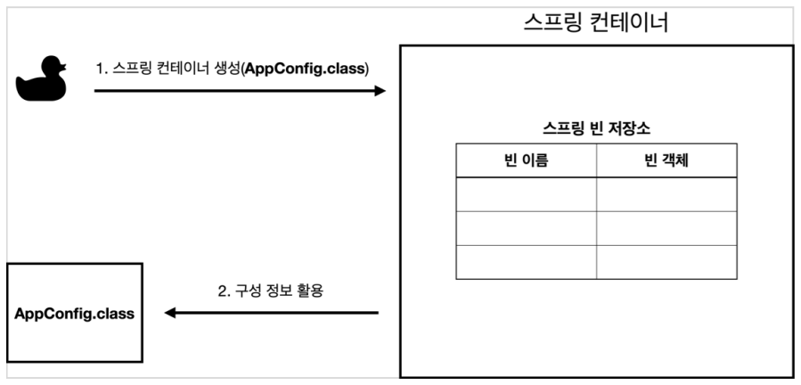
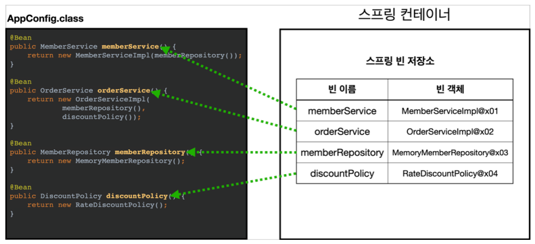
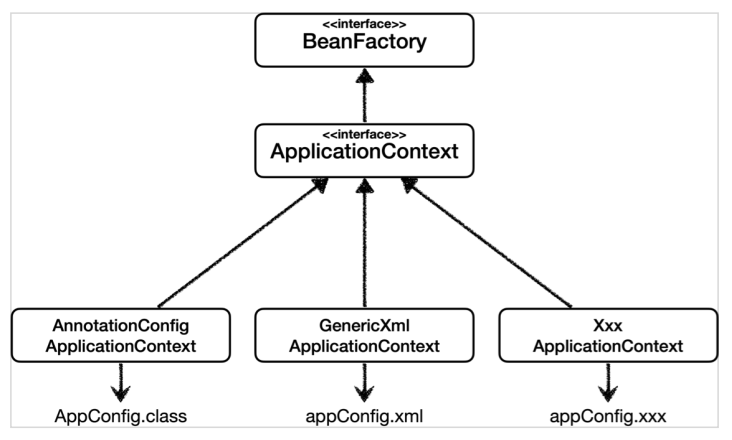

[TIL on April 12th, 2023](../../../TIL/2023/04/04-12-2023.md)
## 섹션 4. 스프링 컨테이너와 스프링 빈

### 개요
* 지금까지는 스프링이 왜 필요한지에 대해 쭉 공부를 해왔음
* 이제는 스프링의 활용법에 대해 본격적으로 강의한다고 함.


### 스프링 컨테이너 생성
* 스프링 컨테이너가 생성되는 과정을 알아보자.

```java
ApplicationContext ac
    = new AnnotationConfigApplicationContext(AppConfig.class);
```

* `AnnotationConfigApplicationContext` 객체를 생성하면서 `AppConfig`의 클래스 리터럴을 넘겼다.
  - 이를 통해 반환 받은 것이 `ApplicationContext`이다.
  - 이 `ApplicationContext`를 스프링 컨테이너라고 하며, 이는 인터페이스이다.
  - 이는 `Annotation` 기반 자바 컨픽으로 만들어진 `ApplicationContext`라는 의미이다: 어노테이션은 자바 기본 문법이다. 이를 통해서 다음과 같은 일을 할 수 있다고 한다:
    1. 컴파일러에게 코드 작성 문법 에러를 체크하도록 정보 제공
    2. 소프트웨어 개발 환경이 빌드나 배포시 코드를 자동으로 생성할 수 있도록 정보 제공
    3. 런타임에 특정 기능을 실행하도록 정보를 제공
    * 관련 문법을 좀 더 공부한다면 이해도를 높일 수 있겠지만, 지금은 이를 활용하는 컨픽이라는 것 정도로 이해하고 넘어가자.
  - 직전에 AppConfig 를 사용했던 방식이 애노테이션 기반의 자바 설정 클래스로 스프링 컨테이너를 만든 것이다.
  - 유사한 방법으로 다르게 제어되는 ApplicationContext도 만들 수 있다. `ClassPathXmlApplicationContext`를 통한다면 XML을 기반에 둔 ApplicationContext도 만들 수 있다.

> NOTE: 엄밀하게 얘기하면, 스프링 컨테이너를 부를 때 `BeanFactory`, `ApplicationContext` 로 구분짓는다. 그러나, `BeanFactory`를 직접 사용하는 경우는 거의 없으므로, 일반적으로 `ApplicationContext`를 스프링 컨테이너라 한다.

1. 스프링 컨테이너 생성
  - `new AnnotationConfigApplicationContext(AppConfig.class)`
  - 스프링 컨테이너를 생성할 때는 구성 정보를 지정해줘야 한다.
  - 여기서는 AppConfig.class를 구성 정보로 지정했다.



2. 스프링 빈 등록
  - 어노테이션 기반의 경우, @Bean이라 표시한 메소드들을 스프링 컨테이너에 등록해준다.



* 빈 이름
  - 빈 이름은 메소드 이름을 사용한다.
  - 빈 이름을 직접 부여할 수도 있다: `@Bean(name="memberService2")`
  - 단, 빈의 이름은 중복되면 안 된다. 경우에 따라 오류가 발생하고, 버그를 일으킬 수 있다. 

3. 스프링 빈 의존관계 설정
* 스프링 컨테이너는 설정 정보를 참고해서 의존관계를 주입한다.
  - 단순히 자바 코드를 호출하는 것 같지만, 차이가 있다. 이 차이는 추후에 설명하도록 한다.

> NOTE: 스프링은 빈을 생성하고, 의존관계를 주입하는 단계가 나뉘어 있다. 그런데 이렇게 자바 코드로 스프링 빈을 등록하면 생성자를 호출하면서 의존관계 주입도 한 번에 처리된다(생성자들끼리 엮여있기 때문에). @Autowired와 같은 어노테이션을 활용해 스프링이 알아서 등록하도록 설정하면 단계가 나누어진다는 의미일 것 같음. 이에 대한 설명은 나중에 들어보자.

<br>

### 컨테이너에 등록된 모든 빈 조회
* 지금까지 등록해둔 것이 제대로 등록이 됐는지 확인해보고자 함.
* 우리가 구현한 걸 확인하는 방법을 배우자.

* Test 코드를 아래와 같이 작성한다.
  - `AnnotationConfigApplicationContext ac = new AnnotationConfigApplicationContext(AppConfig.class);`으로 해야함. 만약에 ac를 인터페이스인 AnnotationConfig만으로 설정하면, ac의 getBeanDefinition() 메소드를 활용할 수 없음.
```java
    AnnotationConfigApplicationContext ac = new AnnotationConfigApplicationContext(AppConfig.class);

    @Test
    @DisplayName("모든 빈 출력하기")
    void findAllBean() {
        String[] beanDefinitionNames = ac.getBeanDefinitionNames();
        for (String beanDefinitionName : beanDefinitionNames) {
            Object bean = ac.getBean(beanDefinitionName);
            System.out.println("name = " + beanDefinitionName + " object = " + bean);
        }
    }
```
* 위 코드에 대한 콘솔 출력 결과는 아래와 같다.

```
name = org.springframework.context.annotation.internalConfigurationAnnotationProcessor object = org.springframework.context.annotation.ConfigurationClassPostProcessor@3ecd267f
name = org.springframework.context.annotation.internalAutowiredAnnotationProcessor object = org.springframework.beans.factory.annotation.AutowiredAnnotationBeanPostProcessor@58ffcbd7
name = org.springframework.context.annotation.internalCommonAnnotationProcessor object = org.springframework.context.annotation.CommonAnnotationBeanPostProcessor@555cf22
name = org.springframework.context.event.internalEventListenerProcessor object = org.springframework.context.event.EventListenerMethodProcessor@6bb2d00b
name = org.springframework.context.event.internalEventListenerFactory object = org.springframework.context.event.DefaultEventListenerFactory@3c9bfddc
name = appConfig object = hello.core.AppConfig$$EnhancerBySpringCGLIB$$f85b5e03@1a9c38eb
name = memberService object = hello.core.member.MemberServiceImpl@319bc845
name = memberRepository object = hello.core.member.MemoryMemberRepository@4c5474f5
name = orderService object = hello.core.order.OrderServiceImpl@2f4205be
name = discountPolicy object = hello.core.discount.RateDiscountPolicy@54e22bdd
```
  - 구분하자면, 아래에서 다섯 번째 줄인 appConfig object 이하는 내가 직접 설정한 메소드들이 Bean으로 등록되는 것.
  - 그외 상위에 있는 것들은 스프링 내부적으로 설정해둔 것들.

* 이제 스프링 외적으로 내가 설정한 Bean만 확인하는 테스트를 작성해보자.

```java
    @Test
    @DisplayName("어플리케이션 빈 출력하기")
    void findApplicationBean() {
        String[] beanDefinitionNames = ac.getBeanDefinitionNames();
        for (String beanDefinitionName : beanDefinitionNames) {
            BeanDefinition beanDefinition = ac.getBeanDefinition(beanDefinitionName);

            if (beanDefinition.getRole() == BeanDefinition.ROLE_APPLICATION) {
                Object bean = ac.getBean(beanDefinitionName);
                System.out.println("name = " + beanDefinitionName + " object = " + bean);
            }
        }
    }
```

* 이를 통해 bean의 정의를 가져오고, 그중에 역할을 가져올 수 있음. 확인할 수 있는 역할들은 아래와 같음.
  - BeanDefinition.ROLE_APPLICATION (= 0)
  - BeanDefinition.ROLE_INFRASTRUCTURE (= 2)

* 그러니, 어플리케이션 빈만을 출력하기 위해서 `if (beanDefinition.getRole() == BeanDefinition.ROLE_APPLICATION)` 조건문을 활용하는 것.
  - 위 어플리케이션 빈 출력 테스트 코드를 통해 얻는 콘솔 로그는 아래와 같음.
```
name = appConfig object = hello.core.AppConfig$$EnhancerBySpringCGLIB$$acbb0914@6b98a075
name = memberService object = hello.core.member.MemberServiceImpl@2e61d218
name = memberRepository object = hello.core.member.MemoryMemberRepository@3569fc08
name = orderService object = hello.core.order.OrderServiceImpl@20b12f8a
name = discountPolicy object = hello.core.discount.RateDiscountPolicy@e84a8e1
```

* 모든 빈 출력하기
  - 실행하면 스프링에 등록된 모든 빈 정보를 출력할 수 있다.
  - ac.getBeanDefinitionNames() : 스프링에 등록된 모든 빈 이름을 조회한다.
  - ac.getBean() : 빈 이름으로 빈 객체(인스턴스)를 조회한다.
* 애플리케이션 빈 출력하기
  - 스프링이 내부에서 사용하는 빈은 제외하고, 내가 등록한 빈만 출력해보자.
  - 스프링이 내부에서 사용하는 빈은 getRole() 로 구분할 수 있다. 이 역할은 BeanDefinition이라는 enum으로 정의되며, 그 내용은 아래와 같다.
    1. ROLE_APPLICATION: 일반적으로 사용자가 정의한 빈, 값은 0
    2. ROLE_INFRASTRUCTURE: 스프링이 내부에서 사용하는 빈, 값은 2
    3. ROLE_SUPPORT: 그 밖의 보조적인 역할을 하는 빈(으로 판단됨. 강의에선 설명하지 않음.). 값은 1

<br>

### 스프링 빈 조회 - 기본
* 빈을 조회하는 가장 기본적인 방법: ac.getBean(빈이름, 타입), ac.geBean(타입)

```java
public class ApplicationContextBasicFindTest {

    AnnotationConfigApplicationContext ac = new AnnotationConfigApplicationContext(AppConfig.class);

    @Test
    @DisplayName("빈 이름으로 조회")
    void findBeanByName() {
        MemberService memberService = ac.getBean("memberService", MemberService.class);
        assertThat(memberService).isInstanceOf(MemberServiceImpl.class);
    }

    @Test
    @DisplayName("이름 없이 타입으로만 조회: 타입으로만 찾는 경우, 같은 타입이 여러 개일 때 곤란해진다")
    void findBeanByType() {
        MemberService memberService = ac.getBean(MemberService.class);
        assertThat(memberService).isInstanceOf(MemberServiceImpl.class);
    }

    @Test
    @DisplayName("구체 타입으로 조회")
    void findBeanByType2() {
        MemberService memberService = ac.getBean("memberService", MemberServiceImpl.class);
        assertThat(memberService).isInstanceOf(MemberServiceImpl.class);
    }

    @Test
    @DisplayName("없는 이름으로 조회")
    void findBeanByNonExistName() {
        assertThatThrownBy(() -> {
            MemberService memberService = ac.getBean("xx", MemberServiceImpl.class);
        }).isInstanceOf(NoSuchBeanDefinitionException.class);
    }
}

```

* 3번째 테스트와 같이 구체 타입에 대해 확인을 할 수도 있다. 그러나, 이렇게 구체 타입에 대한 확인은 기본적으로 바람직하지 않다는 점 인지해야 한다.

* getBean에 인자로 들어가는 것들이 뭔지 확인할 필요가 있을 듯.


<br>

### 스프링 빈 조회 - 동일한 타입이 둘 이상
* 타입으로 조회 시 같은 타입의 스프링 빈이 둘 이상이면 오류가 발생한다. 이때는 빈 이름을 지정하자.
* `ac.getBeanOfType()`을 사용하면 해당 타입의 모든 빈을 조회할 수 있다.

* static class를 활용해서 테스트 안에서만 활용할 수 있는 컨픽을 만들어줌.
* 아래와 같은 테스트를 구현했다고 하자.
```java
package hello.core.beanfind;

// import문 생략

public class ApplicationContextSameBeanFindTest {

    AnnotationConfigApplicationContext ac = new AnnotationConfigApplicationContext(SameBeanConfig.class);

    @Test
    @DisplayName("타입으로 조회 시에 같은 타입이 둘 이상 있으면, 중복 오류가 발생한다.")
    void findBeanByTypeDuplicate() {
        MemberRepository bean = ac.getBean(MemberRepository.class);
    }

    @Configuration
    static class SameBeanConfig {

        @Bean
        public MemberRepository memberRepository1() {
            return new MemoryMemberRepository();
        }

        @Bean
        public MemberRepository memberRepository2() {
            return new MemoryMemberRepository();
        }
    }
}

```

* 다음과 같은 예외가 발생한다.
  - `NoUniqueBeanDefinitionException`

```
org.springframework.beans.factory.NoUniqueBeanDefinitionException: No qualifying bean of type 'hello.core.member.MemberRepository' available: expected single matching bean but found 2: memberRepository1,memberRepository2
```

* 아래와 같이 잡을 수 있다.

```java
    void findBeanByTypeDuplicate() {
        Assertions.assertThatThrownBy(() -> {
            MemberRepository bean = ac.getBean(MemberRepository.class);
        }).isInstanceOf(NoUniqueBeanDefinitionException.class);
    }
```

* 그래서 이같은 문제를 막기 위해 아래와 같이 getBean 메소드에 인자를 추가하면 된다.
```java
    @Test
    @DisplayName("타입으로 조회 시 같은 타입이 둘 이상 있다면 빈 이름을 지정하면 된다")
    void findBeanByName() {
        MemberRepository memberRepository = ac.getBean("memberRepository1", MemberRepository.class);
        assertThat(memberRepository).isInstanceOf(MemberRepository.class);
    }
```

* 나중에 자동으로 의존관계를 주입할 때도 이런 게 자동으로 활용된다고 함.

<br>

### 스프링 빈 조회 - 상속 관계
* 부모 타입으로 조회했는데, 자식이 여러 개 있으면 어떻게 될까?
  - **자식 빈들도 함께 조회가 된다(대원칙)**
* 모든 자바 객체의 부모인 'Object' 타입을 활용하면, 모든 스프링 빈을 다 조회한다.
* getBean 메소드의 다양한 활용법에 대해서 설명하는 것이라 이해하면 될 듯. 이정도까지만 이해하고 있으면 된다고 함.

<br>

### BeanFactory와 ApplicationContext
#### BeanFactory
* 스프링 컨테이너의 최상위 인터페이스이다.
* 스프링 빈을 관리하고 조회하는 역할을 담당한다.
* `getBean()`을 제공한다.
* 지금까지 우리가 사용했던 대부분의 기능은 BeanFactory가 제공하는 기능이다.

#### ApplicationContext
* BeanFactory 기능을 모두 상속받아서 제공한다.
* 빈을 관리하고 검색하는 기능을 BeanFactory가 제공해주는데, 그러면 둘의 차이가 뭘까?
  - BeanFactory는 BeanFactory고 ApplicationContext는 다양한 기능을 수행하기 위해 다른 인터페이스들을 추가로 구현할 듯.
* 애플리케이션을 개발할 때는 빈을 관리하고 조회하는 기능은 물론이고, 수많은 부가기능이 필요하다. 
  1. 메시지소스를 활용한 국제화 기능
    - 예를 들어서 한국에서 들어오면 한국어로, 영어권에서 들어오면 영어로 출력
  2. 환경변수
    - 로컬, 개발, 운영등을 구분해서 처리
    - 로컬: 초기에 내 컴퓨터에서 내부적으로만 실행해보는 단계
    - 테스트 서버, 개발 환경: 서버에 올려놓고 동작시키면서 확인해보는 단계
    - 실제 프로덕션에 나가는 운영 환경: 실제 서비스를 실행하는 환경에서 확인하는 단계
  3. 애플리케이션 이벤트
    - 이벤트를 발행하고 구독하는 모델을 편리하게 지원
  4. 편리한 리소스 조회
    - 파일, 클래스패스, 외부 등에서 리소스를 편리하게 조회
* 이런 것들을 ApplicationContext를 통해 수행할 수 있게 해줌.

#### 정리
* ApplicationContext는 BeanFactory의 기능을 상속받는다.
* ApplicationContext는 빈 관리기능 + 편리한 부가 기능을 제공한다.
* BeanFactory를 직접 사용할 일은 거의 없다. 부가기능이 포함된 ApplicationContext를 사용한다.
* BeanFactory나 ApplicationContext를 스프링 컨테이너라 한다
  - 결국 BeanFactory가 하는 역할이 스프링 컨테이너인데, 이를 상속하면서 부가기능을 제공하는 ApplicationContext를 편의상 만들어놓고 쓰는 거라, 둘 다 스프링 컨테이너라고 부르는 듯함.

<br>

### 다양한 설정 형식 지원 - 자바 코드, XML
* 이렇게 동작하는구나-하고 이해하는 정도로 넘어갈 예정
* 스프링 컨테이너는 다양한 형식의 설정 정보를 받아들일 수 있게 유연하게 설계되어 있다.



* GenericXmlApplicationContext: 문서 xml으로 설정을 할 수 있다.

1. 어노테이션 기반 자바 코드 설정 사용
  - 지금까지 했던 것.
  - `new AnnotationConfigApplicationContext(AppConfig.class)`
  - `AnnotationConfigApplicationContext` 클래스를 사용하면서 자바 코드로 된 설정 정보를 넘기면 된다.

2. XML 설정 사용
  - 최근에는 스프링 부트를 많이 사용하면서 XML 기반 설정을 사용하지 않는다.
  - 아직 많은 레거시 프로젝트들이 XML로 되어 있고, 또 XML을 사용하면 컴파일 없이 빈 설정 정보를 변경할 수 있는 장점도 있으니 알고는 있어야 한다.
  - GenericXmlApplicationContext를 사용하여 xml 설정 파일을 넘기면 된다.

* XmlAppConfig 사용 자바 코드
  - XmlAppContext는 다음과 같이 작성해 테스트한다.
```java
public class XmlAppContext {

    @Test
    void xmlAppContext() {
        ApplicationContext ac = new GenericXmlApplicationContext("appConfig.xml");
        MemberService memberService = ac.getBean("memberService", MemberService.class);
        Assertions.assertThat(memberService).isInstanceOf(MemberService.class);
    }
}
```

* `ApplicationContext ac = new GenericXmlApplicationContext("appConfig.xml");`를 통해서 main 내 java를 제외한 다른 코드들을 넣어두는 resource 패키지의 appConfig.xml을 연결한다.
  - appConfig.xml은 아래와 같이 작성한다.

```xml
<?xml version="1.0" encoding="UTF-8"?>
<beans xmlns="http://www.springframework.org/schema/beans"
       xmlns:xsi="http://www.w3.org/2001/XMLSchema-instance"
       xsi:schemaLocation="http://www.springframework.org/schema/beans http://www.springframework.org/schema/beans/spring-beans.xsd">

    <bean id="memberService" class="hello.core.member.MemberServiceImpl">
        <constructor-arg name="memberRepository" ref="memberRepository" />
    </bean>

    <bean id="memberRepository" class="hello.core.member.MemoryMemberRepository" />

    <bean id="orderService" class="hello.core.order.OrderServiceImpl">
        <constructor-arg name="memberRepository" ref="memberRepository" />
        <constructor-arg name="discountPolicy" ref="discountPolicy" />
    </bean>

    <bean id="discountPolicy" class="hello.core.discount.RateDiscountPolicy" />
</beans>
```

  - 형식이 xml인 것을 빼고는 AppConfig와 완전히 같은 내용을 작성하고 있는 것.
  - `constructor-arg`에는 생성자 관련 정보가 들어가는 것을 확인할 수 있다.
  - xml 기반 설정 관련 내용은 스프링 공식 레퍼런스 문서를 확인하자.

<br>

### 스프링 빈 설정 메타 정보 - BeanDefinition
* 스프링은 어떻게 이런 다양한 설정 형식을 지원하는 것일까? 그 중심에는 BeanDefinition 이라는 추상화가 있다.
* 쉽게 이야기해서 **역할과 구현을 개념적으로 나눈 것**이다!
  - XML을 읽어서 BeanDefinition을 만들면 된다.
  - 자바 코드를 읽어서 BeanDefinition을 만들면 된다.
  - 스프링 컨테이너는 자바 코드인지, XML인지 몰라도 된다. 오직 BeanDefinition만 알면 된다.
* `BeanDefinition`을 빈 설정 메타정보라 한다.
  - `@Bean`, `<bean>` 당 각각 하나씩 메타 정보가 생성된다.
* 스프링 컨테이너는 이 메타정보를 기반으로 스프링 빈을 생성한다.

* 스프링 컨테이너 자체는 BeanDefinition 인터페이스에만 의존함.
  - 이를 구현하는 방식이 AppConfig.class가 될 수도 있고, appConfig.xml, appConfig.xxx 등이 될 수도 있는 것.

* `AnnotationConfigApplicationContext`는 `AnnotatedBeanDefinitionReader`를 사용해서 `AppConfig.class`를 읽고 `BeanDefinition`을 생성한다.
* `GenericXmlApplicationContext`는 `XmlBeanDefinitionReader`를 사용해서 `appConfig.xml` 설정 정보를 읽고 `BeanDefinition`을 생성한다.
* 새로운 형식의 설정 정보가 추가되면, `XxxBeanDefinitionReader`를 만들어서 `BeanDefinition`을 생성하면 된다.

> 결국 뭘 활용하든 간에 BeanDefinition을 생성해 ApplicationContext에 전달해주면 됨. 대신에 이를 활용하기 위해선 어떤 식으로 설정해야 하는지 규칙을 알아야 한다.

* 아래 테스트 코드를 활용해서 BeanDefinitionTest를 수행할 수 있다.

```java
public class BeanDefinitionTest {

    AnnotationConfigApplicationContext ac = new AnnotationConfigApplicationContext(AppConfig.class);

    @Test
    @DisplayName("빈 설정 메타정보 확인")
    void findApplicationBean() {
        String[] beanDefinitionNames = ac.getBeanDefinitionNames();
        for (String beanDefinitionName : beanDefinitionNames) {
            BeanDefinition beanDefinition = ac.getBeanDefinition(beanDefinitionName);

            if (beanDefinition.getRole() == BeanDefinition.ROLE_APPLICATION) {
                System.out.println("beanDefinition = " + beanDefinitionName +
                        " beanDefinition = " + beanDefinition);
            }
        }
    }
}

```

* BeanDefinition 정보
  - BeanClassName: 생성할 빈의 클래스 명(자바 설정 처럼 팩토리 역할의 빈을 사용하면 없음)
  - factoryBeanName: 팩토리 역할의 빈을 사용할 경우 이름, 예) appConfig
  - factoryMethodName: 빈을 생성할 팩토리 메서드 지정, 예) memberService
  - Scope: 싱글톤(기본값)
  - lazyInit: 스프링 컨테이너를 생성할 때 빈을 생성하는 것이 아니라, 실제 빈을 사용할 때 까지 최대한 생성을 지연처리 - 하는지 여부
  - InitMethodName: 빈을 생성하고, 의존관계를 적용한 뒤에 호출되는 초기화 메서드 명
  - DestroyMethodName: 빈의 생명주기가 끝나서 제거하기 직전에 호출되는 메서드 명
  - Constructor arguments, Properties: 의존관계 주입에서 사용한다. (자바 설정 처럼 팩토리 역할의 빈을 사용하면 없음)

#### 정리
* BeanDefinition을 직접 생성해서 스프링 컨테이너에 등록할 수 도 있다. 하지만 실무에서 BeanDefinition을 직접 정의하거나 사용할 일은 거의 없다. 어려우면 그냥 넘어가면 된다^^!
* BeanDefinition에 대해서는 너무 깊이있게 이해하기 보다는, 스프링이 다양한 형태의 설정 정보를 BeanDefinition으로 추상화해서 사용하는 것 정도만 이해하면 된다.
* 가끔 스프링 코드나 스프링 관련 오픈 소스의 코드를 볼 때, BeanDefinition 이라는 것이 보일 때가 있다. 이때 이러한 메커니즘을 떠올리면 된다.

* 애초에 ApplicationContext 인터페이스에 getBean 메서드를 구현하지 않은 것은, 개발 레벨에서 컨테이너를 직접 만질 일이 없기 때문임. 그렇기 때문에 getBean 메서드는 구체 클래스로 내려가야만 활용할 수 있는 거고.

* AppConfig도 이전에 있던 FactoryMethod를 통한 설정이 발전한 형태. 