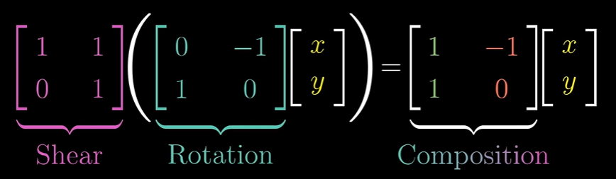

[TIL on February 2nd, 2023](../../TIL/2023/02/02-02-2023.md)
# **[Essence of linear algebra](https://youtube.com/playlist?list=PLZHQObOWTQDPD3MizzM2xVFitgF8hE_ab)**
### **[Vectors | Chapter 1, Essence of linear algebra](https://youtube.com/playlist?list=PLZHQObOWTQDPD3MizzM2xVFitgF8hE_ab)**
* 벡터 A(-2, 3)
  - 벡터의 시작점은 (0, 0)이라 둠
  - 벡터의 종점은 시작점에서 *x*축에 평행하게 -2만큼 이동하고 *y*축에 평행하게 3만큼 이동해 얻을 수 있다.

* 벡터의 합(vector addition)
  - A, B 벡터가 각각 A(x1, y1), B(x2, y2)라 하자.
  - 벡터 B를 시작점(origin)에서 이동시켜 A의 끝점에 둔다.
  - 각 벡터는 특정 움직임을 모사한다.
  - A + B = (x1 + x2, y1 + y2)이다.

* 벡터의 곱(vector multiplication)
  - 벡터 A(x1, y1)에 대해서 1/3을 곱한다고 생각하면 그 이동하려는 경향을 1/3로 만든다 표현할 수 있다.
  - -1.8배를 할 수도 있고, 3배로 만들 수도 있다. 이 스케일링(scaling)이라 한다. 그리고 이때 숫자들을 스칼라(스케일러, scalar)들이라 한다.
  - 벡터 A에 2를 곱한다 하면 2A = (2x1, 2y1)으로 나타낼 수 있다.

* 이러한 표현이 가능하기 때문에 컴공과나 물리과가 이를 리스트 또는 화살표로 인식할 수 있는 것이다.
 

### **[Linear combinations, span, and basis vectors | Chapter 2, Essence of linear algebra](https://youtu.be/k7RM-ot2NWY?list=PLZHQObOWTQDPD3MizzM2xVFitgF8hE_ab)**
* 벡터 A(-2, 3)를 생각해보자.
  - 이는 단위벡터(unit vector, scale vector) i, j에 스칼라 값을 곱해서 구할 수 있다. i는 (1, 0)이며, j는 (0, 1)이다.
  - A = -2i + 3j이다.

* 2개의 기저 벡터 v, w가 있다고 하자. a, b가 스칼라일 때, 이를 선형 조합으로 av + bw를 만들 수 있다. 한 벡터에 대한 스칼라는 고정한 채로 다른 스칼라를 감소 또는 증가시키면 직선을 얻을 수 있다.
  - 만약, a와 b가 임의로 변한다고 하면, 이를 통해 평면 상 모든 벡터를 표현할 수 있다.
  - 그러나 v와 w가 우연히 동일한 방향을 갖는다면 av + bw는 한 직선 밖에 표현할 수가 없다.
  - 두 기저 벡터 모두 영벡터면 0차원인 점에 그칠 수도 있다.

* 이같이 임의의 스칼라 a, b에 대해 선형 조합된 벡터 av + bw가 도달할 수 있는 범위를 스팬(span)이라고 한다.
  - v와 w가 동일한 방향이면 스팬은 한 직선이다.

* 벡터를 화살표로 생각하지 말고, 끝점만 있는 점이라고 생각하자.
  - 하나의 벡터는 화살표로 생각하는 것이 더 직관적이지만, 여러 벡터의 집합은 끝점의 모임(collection)으로 생각하는 게 좋다.

* 3차원 공간 상의 두 개 벡터가 있다면 이들로 만들 수 있는 스팬은 공간 상의 한 평면이 된다.
  - 3개의 벡터는 3차원 공간 모두를 표현할 수 있다. 2개의 벡터로 만든 평면을 3번째 벡터가 3차원 공간으로 움직이며 스위핑한다고 생각할 수 있을 듯함.

* 선형적 독립성; Linearly dependent (independent)
  - 스팬과 동일한 차원의 벡터는 선형적으로 종속됐다고 한다.
  - 스팬에 또다른 차원을 더하는 벡터는 선형적으로 독립적이라 한다.

* 벡터 공간의 기저는 선형적으로 독립된 벡터들의 집합이다. 이 벡터들은 벡터 공간 전체로 신장(span)한다.
 

### **[Linear transformations and matrices | Chapter 3, Essence of linear algebra](https://youtu.be/kYB8IZa5AuE)**
* 선형변환(linear transformation)과 행렬과의 연관성
  - 변형은 벡터의 방향성을 바꾼다. 즉, 원래 벡터가 가지고 있던 방향성을 움직여 다른 방향을 향하게 만든다.
  - 선형변환은 모든 input vector에 동일한 변화를 준 output vector가 되게 한다.
  - 벡터의 집합을 선형변환 시 2차원의 경우 평면이 변형됨.
  - 선형의 의미는 Lines remain lines과 origin remain origin의 성질을 갖는다: 즉, 선은 선으로 유지되고, 원점도 다른 곳으로 이동하지 않는다.

* 선형변환은 결국 변형 전 벡터와 변형 후 벡터의 관계를 통해 설명된다. 이들의 관계를 통해 2×2 행렬을 만들 수 있다.
  - 변형 전 단위 벡터 i의 변형 후 위치 정보와 변형 전 단위 벡터 j의 변형 후 위치 정보를 활용해 선형변환을 할 수 있다.

> [{a, c},{b, d}]{x, y} = {a, c}x + {b, d}y

  - 만약 두 벡터의 선형변환에 활용되는 a, b와 c, d가 평행하면 이 선형변환을 받은 모든 점은 직선 위에 대응된다.

* ai + bj라고 하고, 현 벡터 공간 상 단위 벡터를 i = (1, 0), j = (0, 1)이라 하자. 현재 벡터 공간에선 ai + bj를 (a, b)로 표현할 수 있다. 이 상태에서 단위 벡터를 재정의한다.
  - 예를 들어 i' = (0, 1), j' = (1, 0)으로 설정한다고 하자. 이 공간 상에서 (a, b)가 단위 벡터가 i = (1, 0), j = (0, 1)인 곳에서 어떻게 표현되는지 알고 싶다면 ai' + bj' = aj + bi라는 것을 알 수 있고, i = (1, 0), j = (0, 1) 공간의 (b, a)로 대응됨을 알 수 있다.
  - 이를 일반화하자. i가 (a, c)로 이동하고, j가 (b, d)로 이동해야 한다면, 해당 연산은 `[{a, c},{b, d}]`를 곱해 수행할 수 있다.

* 선형변환은 함수로, 벡터를 입력 받아 벡터를 반환한다.

* 이를 활용하면 기본 단위 벡터인 $\hat{i} = (1, 0)$과 $\hat{j} = (0, 1)$을 각각 $\hat{i}' = (\cos{\theta}, \sin{\theta})$, $\hat{j}' = (-\sin{\theta}, \cos{\theta})$로 옮기는 것과 동일하다. 따라서 회전변환은 아래와 같이 나타난다.

|$\hat{i}'$    |$\hat{j}'$     |
|--------------|---------------|
|$\cos{\theta}$|$-\sin{\theta}$|
|$\sin{\theta}$|$\cos{\theta}$ |
 

### **[Matrix multiplication as composition | Chapter 4, Essence of linear algebra](https://youtu.be/XkY2DOUCWMU)**
* Composition을 생각하자.
  - 최종 연산의 결과를 확인하면 composition 하기 위한 2×2 행렬을 구할 수 있다.
  - 원 벡터를 회전한 후 shaer를 주기 위한 연산은 아래 식과 같다.

  

  - 오른쪽에서 왼쪽으로 읽어야 한다. f(g(x))와 같은 합성 함수와 비슷하다.

* 매트릭스 곱은 여러 번의 선형변환을 수행하는 것이다. 결국 원래 있던 단위벡터를 어디로 이동시킬 것인지에 대한 문제라 이해할 수 있을 듯하다.

* 결합법칙이 성립한다는 것을 행렬 곱의 의미를 통해서 직관적으로 파악할 수도 있음을 언급함.
 

### **[Three-dimensional linear transformations | Chapter 5, Essence of linear algebra](https://youtu.be/rHLEWRxRGiM)**
* 3차원적으로 생각할 때, 축을 이루는 3개의 단위벡터가 이동하는 것을 생각함.
* 3차원 벡터 상에서 두 번의 선형 변환을 수행한다고 하면, 3×3 행렬 2개의 곱으로 나타나게 된다.
 

### **[The determinant | Chapter 6, Essence of linear algebra](https://youtu.be/Ip3X9LOh2dk?list=PLZHQObOWTQDPD3MizzM2xVFitgF8hE_ab)**
* 선형 변환이 단위 벡터의 위치를 조정하면서 공간을 늘리거나 줄인다는 사실을 알았다. 그렇다면, 이 선형 변환이 공간을 얼마나 늘이고 줄이는지 알 수 있는가?

* 일례로, [{3, 0}, {0, 2}] 행렬이 있다고 하자. 이는 단위벡터 i를 {3, 0}로 옮기고, 단위벡터 j는 {0, 2}로 옮기는 선형변환을 수행한다.
  - 이는 i * j의 넓이인 1을 6배로 늘린다.
  - 그렇기 때문에 이 선형 변환의 행렬식은 6이다.
  
* 행렬식이 0이라는 건 면적을 0으로 만든다는 것이다.

* 행렬식은 음수가 될 수 있다. 그렇다면 면적이 음수일 수 있다는 건가? 이는 무엇을 의미하는가?
  - 벡터의 오리엔테이션을 뜻한다. i와 j의 180도 미만의 각을 방향이 시계 방향인지, 반시계 방향인지 표현한다고 생각할 수 있다.

* 3차원에 이를 대입하게 되면 선형 변환 후의 부피 증가/감소율을 의미하게 된다.
  - 행렬식이 0이라는 건 부피가 평면, 선, 원점으로 압축된다는 뜻이다.

* 오리엔테이션(지향성)은 오른손 법칙을 통해 알 수 있다.

* 2차원 행렬식은 ad - bc로 구할 수 있다.
  - 만약, {a, 0}와 {0, d}였다면 간단하게 ad만큼 면적이 증가할 것이라고 알 수 있다.
  - {a, 0}와 {c, d}였다면 평행사변형이 될 것이며, 이는 여전히 ad - 0c = ad만큼 면적을 변형시킬 것이다.

* 이런 관점에서 행렬식을 파악하게 된다면, 간단하게 $det(M_1)det(M_2) = det(M_1M_2)$인 이유를 설명할 수 있다.
 

### **[Inverse matrices, column space and null space | Chapter 7, Essence of linear algebra](https://youtu.be/uQhTuRlWMxw?list=PLZHQObOWTQDPD3MizzM2xVFitgF8hE_ab)**
* Inverse matrices, column space, rank, null space에 대해 알아볼 것.

* 행렬들의 유용성: 연립방정식을 풀 때 활용할 수 있음.
  - 다음과 같은 세 식이 있다고 하자: $2x + 5y + 3z = -3$, $4x + 0y + 8z = 0$, $1x + 3y + 0z = 2$
  - $\vec{x} = \lbrace{x, y, z}\rbrace$라고 하면, $A\vec{x} = \vec{v}$ 꼴의 식을 얻을 수 있음.
  - 즉, $\vec{x}$를 $A$라는 선형 변환을 통해 $\vec{v}$로 만드는 $\vec{x}$를 구하는 문제라고 이해할 수 있다.

* $A$의 행렬식이 0이 아닌 경우엔 항상 $\vec{v}$에 대응되는 유일한 $\vec{x}$를 구할 수 있다.
  - $A^{-1}A\vec{x} = A^{-1}\vec{v} ⇒ \vec{x} = A^{-1}\vec{v}$
* 이는 $A^{-1}$가 존재한다는 의미이다.

* $det(A) = 0$라면 함수적 성질이 통하지 않는다. $A\vec{x}$를 통해 얻은 $\vec{v}$는 다시 $\vec{x}$로 복원할 수 없게 된다.
  - $det(A) = 0$이어도 답이 존재할 가능성은 있다. 압축된 결과와 방향이 일치하는 벡터는 답을 찾을 수도 있다.

* 3차원 상에서 $det(A) = 0$인 A로 선형 변환을 하면 평면이 되거나 선이 되거나 점이 된다.
  1. Rank 1: 1차원, 선
  2. Rank 2: 2차원, 평면

* Rank라는 것은 선형 변형 결과물의 차원을 뜻한다.
  - 2차원 선형 변환의 경우 변형 결과가 2인 것이 최대이다.
  - 3차원 선형 변환의 경우 변형 결과가 3인 것이 최대이다.

* $A\vec{x}$의 모든 연산 결과를 "$A$의 Column space"라고 한다.
  - Span of columns와 같은 말이다

* Full rank가 column의 개수와 동일할 때 이를 Full rank라고 한다.

* column space에는 항상 원점이 포함되며, 랭크가 낮아질 때는 몇 개의 column이 원점으로 압축된다.
  - 이렇게 원점으로 압축되는 벡터들을 'null space', 또는 'kernel'이라 한다.
  - Null space 상 벡터들은 항상 $A\vec{x} = [0, 0]$을 만족하게 된다.
 

