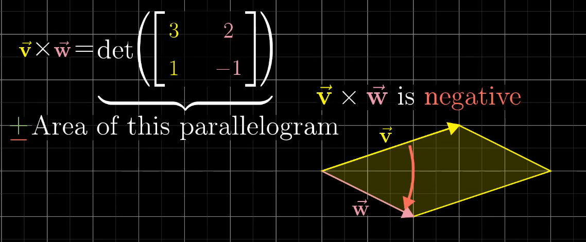

[TIL on February 15th, 2023](../../TIL/2023/02/02-15-2023.md)
# **[Essence of linear algebra](https://youtube.com/playlist?list=PLZHQObOWTQDPD3MizzM2xVFitgF8hE_ab)**
### **[Nonsquare matrices as transformations between dimensions | Chapter 8, Essence of linear algebra](https://youtu.be/v8VSDg_WQlA?list=PLZHQObOWTQDPD3MizzM2xVFitgF8hE_ab)**
* 비정방형 행렬(nonsquare matrices)의 의미
  - 2차원 벡터를 입력하고 3차원 벡터를 얻는 선형 변환도 존재한다. 아래 선형 변환식을 보자.

|$\hat{i}$|$\hat{j}$|
|---------|---------|
|2        |0        |
|-1       |1        |
|-2       |1        |

* 이 경우, $\hat{i}$ = [1, 0]을 [2, -1, 2]로 이동시키고, $\hat{j}$ = [0, 1]을 [0, 1, 1]로 이동시키는 선형 변환이라 할 수 있다.
  - 3×2 행렬이라 부른다. 해당 변형을 하더라도 column space가 뭉개지지(squash) 않기 때문에 이는 full rank이다.
* 반대로, 2×3 행렬은 어떤가?

|$\hat{i}$|$\hat{j}$|$\hat{j}$|
|---------|---------|---------|
|3        |1        |4        |
|1        |5        |9        |

  - 3차원 공간을 2차원에 대응시키는 선형변환이라 할 수 있다.
 

### **[Dot products and duality | Chapter 9, Essence of linear algebra](https://youtu.be/v8VSDg_WQlA?list=PLZHQObOWTQDPD3MizzM2xVFitgF8hE_ab)**
* 일반적으로 스칼라 곱(dot product)이라 하면 동일한 위치의 성분들을 서로 곱하고 그 곱한 값들을 더하는 것으로 구한다.
  - $[1, 2]^T·[3, 4]^T$는 1×3 + 2×4로 구한다.
* 두 벡터의 스칼라 곱을 하면, 한 벡터를 다른 한 벡터로 사영하고, 그 사영의 길이와 사영되지 않은 벡터의 길이를 곱한 게 된다.
  - 만약 한 벡터의 사영과 다른 한 벡터의 방향이 다르면 스칼라 곱 값은 부호가 음수가 된다.
* 두 벡터가 같은 길이라면 어느 한 쪽으로 사영을 해도 똑같은 결과가 나타난다.
  - 두 벡터 중 한 벡터가 줄거나 늘어났다고 해도 그만큼의 값을 줄이거나 늘리는 것과 다를 게 없다.
* 사실 스칼라 곱의 연산 방법과 사영과 벡터의 연산은 완전 별개의 것으로 보인다. 그러나 이는 벡터와 비정방형 행렬과의 곱으로 생각할 수 있다.
  - 예를 들어, 1×2 벡터인 A가 $[1, -2]$이고, 2×1 벡터인 B가 $[4, 3]^T$라고 두자. 이는 $A\hat{b}$라고 생각할 수 있다. 즉, A는 2×2 벡터인 $[[1, 0], [-2, 0]]$라고 두면, 벡터 $[4, 3]^T$에서 i를 {1, 0} j를 {-2, 0}으로 옮기는 연산이라 표현할 수 있다.
  - 선형 변환을 벡터 그 자체와 연결지을 고리가 생기는 셈이다.
  - 단위 벡터 $\hat{u} = \lbrace{u_x, u_y}\rbrace$에 대해서 이 방향의 사영을 구하는 것은 이 벡터와 스칼라 곱을 취하는 것과 완전히 똑같다. 이는 Dot product example (@7:14) 파트에서 잘 설명해준다. 여기에 사영할 벡터의 길이로 스케일링하는 것과 똑같다.

* 이러한 성질을 이중성(duality)이라고 한다. 두 수학적 사실의 연결성.
 

### **[Cross products | Chapter 10, Essence of linear algebra](https://youtu.be/eu6i7WJeinw?list=PLZHQObOWTQDPD3MizzM2xVFitgF8hE_ab)**
* 벡터 곱(cross products)

  - $\vec{v}×\vec{w}$ = (평행사변형의 넓이)×(-1 또는 1)
  - 이때 부호는 $\vec{v}$와 $\vec{w}$ 사이의 180도 이내 각을 $\theta$라고 할 때, 이 각이 시계방향으로 형성되면 -1, 반시계방향으로 형성되면 1로 결정된다. 그렇기 때문에 벡터 곱은 순서를 신경써야 한다.
  - $\vec{v}×\vec{w} = det([[3, 2], [1, -1]]) = -3·1-2·1 = -5$

* 평행사변형의 넓이로 생각했을 때, 단순히 벡터에 스칼라를 곱해 길이를 늘리거나 줄이는 경우 그에 비례해서 벡터 곱 결과도 늘거나 줄어든다.
 

### **[Cross products in the light of linear transformations | Chapter 11, Essence of linear algebra](https://youtu.be/BaM7OCEm3G0?list=PLZHQObOWTQDPD3MizzM2xVFitgF8hE_ab)**

* 위와 같이 1열을 $\hat{i}$, $\hat{j}$, $\hat{k}$로 둬야 하는 건 썩 직관적이지 않다.
* 2차원 벡터의 외적에서 유추하면 3D 벡터의 외적을 $\hat{u}×\hat{v}×\hat{w}$로 계산해야 한다 생각할 수 있다. 그리고 이 값은 $\hat{u}$, $\hat{v}$, $\hat{w}$로 형성되는 직육면체의 부피 값이라 생각할 수 있다. 그러나 실제론 그렇지 않다.

.png)

* 위와 같이 $f([x, y, z]^T)$를 정의하자. 

.png)
* 이중성 개념에 따라, 함수가 선형적이라는 것은 결국 어떤 벡터와의 dot product로 표현이 가능하다는 것이다. 따라서 그 벡터에 해당하는 $\vec{p}$를 이 수식과 같이 표현할 수 있다.
  - 

* 3D-to-1D 선형 변환을 1×3 벡터로 부호화한 것임.

* 이 행렬을 특정 벡터와의 점 곱(dot product)으로 표현할 수 있단 것.

* $p_{1}·x + Wp_{2}·y + p_{3}·z$를 $\vec{v}$와 $\vec{w}$의 성분 곱으로 나타낼 수 있다.

* $\vec{a} = [x, y, z]^T$로 두자. $\vec{a}$와 $\vec{v}$, $\vec{w}$의 성분들로 구성한 3차원 행렬식을 오른편에 두고, $\vec{p}$와 $\vec{a}$의 도트 곱(dot product)를 수행하는 식을 왼편에 둔다.
  - 행렬식을 통해 1차원 값을 만들고, $\vec{a}$와 선형 변환과 동등한 역할을 수행하는 듀얼 벡터(dual vector) $\vec{p}$의 내적을 생각하는 것.
 

### **[Cramers rule, explained geometrically | Chapter 12, Essence of linear algebra](https://youtu.be/jBsC34PxzoM?list=PLZHQObOWTQDPD3MizzM2xVFitgF8hE_ab)**
* 크레머의 공식
* $det(A) = 0$인 경우는 제외한다: 해가 무수히 많거나 해가 없기 때문.
* dot product의 값은 일반적으론 유지되지 않는다. 단, 선형 변환 후에도 dot product 값이 변하지 않는 경우는 orthonormal한 변환이라 따로 부른다.
  - 유지되는 경우엔 단순하게 변환 후 벡터의 사영으로 변환 전 벡터를 구할 수 있다.

* (signed area)라고 해서 부호가 붙는 면접 값을 따로 부름.

* 우리가 찾고자 하는 벡터 $[x, y]^{T}$을 $\vec{i}$만큼 옮기면 그 부호 붙은 면적(signed area)은 $y$가 된다. 마찬가지로 같은 벡터를 $\vec{j}$만큼 옮기면 그 면적은 $x$가 된다.
  - 선형 변형 후의 면적은 그렇게 얻은 값에 $det(A)$를 곱하면 된다.
  - 이러한 관계를 통해서 $y = Area / det(A)$라는 결론에 이를 수 있다.
  - x는 $x = Area / det(A)$를 통해 마찬가지로 구할 수 있다.
  - 이를 활용하여 3차원 벡터에 대해서도 
 

### **[Change of basis | Chapter 13, Essence of linear algebra](https://youtu.be/P2LTAUO1TdA?list=PLZHQObOWTQDPD3MizzM2xVFitgF8hE_ab)**
* 표준 좌표계의 기저 벡터, $\hat{i} = [1, 0]^{T}, \hat{j} = [0, 1]^{T}$
  - 만약에 우리가 다른 기저 벡터들을 사용한다면?

* 만약 기저 벡터 $\hat{b_{1}} = [2, 1]^{T}, \hat{b_{2}} = [-1, 1]^{T}$으로 둔다고 하자.
  - 서로가 같은 것을 관측하더라도 다른 값을 보고 있다고 말하게 된다.
  - $3\hat{i} + 2\hat{j} = (5/3)\hat{b_{1}} + (1/3)\hat{b_{2}}$
* $[[2, -1], [1, 1]]$은 우리가 i, j로 사용하는 좌표계를 b1, b2를 사용하는 좌표계로 바꾸는 선형 변환이다.
  - 이 선형 변환의 역행렬은 b1, b2를 사용하는 좌표계를 i, j로 사용하는 좌표계로 바꾸는 선형 변환이 된다.

* (b1, b2) 좌표계에서 (i, j) 좌표계의 선형 변형을 활용하려면 (b1, b2) 좌표계 상 벡터를 (i, j) 좌표계로 옮긴 뒤, 우리가 알고 있는 (i, j) 좌표계의 선형 변형을 수행하고, 다시 (b1, b2) 좌표계로 보내면 된다.
  - 정리해서, (b1, b2) 좌표계의 특정 벡터를 $\vec{b}$라고 하자. 이를 (i, j) 좌표계로 보내는 선형 변환을 A라고 두고, (i, j) 좌표계에서 수행하고 싶은 선형 변형을 T라고 하자.
  - 선형 변형 T를 수행한 결과는 다음과 같이 구할 수 있다: $A^{-1}TA\vec{b}$
 