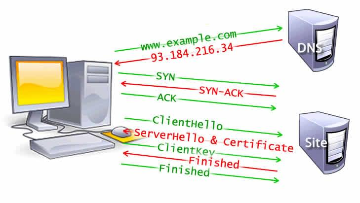

[TIL on May 16th, 2022](../../TIL/2022/06/06-16-2022.md)
# **How Browsers Work 01: Navigation**
#### Goal of web development:
- Content that is fast to load and smooth to interact with

#### Two major issues in web performance
- Network latency
- Browsers are considered single threaded

### Navigation
- Navigation occurs whenever a user requests a page by entering a URL into the address bar, clicking a link, submitting a form, as well as other actions
- Latency and bandwidth can cause delays for navigation
- Process: DNS Lookup (if necessary) > TCP Handshake > TLS Negotiation

#### DNS Lookup
- DNS (Domain Name Server) lookup must happens When you visit a site and you've never visited there
- If our browser requests a DNS lookup, a name server fielded that request and responds an IP address according to it
- After this initial request, the IP will likely be cached for a time, which speeds up subsequent requests by retrieving the IP address from the cache instead of contacting a name server again

#### TCP Handshake
- Once the IP address is known, the browser sets up a connection to the server via a TCP (Transmission Control Protocol) three-way handshake
- The browser and web server can negotiate the parameters of the network TCP socket connection before transmitting data, often over HTTPS

#### TCP three-way handshake
- Often referred to as SYN-SYN-ACK or more accurately SYN, SYN-ACK, ACK
- There are three messages transmitted by TCP to negotiate and start a TCP session between two computers

### TLS Negotiation
- Another "handshake" is required for secure connections established over HTTPS

#### What does the TLS negotiation do:
- determines which cipher will be used to encrypt the communication;
- verifies the server; and
- establishes that a secure connection is in place before beginning the actual transfer of data

- This requires three more round trips to the server before the request for content is actually sent

#### Steps to make connection

[Image from mdn]
- The DNS lookup, the TCP handshake, and 5 steps of the TLS handshake including clienthello, serverhello and certificate, clientkey and finished for both server and client
- After the 8 round trips, the browser is finally able to make the request

#### Importance of security
- While making the connection secure adds time to the page load, a secure connection is worth the latency expense 
- The data transmitted between the browser and the web server cannot be decrypted by a third party

___

### References
- [Populating the page: how browsers work-Navigation](https://developer.mozilla.org/en-US/docs/Web/Performance/How_browsers_work#navigation)