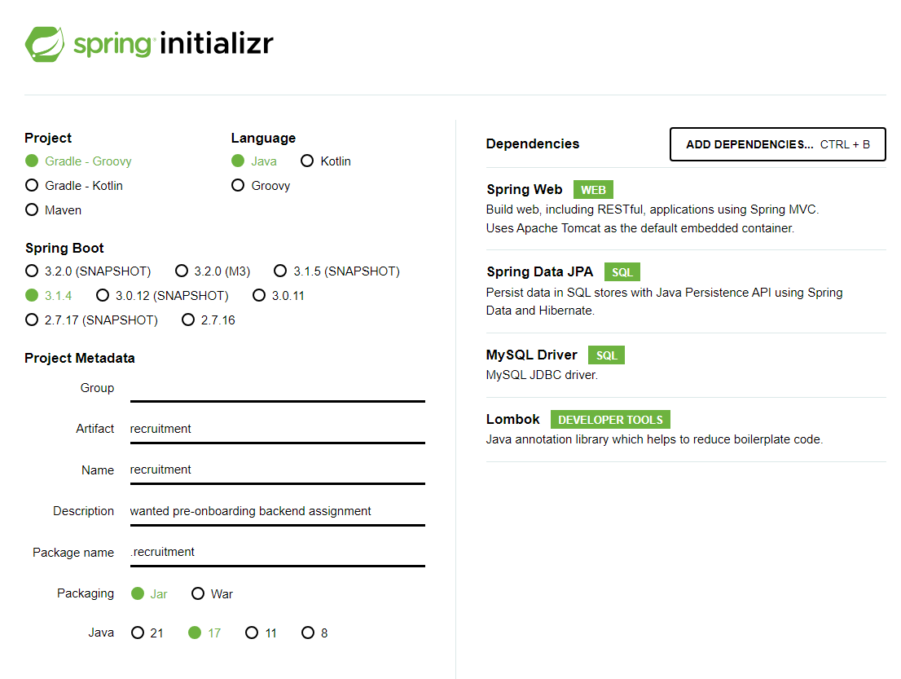

**백엔드 | 프리온보딩 인턴십 10월**

## Initialize
### spring initialzr
* 의존성
  1. Spring Web: 톰캣과 같은 서버 개발 요소 활용 목적
  2. Spring Data JPA: JPA를 통해 ORM 활용 목적
  3. MySQL Driver: MySQL 활용을 위함
  4. Lombok: Getter, Setter 등의 보일러 플레이트 코드를 어노테이션으로 간략하게 쓰기 위함

* 설정 사진

